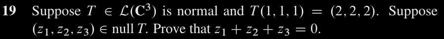

$\newcommand{\ddfrac}[2]{\frac{\displaystyle{#1}}{\displaystyle{#2}}}$

## Exercises

### Ex. 11

$(\rightarrow)$ Observe $v = v_U + v_{U^\bot}$ and $w = w_U + w_{U^\bot}$. Clearly,
\begin{aligned}
    \langle Pv, w \rangle &= \langle v_U, w \rangle \\\\
                  &= \langle v_U, w_{U^\bot} \rangle + \langle v_U, w_U \rangle \\\\
                  &= 0 + \langle v_U, w_U \rangle \\\\
    \langle v, Pw \rangle &= \langle v_{U^\bot}, w_U \rangle + \langle v_U, w_U      \rangle \\\\
                  &= 0 + \langle v_U, w_U \rangle
\end{aligned}

$(\leftarrow)$ For $U = range \ T$ and $v = v_U + v_{U^\bot}$, we show $Tv = v_U$.

**Lemma.** $Tv_U = v_U$.

Since $v_U \in range \ T$, by definition we know $Tv_0 = v_U$. So $T(Tv_0) = Tv_0$ as $T^2 = T$, which concludes $Tv_U = v_U$.

**Lemma.** $Tv_{U^\bot} = 0$.

By definition we know $v_{U^\bot} \in (range \ T)^\bot$. But given $T$ is *self-adjoint*, $(range \ T)^\bot = null \ T$. So $v_{U^\bot} \in null \ T$.

In conclusion, $Tv = Tv_U + Tv_{U^\bot} = v_U + 0 = v_U$.

### Ex. 17

**Fact.** For $normal \ T$, $range \ T$ = $range \ T^\*$ and $null \ T = null \ T^\*$. For any $T$, $range \ T = (null \ T^\*)^\bot$. See *ex.16*.

**Lemma.** For $normal \ T$, $range \ T \cap null \ T = \{0\}$.

Observe $L.H.S = (null \ T^\*)^\bot \cap (null \ T^\*)$ by the aforementioned facts.

**Theorem.** $null \ T^k = null \ T$.

Clearly $null \ T \subset null \ T^k$ as $T0 = 0$ for any operator $T$. It remains to show $null \ T^k \subset null \ T$.

$v \rightarrow^T v_1 \rightarrow^T v_2 \rightarrow^T \dots \rightarrow^T v_k = 0$.

$v_{k-1} \in range \ T \cap null \ T$, so $v_{k-1} = 0$.

...

$v_1 \in range \ T \cap null \ T$, so $v_1 = 0$.

Thus $Tv = v_1 = 0$, and $v \in null \ T$.

**Theorem.** $range \ T^k = range \ T$.

Let $T'$ be the same as $T$ but restricted on subspace $range \ T$. Observe it is a linear operator.

We prove $null \ T' = \{0\}$. Observe for $v \in null \ T'$, $v \in range \ T \cap null \ T$, and hence $v = 0$. Clearly $T'0 = 0$ as $T0 = 0$ for any operator $T$.

It follows $dim \ null \ T' = 0$. By *The Fundamental Theorem of Linear Maps* (See Axler page 63), $dim \ range \ T = dim \ range \ T'$. But by definition $range \ T' \subset range \ T$, and therefore $range \ T' = range \ T$.

We conclude $T[range \ T] = range \ T$, The image of $range \ T$ under $T$ is exactly $range \ T$. Clearly it suffices to prove our intended theorem.

### Ex. 19

By normality we know $null \ T = (range \ T)^\bot$. So $(z_1, z_2, z_3) \bot v$, for any $v \in ran \ T$. It follows
\begin{align*}
    (z_1, z_2, z_3) \cdot v &= 0 \\\\
    (z_1, z_2, z_3) \cdot T(1, 1, 1) &= 0 \\\\
      &= (z_1, z_2, z_3) \cdot (2, 2, 2) = 2 z_1 + 2 z_2 + 2 z_3 = 2 (z_1 + z_2 +    z_3)
\end{align*}
Thus $z_1 + z_2 + z_3 = 0$.

