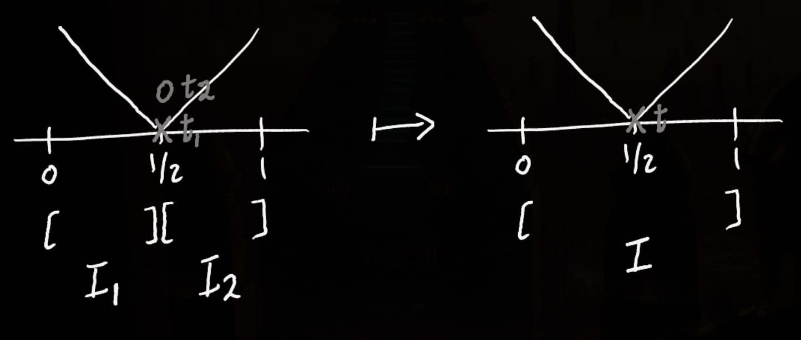
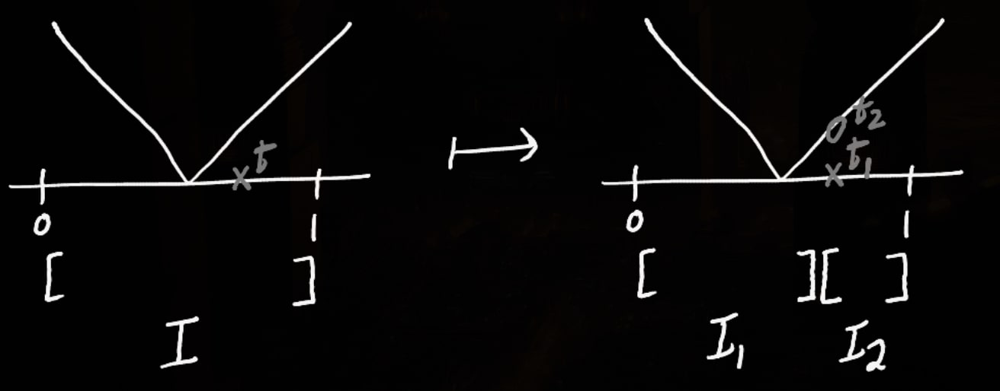

## Exercises {#problems .unnumbered}

### 1 {#section .unnumbered}

#### a {#a .unnumbered}

By definition of a gauge, we have
\begin{aligned}
    t_i - \delta(t_i) &\leq x_{i-1} \\\\
    x_i &\leq t_i + \delta(t_i)
\end{aligned}
Implying,
\begin{aligned}
    x_i - x_{i-1} \leq t_i + \delta(t_i) - x_{i-1} \\\\
    -t_i + \delta(t_i) \geq -x_{i-1}
\end{aligned}
Concluding for all $i \in \{ 1,2, \dots, n \}$,
\begin{aligned}
    x_i - x_{i-1} &\leq t_i + \delta(t_i) - t_i + \delta(t_i) \\\\
    &\leq 2 \delta(t_i)
\end{aligned}

#### b {#b .unnumbered}

Clearly $x_i - x_{i-1} \leq 2 \delta^*$ for all $i \in \{1, 2, \dots, n\}$. Then $\max \\{x_i - x_{i-1}\\} = ||\dot{p}|| \leq 2 \delta^*$.

#### c {#c .unnumbered}

$\max \\{ x_i - x_{i-1} \\} \leq \delta_* = inf \\{ \delta(t) \\}$. Then $x_i - x_{i-1} \leq \delta_*$
\begin{aligned}
    x_i &\leq \delta(t_i) + x_{i-1} \\\\
    &\leq \delta(t_i) + t_i \qquad \text{by def } x_{i-1} \leq t_i \\\\
\end{aligned}
Analogously,
\begin{aligned}
    x_{i-1} &\geq - \delta_*(t_i) + x_i \\\\
    &\geq - \delta_*(t_i) + t_i \qquad \text{by def } x_i \geq t_i
\end{aligned}
Therefore, $[x_{i-1}, x_i] \subset [ t_i - \delta(t_i), t_i + \delta(t_i) ]$, i.e
$Q$ is $\delta-$fine.

#### d {#d .unnumbered}

### 2 {#section-1 .unnumbered}

#### a {#a-1 .unnumbered}

Observe for interval $[x_{i-1}, x_i]$ for any partition,

\begin{aligned}
    \forall i,j, \quad [x_{i-1}, x_i] \cap [x_{j-1}, x_j] = \begin{cases}
        [x_{i-1}, x_i]\qquad & i = j \\\\
        \{ x_i \} \qquad &j = i + 1 \\\\
        \{ x_{i-1} \} \qquad &j= i - 1 \\\\
        \phi \qquad &\text{otherwise}
    \end{cases}
\end{aligned}
It is easy to see considering any third interval containing a point $x$, necessarily implies two intervals share an intermediary point, violating the partitioning condition.

#### b {#b-1 .unnumbered}

Yes. For example, on $[0,1]$, we have the partition:
\begin{aligned}
    &([0, 1/4], 1/4),  \\\\
    &([1/4, 1/2], 1/4), \\\\
    &([1/2, 3/4], 3/4), \\\\
    &([3/4, 1], 3/4)
\end{aligned}

### 3

#### a

<!--  -->

For every intervals $I_1, I_2$ with a common tag $t_1 = t_2$, subtitute them by a single interval $I$ with tag $t = t_1 = t_2$.

Clearly $S(f,\{I\}) = S(f, \{I_1, I_2\})$.

#### b

Yes.

#### c

<!--  -->

For every interval $I$ with a tag $t$ contained only in it, Partition $I$ to $I_1, I_2$ separated at $t$, with tags $t_1 = t_2 = t$.

### 4

#### a

Let $I$ be an interval containing $1$. Denote its tag by $t = 1 + x$. As both $1$ and $1 + x$ are in $I$, $|I| \geq x$. But by definition $\delta(t) = \delta(1+x) = 0.5 x < x$, Contradiction. Therefore the tag of $I$ is necessarily $1$.

#### b

At maximum two intervals $I_1$ and $I_2$ can contain $1$. From _a_, their tags are $t_1 = t_1 = 1$. By definition $\delta(1) = 0.01$, So $|I_1| + |I_2| \leq 0.01 + 0.01 = 0.02$.
