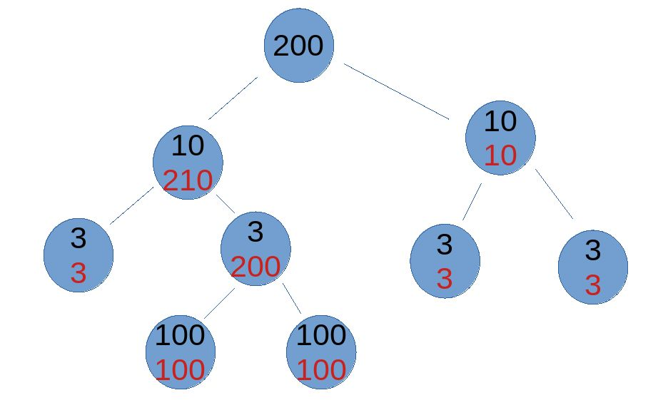
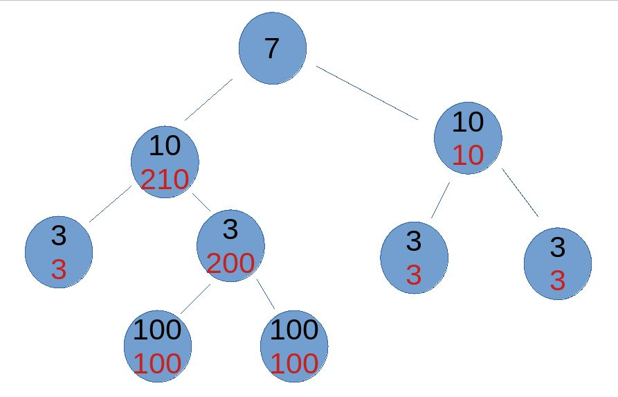
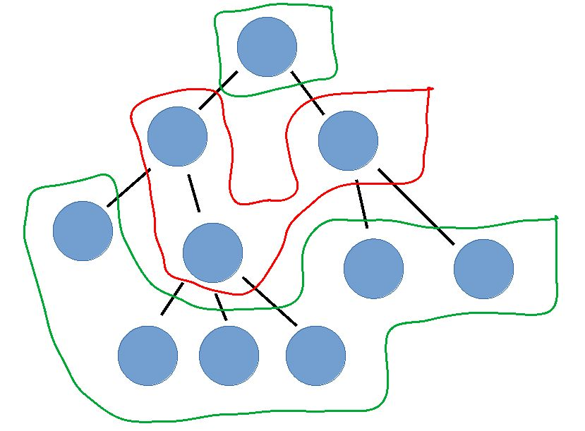
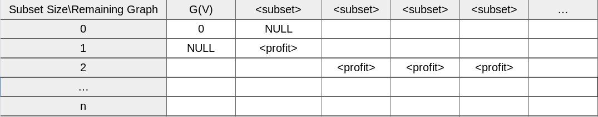
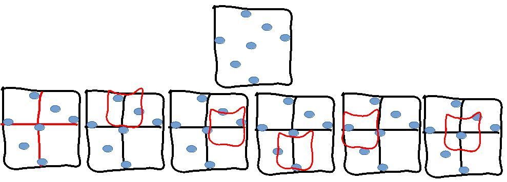

## Problem 1

### a
Consider a graph of vertices $v_1, v_2, v_3$, whose weights are correspondingly $10, 6, 6$, and connected by edges $\{v_1,v_2\}, \{v_2, v_3\}$.

The optimal subset is $v_2, v_3$ of profit sum equal to $6 + 6 = 12$, But the algorithm picks subset $v_1$ with profit $10$.

### b
Since the graph is given to be acyclic, Each neighbour of the graph's root, Constitutes a root of a subtree of its own, with no vertex being shared among any two subtrees.

We design a divide and conquer algorithm where solutions to smaller subtrees can be merged for a larger subtree.

The base case is when the tree has only one vertex, where optimal subset contains only that vertex.

Assuming we know solutions of subtrees, How can we merge? Observe the optimal subset of the whole tree either

- (1) Contains the root
- (2) Does not contain the root

For (2), The optimal solution of the whole tree is the sum of all subtrees' optimal profits. Assume for the sake of contradiction that is not the case. Then there are different selections of vertices with overall greater profit. Since by definition we are assuming whole tree's root to be excluded, We know the different selection is in one of the subtrees. We know also that subtree's new total profit is greater, But that contradicts the fact subtree is given optimal in the first place to us.

For (1), The tricky part comes into play. If we restricted our scope only on a subtree, Then It is possible to choose a non-optimal subset, As it shall be better integrated with the bigger subtree, Yielding a greater profit for the bigger subtree. Particularly, That happens if we had to include the new root in the subset and exclude the subtree's root.

The key is to have this information given to us by the main algorithm. So we let it compute also optimal possible profit under the assumption root is excluded. With that in our pocket we can compute the whole big tree's optimal subset profit assuming it contains the root.

Specifically, we loop on each given subtree and check whether root is included in optimal solution. If not, we add subtree's optimal profit. If yes we add subtree's optimal profit under the assumption subtree's root is excluded.

Finally we select the maximum of case (1) and case (2) and return it as the optimal solution.

Observe we have covered all possible cases by such a simple trick!

**Example**

Black number indicates profit of a single vertex, and red is the optimal profit of the vertice's subtree.

For the first tree, Case (1) is maximum, and for the second tree, Case (2) is maximum.




**Psuedo Code**

```
optimalSubsetProfit(tree G, tree root v_r)
  if (verticesNumber(G) == 1)
    return (True, profit(v_r), profit(v_r))

  subtreesOptimalData = ()

  for v_neig in neighbours(v_r)
    out = (optimalProfit, isRootIncluded, profitRootExcluded) = optimalSubsetProfit(subtree(v_neig), v_neih)
    subtreesOptimalData.append(out)
  
  
  profitRootExcluded = 0
  for subtree in subtreesOptimalData
    profitRootExluded += subtree.optimalProfit
  
  profitRootIncluded = 0
  for subtree in subtreesOptimalData
	if subtree.isRootIncluded == False
	  profitRootIncluded += subtree.optimalProfit
	else
	  profitRootIncluded += subtree.profitRootExcluded
  
  optimalProfit = max{profitRootExcluded, profitRootIncluded}
  if optimalProfit == profitRootExcluded
	isRootIncluded = False
  else
    isRootIncluded = True
  
  return optimalProfit, isRootIncluded, profitRootExcluded
```

### c

**Remark** Stacks' Vertices Number

Think of the given graph as levels of stacks from bottom to top as shown below



Observe the number of vertices in a stack must be equal or greater than the number of its preceeding stack. So, final stack of leafs is the greatest.


**Algorithm Description**

- Include the bottom most stack in solution subset.
- Ignore the preceeding stack, As every vertex in it is adjacent to some selected vertex.
- Include the preceeding stack in solution subset.
- Continue similarly untill the whole graph is covered

By alternatively toggling between stacks, We ensure no adjacent vertices are selected, and we greedily select stacks of greatest number of vertices.


**Psuedo-code**

```
optimalProfit(tree G, tree's root v_r)

  if G contains one vertex
	return (True, 1)


  someChildIncluded = False
  count = 0

  for each child v_chi of root v_r
    (isChildIncluded, childCount) =  optimalProfit(G, v_chi)
    
	if isChildIncluded == True
	  someChildIncluded = True
	increase count by childCount


  if someChildIncluded == True
    return (False, count)
  else
    return (True, count+1)
```

**Complexity** $\log(n)$

**Proof**

**Theorem. 1** If the given graph contains only vertices with at most 1 child branch, Then the algorithm selects maximum number of valid vertices.

Note the graph in this case is basically a linear path of vertices. Note also the number of vertices selected by our algorithm is $\lceil \frac{n}{2} \rceil$, where $n$ is the number of graph's vertices.

It sufficies to show if there is any selection subset $U$ whose number of vertices is more than $\lceil \frac{n}{2} \rceil$, Then $U$ contains two adjacent vertices. The proof is by induction on $n$.

The base case of $n = 2$ is trivial. Assume the statement holds for $k \geq 2$, and consider an arbitrary graph $G$ where $n = k+1$.

Consider an arbitrary $X \subseteq G(V)$ with vertices number at least $\lceil \frac{k+1}{2} \rceil + 1$. Our goal now is to prove the existince of two adjacent vertices in $X$. By removing a leaf from $G$ we obtain a graph $G'$ whose number of vertices is $n' = n - 1 = k + 1 - 1 = k$. Define $X'$ to be $X \cap G'(V)$. Observe $X'$ contains at least $\lceil \frac{k+1}{2} \rceil + 1 - 1 = \lceil \frac{k+1}{2} \rceil = \lceil \frac{k}{2} \rceil + 1$ vertices. By the induction hypothesis it follows $X'$ contains two adjacent vertices, And so does $X$.

**Definition. 1** _multiLinearLeafsParent_ and _branchPath_

For any vertex v, If all its child generations have degree at most 2, Then we call it _multiLinearLeafsParent_. Note on any branch l, Vertices constiute a linear path from v and upto the leaf. We call that path _branchPath(v, l)_.

**Lemma. 1**

If a vertex _v_ contains more than one branch for children, and it is _multiLinearLeafsParent_, Then

- **1.1** If for any branches _l_, The length of _branchPath(v, l)_ is odd, Then _v_ is selected by the algorithm.
- **1.2** If for some branch _l_, The length of _branchPath(v, l)_ is even, Then _v_ is ignored by the algorithm.


**Lemma. 2** If the given graph contains a vertex with more than 2 child branches, and a new graph $G'$ is constructed by removing either

- $(1)$ Two bottom most vertices from odd length _branchPath_ $l_0$, or
- $(2)$ One leaf from an even length _branchPath_,

From some vertex $v_0$ which has at least two branches, Then the algorithm's selections on $G'$, are also selected on $G$.

Select that given vertex which has more than 2 child branches, and call it $v_0$. Call its branches $l_1, l_2, \dots, l_m$.

For case $(1)$, The new pruned branch is still of odd length. It is fine if the branch is completely removed also. Since parity of branches are reserved, By _Lemma. 1_, the algorithm makes the same choice on $v_0$ for both $G$ and $G'$ graphs.

Note in case the branch is completely removed, Then the choice on $v_0$ is totally dependent on other branches. If there is another even length branch then ignoring $v_0$ is reserved on $G'$; If all branches are of odd length then selecting $v_0$ is reserved also. All these cases follow by _Lemma. 1_.

For case $(2)$, We know there is another even length branch in $G'$, and by _Lemma. 1_, the algorithm ignores $v_0$ on both $G$ and $G'$ graphs.


**Theorem. 2** If the given graph contains a vertex with more than 2 child branches, Then the algorithm selects maximum number of valid vertices.

The proof is by strong induction. The base case of $n = 3$ vertices is trivial (if you are super nerd, for $n$ less than $3$, It is vacuously true). Assume the statement holds for $k \leq p$ where $p \geq 3$, and consider arbitrary graph where number of vertices $n$ is $k+1$.

Call the count the algorithm produces $p$. Assume for the sake of contradiction there is a valid selection $X$ of vertices with count at least $p + 1$.

Select that given vertex which has more than 2 child branches promised by the theorem's hypothesis, and call it $v_0$. Call its branches $l_1, l_2, \dots, l_m$.

We are ahead of two cases

- $(1)$ For some branch $l_0$, length of $branchPath(v_0, l_0)$ is odd
- $(2)$ For any branch $l_i$, length of $branchPath(v_0, l_i)$ is even

For $(1)$, Construct a new graph $G'$ where the two bottom most vertices are removed from $l_0$.

Note existince of at least 2 vertices along the branch is ensured by the definition of branch's existince; There is no odd branch of path length equal to 1.

Note also exactly one vertex of the selected two vertices is in $X$, The optimal selection of $G$, As the two vertices are adjacent.

By _Lemma. 2_, Selections made on $G'$ are exactly the same as selections made on $G$ by the algorithm, Except on $G$ there is an additional leaf selected. So selections number $p=p'+1$.

Define $X' = X \cap G'(V)$. At most one vertex selected by the algorithm on $G$ is in $X$ but not in $X'$. So $X'$ has at least $p+1-1=p$ vertices. But we have just established $p=p'+1$, Thus $X'$ has at least $p'+1$ vertices.

Number of vertices in $G'$ is $n-2 = k+1-2 = k-1$. By the induction hypothesis, $p'$, The number of selections made by the algorithm, is the greatest valid solution for $G'$.

Contradiction, as $X'$ is a valid solution for $G'$.

For $(2)$, We fix some branch $l_0$ and construct a new graph $G'$ where leaf of $l_0$ is removed.

By a very similar reasoning a contradiction is reached.


**Corollary. 1** The algorithm produces a the maximum number of selections, Generally

Follows immediately by _theorem 1_ and _theorem 2_.

### d

**Remark** Redundant Subproblem


If considered the subset marked by a red rectangle, We notice we are left with exploring remaining search space of $v_1, v_2$. We see two different subsets with the same search subspace, Which is redundant. Moreover, The left subset's profit is $9$ while the right subset's profit is $10$. So we can safely assure the right subset is yielding a better solution.

This observation clearly suggests an algorithm based on dynamic programming. It also suggests a subproblem defined in terms of profit and remaining graph vertices.


**Table**



Our algorithm is initialized on row = 0 and maxRowProfit = 0

**Algorithm Description**

For each row, we loop on all remaining graph subsets alongside their memoized profits. Then for the remaining graph selected, and for each vertex of it, We sum its profit to previous total profit and remove the vertex from remaining graph, to generate a new solution.

**Psuedo-code**
```
optimalProfit(row, maxRowProfit)
  if row == n
    return maxRowProfit

  maxNextRowProfit = -1
  
  for each ith profit of table[row, ]
    for each vertex v of ith graph subset
	  totalProfit = profit + v.profit
	  remGra = removeAdj(ith graph subset, v)
	  	  
	  if table[row+1, remGra] < totalProfit
	    table[row+1, remGra] = totalProfit

	  if table[row+1, remGra] > maxNextRowProfit
	    maxNextRowProfit = totalProfit

  if maxNextRowProfit == -1
    return maxRowProfit
  
  optimalProfit(row+1, maxNextRowProfit)
```

Note the algorithm can be trivially extended to output the solution subset by outputting $G(V)$ - $remGra$, where $remGra$ is the last remaining graph found by the algorithm.


## Problem 2

### a

Maximum distance between two requests $r_i$ and $r_j$ is $\sqrt{(1/2)^2 + (1/2)^2} = \sqrt{1/4 + 1/4} = 1\sqrt{2} \leq 1$

### b

**Algorithm Description**



Recursively the algorithm divides requests into nine sub problems. The first four calls cover all requests, but we also need to check a subproblem between each pair of those four. The base case is when the square length is $1/2$, and if two requests are within the square, Then the algorithm terminates as given requests are not valid.

It is not hard to see why those calls between each pair of the first four are necessary and sufficient to merge.

We don't see a need for specifying a psuedo-code (and my time is limited to write all details).

### c

Exactly the same as **b** but on the base case, The algorithm checks whether there are three requests within the square.
