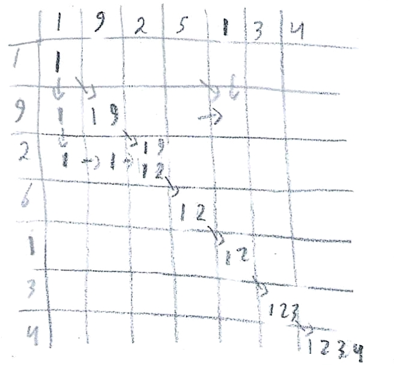
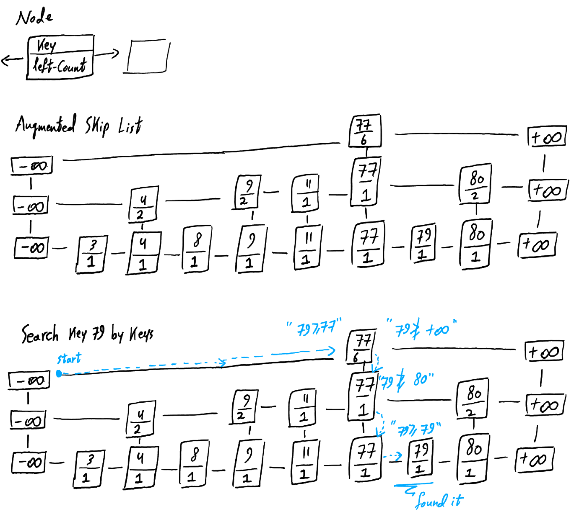
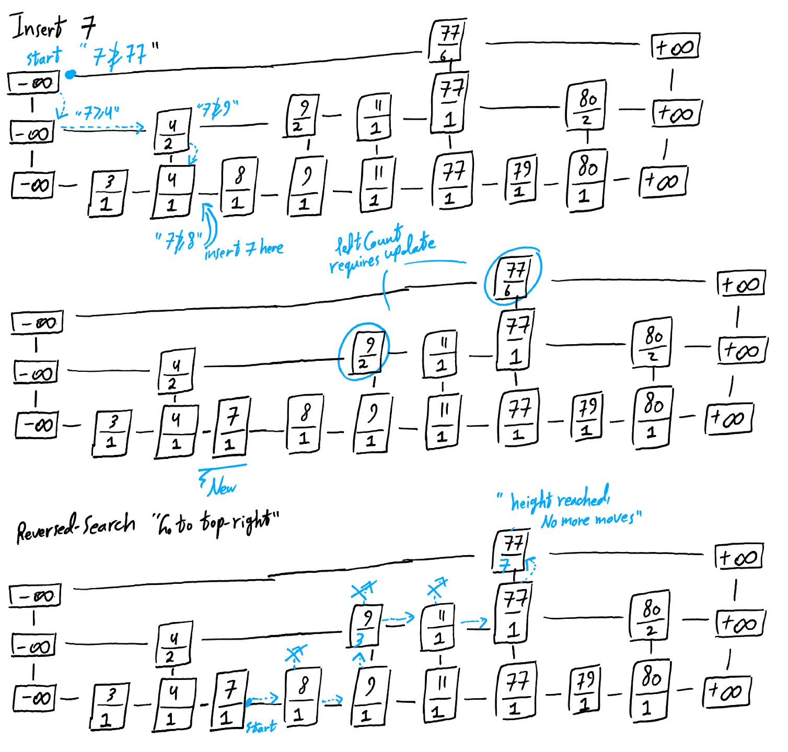
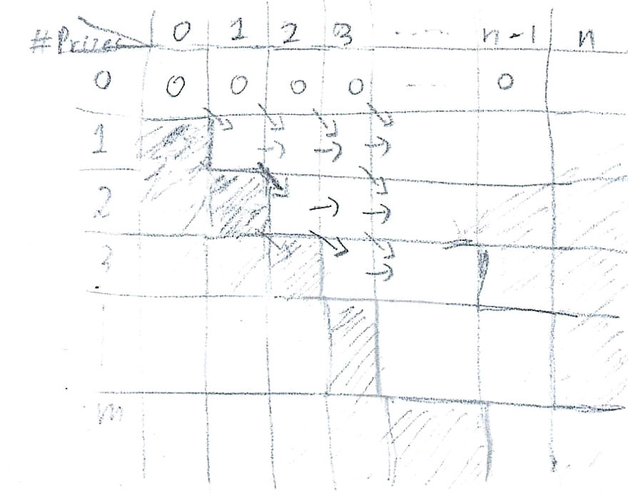

$\newcommand{\ddfrac}[2]{\frac{\displaystyle{#1}}{\displaystyle{#2}}}$

## Exercises
### Ex. 1
Done.

### Ex. 2

**Definition.**   *coll*, $p[coll]$\
We denote by *coll* the collision event of $f(k_1) = f(k_2)$ for fixed
$k_1 \neq k_2$, and by $p[coll]$ the probability of that event
happening.

**Definition.**   $\{f_{coll-i,j}\}$\
We denote all functions with a collision on $i, j \in U$ by
$\{f_{coll-i,j}\}$

**Note.**   It's explicitly assumed\

1.  \(i\) The given hash family $\mathcal{H}$ contains all possible
    functions $f:U \rightarrow B$.

2.  \(ii\) for any fixed $i$ and $j$,
    $f(i), f(j) \in \{0, \dots, |B|-1\}$ are independently and randomly
    assigned.

We are not aware whether these properties are part of a hash's family
definition.

**Lemma.**   For a family of functions $\mathcal{H}$ whose functions are
defined on $f:U \rightarrow B$,
$p[coll] = \frac{\displaystyle{1}}{\displaystyle{|B|}}$\
For a fixed $k \in B$, $|\{f_{coll-i,j} | f(i)=f(j)=k \}| = |B|^{|U|-2}$
To see why, Think of $f(k_i)$ and $f(k_j)$ as a fixed determined values;
As a deferred choice, how many choices we have for $f$, for the
remaining of $|U|-2$ elements?

Considering all $x_i \in \{0, \dots, |B|-1\}$ for
$f(k_i) = x_i = f(k_j)$,
$|\{f_{coll-i,j}\}| = |B|^{|U|-2} + \dots + |B|^{|U|-2} = |B| \cdot |B|^{|U|-2} = |B|^{|U|-1}$.

Finally,
$\frac{\displaystyle{|\{f_{coll-i,j}\}|}}{\displaystyle{|\mathcal{H}|}} = \frac{\displaystyle{|B|^{|U|-1}}}{\displaystyle{|B|^{|U|}}} =                                     \frac{\displaystyle{1}}{\displaystyle{|B|}}$.
The result is concluded, recalling a function is drawn randomly from
$\mathcal{H}$.

**Corollarly.**   If $p[coll] \leq \epsilon$, Then
$\epsilon \geq \frac{\displaystyle{1}}{\displaystyle{|B|}}$.

**Theorem.**   If $p[coll] \leq \epsilon$, Then
$\epsilon \geq \frac{\displaystyle{1}}{\displaystyle{|B|}} - \frac{\displaystyle{1}}{\displaystyle{U}}$.
Note
$\epsilon \geq \frac{\displaystyle{1}}{\displaystyle{|B|}} - \frac{\displaystyle{1}}{\displaystyle{U}}$
is equivalent to $|B| |U| \epsilon + |B| \geq |U|$ by trivial algebraic
operations. It immediately follows from *lemma 4*,
$|B| |U| \epsilon + |B| \geq |B| |U| \frac{\displaystyle{1}}{\displaystyle{|B|}} = |U|+|B| \geq |U|$,
since $|B| > 0$.


### Ex. 3 

Done.


### Ex. 4

**Fact.**   Trees' Keys\
Keys of the tree are keyed on low endpoints. i.e nodes on the left
subtree have low endpoints less than the root's low endpoint and nodes
on the right subtree have greater low endpoints.

**Definition.**   Goodness\
By an *optimal-interval* we mean an overlapping one with the lowest low
endpoint. We say some interval is *better* when its low endpoint is
strictly lower.

**Lemma.**   No *better-interval* on the right subtree.\
If any search algorithm terminated upon finding an overlapping interval
$x$, Then for any other overlapping interval on the right subtree, Its
low endpoint is going to be at least equal to $x$'s low endpoint. That
due to *Fact 1*.

**Observation.**   Possible *better-intervals* on the left subtree.\
For node $x$ whose interval overlaps with the queried interval $i$, The
possible existince of a *better-interval* on the left subtree is
justified by verifying $x.left.max$ to be at least $i.low$, and *Fact
1*.

**Corollary.**   If $x.left.max$ is less than queried $i.low$, Then the found overlapping interval in $x$ is the *optimal*.

**Tinkering Search Algorithm.** The previous discussion suggests a
simple modification to solve our problem. The algorithm maintains a
variable $bestInterval$, Updating it whenever a better overlapping
interval is found. If the algorithm found an interval, and $x.left.max$
is less than $i.low$, It terminates. If $x.left.max$ were at least
$i.low$, It steps to left subtree.

```
INTERVAL-SEARCH(T, i)
  bestIntervalNode = nil
  x = T.root

  while x != T.nil
    if i overlaps with x.int and x.int is better than bestIntervalNode
      bestIntervalNode = x

    if x.left != T:nil and x.left.max >= i.low
      x = x.left
    else
      if bestIntervalNode == nil
        x = x.right
      else return bestIntervalNode
  return bestIntervalNode
```

### Ex. 5

Done.


### Ex. 6

In *Memoized-Cut-Rod*, Initalize a new binary array $c[0..n-1]$ where
$c[i]=1$ if there's a cut at the ith possible cut position. In
*Memoized-Cut-Rod-Aux*, While computing the maximum $q$ in $i$'s loop,
store $i_0$ value which corresponds to the maximum $q$. Then set
$c[i_0]=1$.


### Ex. 7
Postponed.

### Ex. 8

**Definition.**   Less-order Sequence\
A sequence *A* is *less-order* than sequence *B* if *A* is less in terms
of the lexicographical order. For example, *A C B* is *less-order* than
*A D A*.

**Remark.**   Misleading Equal Character\
Consider sequences *A = 1 9 2 5 1 3 4* and *B = 1 9 2 6 1 3 4*. On *A2 =
1 9* and *B2 = 1 9*, We have a subsequence *1 9*. But since *9* is a
huge number we can't append subsequence *2 3 4*. In fact the optimal
subsequence of *A* and *B* is *1 2 3 4*. Our algorithm must prefer
*less-order* subsequences as they enable better chances of a longer
subsequence.

**Approach.**   Same but tinkered\
Following exactly the same formulation and solution mentioned in CLRS
but with a simple tinkering:
-   A new character appended to a subsequence must be monotonically
    increasing. Otherwise the subsequence is passed as it is without
    appending the new character.
-   if two subsequences collided in the same memoization-table entry,
    the *less-order* one is preferred.

**Example.**  \
*A = 1 9 2 5 1 3 4*\
*B = 1 9 2 6 1 3 4*



-   Entry *c\[2,2\]* prefers *1 2* over *1 9*.
-   Entry *c\[4,4\]* does not append *1* conforming to the monotonic
    increase condition.

**Note.**  \
We rely on our intuition without rigorously proving the correctness of
our solution.


## Problems
### Prob. 1
#### a

We donte *with high probability* by *w.h.p*. As instructed in lectures,
Proofs here are identical to them but on the case of nodes m rather than
all n nodes. We follow the same assumptions. Namely, Total number of
moves is, Moves until all head tosses (upward moves) are consumed.

**Finger-Search Algorithm**

We define:
-   `curN`, As currently pointed node
-   `N.r`, As the right node of node `N`
-   `N.d`, As the downward node of node `N`
-   `N.u`, As the upward node of node `N`
-   `N.l`, As the left node of node `N`
-   `N.key`, As the key of node `N`

```
Finger-Search(x,k)
  curN = x
  while curN.key != k:
    if (curN.u != NULL) AND (curN.u.r.leftCount + counter <= k), then curN = curN.u
    else if curN.r.key <= k, then curN = curN.r
    else curN = curN.d
```

Recall we are assuming a successful search, so the case of finding a key
greater than *k* while we are in *level-0* is impossible. So is the case
of reaching *+inf*. So we omit those validations.

**Lemma.**   The height, i.e maximum node's upward levels, is bounded by
$c\lg m$ *w.h.p*\
$$\begin{aligned}
  Pr[\text{no node's height} \leq c\lg m] &= 1 - Pr[\text{some node's height} > c\lg m] \\\\
  Pr[\text{some node's height} > c\lg m] &\leq m \cdot Pr[\text{node x height} > c\lg m] \textit{  (union bound)} \\\\
                                          &\leq m \cdot \left (\frac{\displaystyle{1}}{\displaystyle{2}} \right )^{c \lg m} = m \cdot (2^{\lg m})^{-c} = m \cdot m^{-c} =   \frac{\displaystyle{1}}{\displaystyle{m^{c-1}}} \\\\
                                          &= \frac{\displaystyle{1}}{\displaystyle{m^\alpha}}, \text{where} \; \alpha=c-1 \\\\
  Pr[\text{no node's height} \leq c\lg m] &= 1 - \frac{\displaystyle{1}}{\displaystyle{m^\alpha}}  \end{aligned}$$

**Lemma.**   For every height $c\lg m$ there is a total number of moves
$d\lg m$ such that $c\lg m$ head tosses (upward moves) appears within
the $d\lg m$ moves *w.h.p*\
Clearly, If we knew the maximum height of any node is $c\lg m$, then the
height of given node $x$ is upper-bounded by it.

As given in the lecture, We use *Chernoff's bound* as our hammer:
$$Pr[Y \geq E[Y] + r] \leq e^{\frac{\displaystyle{-2r^2}}{\displaystyle{m}}}$$

Observe among $d\lg m$ total tosses, The following are equivalent:
-   $\geq c\lg m$ heads *w.h.p*.
-   $< c\lg m$ heads is bounded.
-   $\geq d \lg m - c \lg m$ tails is bounded

Let $Y$ denote the number of tails. Note
$Ex[Y] = \frac{\displaystyle{d\lg m}}{\displaystyle{2}}$ by *linearity of expectation*, and set $r = (d/2 - c) \lg m$. Thus,
$$
\begin{aligned}
  Pr[Y \geq \frac{\displaystyle{d\lg m}}{\displaystyle{2}} + (d/2 - c) \lg m] &\leq e^{\frac{\displaystyle{-2(d/2 - c)^2 \lg^2 m}}{\displaystyle{d\lg m}}}\\\\
  Pr[Y \geq (d-c) \lg m] &\leq e^{-9/4 \cdot c \cdot \lg m}, \text{Setting d=8c}\\\\
                                                       &\leq (2^{\lg m})^{-c}, \text{As $e>2$ and $9/4>1$}\\\\
  &= \frac{\displaystyle{1}}{\displaystyle{m^c}}
\end{aligned}
$$
Therefore Pr\[$\geq c\lg m$ heads\] = 1 - $\frac{\displaystyle{1}}{\displaystyle{m^c}}$. *QED*


#### b

We begin by augmenting *node* with data additional to mentioned ones in
**a**. Namely, *n.leftCount* which denote the number of nodes additional
to node *n.l* upto current *n*. Note the number considers all nodes in
*level-0*.

For *Search*, Clearly augmenting new data on nodes do not influence the
number or order of nodes in the skip list. So nothings needs to be done
to prove the complexity is maintained.

For *Insert* and *Delete*, *n.leftCount* of some nodes must be updated.
Those nodes are exactly characterized by the same line of reasoning
mentioned in the lecture and in **a**. If *Search* is getting from a
top-left node to some level-0 node, Then *Reversed-Search* is getting
from a level-0 node to some top-right node. Nodes along that path are
exactly the ones which need update. The proofs are identical to **a**.
For the sake of brevity we omit them here and invite the reader to
observe the following diagrams as a convincing evidence.





#### c

```
Compute-Rank(x)
  curN = x
  counter = 0
  while curN != -inf:
    if curN.u != NULL, then curN = curN.u
    else counter = counter + curN.leftCount; curN = curN.l
  return counter
```
```
Rank-Search(x,r)
  counter = Compute-Rank(curN)
  while counter != r:
    if (curN.u != NULL) AND (curN.u.r.leftCount + counter <= k), then curN = curN.u
    else if curN.r.leftCount + counter <= k, then curN = curN.r
    else curN = curN.d
    return curN
```
Again, As we assume a succesful search we do not check the cases of
*+inf* and stepping downward while being in *level-0*.

Again, Proofs are identical to **a** and they are omitted for brevity.
`

### Prob. 2

For the sake of brevity we only show the *optimal-substructure* and
*memoization-table*, Whereby the algorithm should be clear enough.

#### a

**Optimal Substructure**
$$
maxSeq(<p_1, \dots, p_n>, m) = max
\set{
    \begin{array}{lr}
        maxSeq(<p_1, \dots, p_{n-1}>, m-1) + p_n,\\\\
        maxSeq(<p_1, \dots, p_{n-1}>, m)
    \end{array}
}
$$

**Memoization Table.** ith column denote the consideration of prizes $p_1, \dots, p_i$, and ith
row denote exactly i prizes.



Since prizes' values are non-negative, table\[m,n\] is the answer.

**Complexity.** Both time and space complexity are $\mathcal{O}(nm)$


#### b

**Remark.** Observe the given sequence $S$ and the optimal-subsequence $OptS$ can
both be divided into two segments, $S1, S2$ and $OptS1, OptS2$, where
$OptS1$ is a subsequence of $S1$ and $OptS2$ is a subsequence of $S2$.\
But neither do we know where exactly $S$ is divided nor how many prizes
are devoted to *blues* and *reds*. The solution is basically to
brute-force all possible cases and apply *(a)* to solve a single case.

**Optimal Substructure**

\begin{align}
  maxSeq(<p_1, \dots, p_n>, m) = max_{0 \leq i \leq n \wedge 0 \leq j \leq m}
   \set{ maxSeq(<p_1, \dots, p_i>, j) \cdot maxSeq(<p_1, \dots, p_{n-i}>, m-j) }
\end{align}

Where '$\cdot$' denotes a concatenation.

**Complexity.** Time is $nm \cdot \mathcal{O}(nm) = \mathcal{O}(n^2m^2)$. Space is the same as *(a)*.


#### c

**Remark**

We can think of this problem as a generalization of *(b)* where the
precedence of *Reds* over *Blues* is equivalent to prizes $p_i$ being
all less than some prize $p_0$. This is the crux of our solution.

We introduce a trick to colour prizes. Pick-up some arbitrary prize
$p_0$ and colour and all prizes $p_i < p_0$ blue and all prizes
$p_i \geq p_0$ red. Call it *prizes-colouring*.

Recursively apply *prizes-colouring* and *(b)* on the given sequence
$S$. Note the base case is the same as *(b)*, where a sequence consists
only of prizes of an equal value.

The justification is clear since we are brute-forcing all possible
cases.

**Complexity**

On average we expect the recursion to count $\log n$ iterations. The
worst case is $n$. So we have time
$n \cdot \mathcal{O}(n^2 m^2) = \mathcal{O}(n^3m^2)$, and space same as
*(a)*.


#### d

