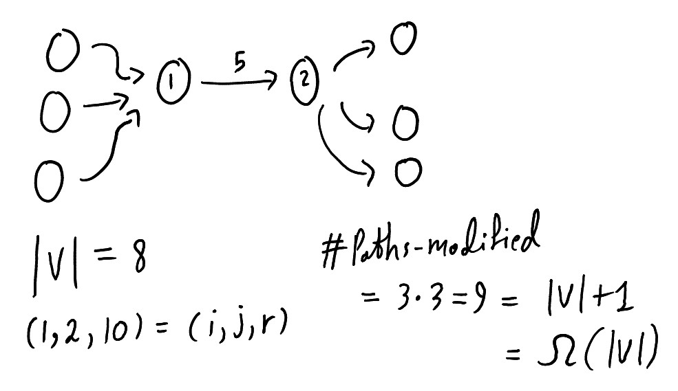
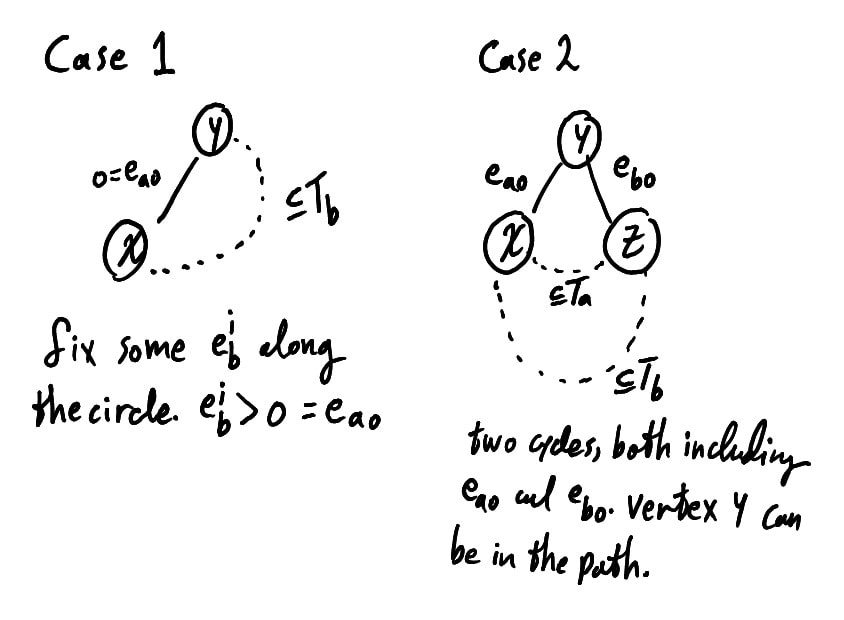
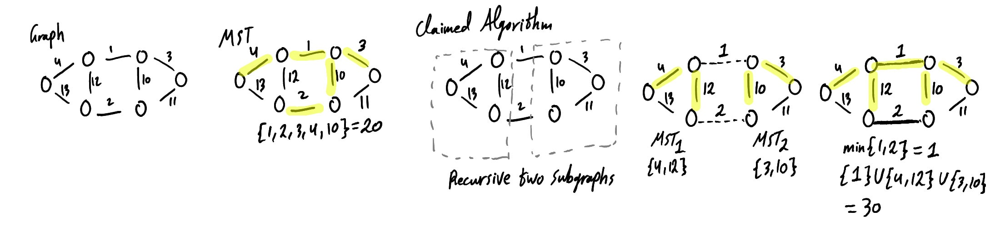

$\newcommand{\ddfrac}[2]{\frac{\displaystyle{#1}}{\displaystyle{#2}}}$

## Exercises

### Ex. 1

skipped in hope of professionally read while solving the exercises, and
well-gain from lectures.


### Ex. 2

To definte shortest-path weight function $\delta$, which satisfies the triangle inequality, enabling the second property of $\overline{w}$.


### Ex. 3 

For a cycle $c = v_0, v_1, \dots, v_k=v_0$ we are given $w(c) = 0$. It is natural to ignore the case $k = 0$.

Recall the facts

1.  $\overline{w}(u,v) \geq 0$
2.  $\overline{w}(u,v) = w(u,v) + h(u) - h(v)$
3.  $\overline{w}(p) = w(p) + h(v_0) - h(v_k)$ for path $p$

**Lemma.**   $\Sigma \overline{w}(v_i, v_{i+1}) = 0$\
$$\begin{aligned}
  \overline{w}(c) &= w(c) + h(v_0) - h(v_k) \\\\
  &= 0 + h(v_0) - h(v_0), v_0=v_k \\\\
  &= 0
\end{aligned}$$

If any $\overline{w}(v_i,v_{i+1}) > 0$ then $\overline{w}(c) > 0$,
contradicting the proved above lemma.


### Ex. 4

skipped in hope of professionally read while solving the exercises, and well-gain from lectures.


### Ex. 5

In page 636 there is a hint of using *fibonacci-heabs*. I am not sure whether it is the key of solving the problem. Anyway, The exercise is postponed untill we gain a guidance from others. Skimming the chapter did not yield any promising clue to pursue.


### Ex. 6

Same as *Ex. 5*


## Problems

### Prob. 1

#### a

Case $r = w_{i,j}$. Nothing to be done.

Case $r < w_{i,j}$. Check to see if new paths including edge $(i,j)$
offer less-weight.

(For LaTeX issue we denote matrix $\Pi$ by $P$)

    for x = 0 to n
      for y = 0 to n
        if d_x,i + r + d_j,y < d_x,y
          d_x,y = d_x,i + r + d_j,y
          P(x,j) = i
          P(x,y) = P(j,y)

Observe $\Pi(x,i)$ is the same, and same for its recursive vertices.
Similarly to $\Pi(j,y)$.

*Complexity.* $\mathcal{O}(V^2)$

Case $r > w_{i,j}$. For paths which do not depend on $w_{i,j}$, Nothing
needs to be updated about them. If their paths are less or equal than
any path which includes $w_{i,j}$ then obviously these paths are still
optimal when the weight of $w_{i,j}$ increases. If for vertex $x$,
$P(x,j) != i$ then $x$ shall never visit edge $\set{i,j\}$.

Our focus starts on vertices $x$ whose $\Pi(x,j)$ equals $i$. For each such $x$ and each arbitrary vertex $y$, We compute minimum paths from $x$ to $y$ and update if needed. Let $D'$ and $\Pi'$ denote minimum distance and predecessor matrices after updating the weight of edge $\set{i,j\}$ to $r$, respectively. Any path $x \rightarrow y$ either consists of a single edge $\set{x,y\}$ or contains an intermediate vertex between $x$ and $y$. We loop on all vertices $z$ to compute $D(x,z) + D(z,y)$ and then set $D'(x,y)$. However, we must check whether edge $\set{i,j\}$ falls into the path $x \rightarrow z$ or $z \rightarrow y$. if NO, then we know $D'(x,z) = D(x,z)$ and $D'(z,y) = D(z,y)$. If YES, then the new weight of path $x \rightarrow y$ which equals $D(x,y) + (r-w_{i,j})$, is equal or less than the new weight $D(x,z) + D(z,y) + (r - w_{i,j})$. That follows by $D(x,y) \leq D(x,z) + D(z,y)$ as the additional weight $r - w_{i,j}$ is added on both sides of the inequality. In this case we know $z$ won't offer a less-weight path. So we can restrict our focus on vertices $z$ whose corresponding paths do not include edge $\set{i,j\}$.

(For LaTeX issues we denote matrix $\Pi$ by $P$)

```
isEdgeInPath(edge {i,j}, path x -> y, predecessor P)
      if P(x,j) != i
        return False

      s = y
      while P(x,s) != x
        if P(x,s) == j
          return False

      return True

Main()
      for x = 0 to n
        if P(x,j) = i
          for y = 0 to n
            minDistance = min{ edge (x,y) if exists, D(x,y) + (r - w_i,j) }
            minVertex = NULL
            isDistanceUpdated = False
            for z = 0 to n
              if isEdgeInPath( {i,j}, x -> y, P) OR z = x OR z = y
                continue to next iteration of z

              zDistance = D(x,z) + D(z,y)
              if (distance < minDistance)
                minDistance = zDistance
                minVertex = z
                isDistanceUpdated = True

             if isDistanceUpdated
               P'(x,y) = P(z,y)
               P'(x,z) = P(x,z)
```

**Complexity.** $\mathcal{O}(V^3)$


#### b




#### c

In the same mannger matrices $M$ and $\Pi$ are maintainces *distances*
and *predecessors*, We maintain also matrix $W$ for the number of edges
corresponding to $d_{i,j}$ in $M$. The algorithm then checks $W$ before
updating a new solution whether its number of edges is at most $h$.

**Complexity.** The overhead is constant over the original algorithm. In
terms of parameters and $h$ is postponed.


#### d

The algorithm constructs a series of matrices $L^1, L^2, .., L^{n-1}$
where $L^m = \left ( l_{ij}^m \right )$, indicating shortest-paths of
edges length at most $m$. The adapted algorithm terminates on $L^{h}$
and outputs it.

**Complexity.** At most the complexity of the original algorithm.


#### e


### Prob. 2

#### a

We prove if there are two different minimum spanning trees, $T_a$ and $T_b$, Then we can construct a minimum spanning tree $T_c$ whose weight is less than either of them.

We define:
-   $E_a = T_a(E)$
-   $E_b = T_b(E)$
-   $E_c = E_a \cap E_b$
-   $E_{a-b} = E_a - E_b$
-   $E_{b-a} = E_b - E_a$
-   $E_{-c} = E_{a-b} \cup E_{b-a}$
-   $e_{a}$, An edge in $E_a$
-   $e_{a0}$, An edge in $E_{a-b}$

**Lemma.**   For an edge $e_{a0} = \{x,y\}$, $x$ and $y$ are connected by a path in $T_b$ which does not include edge $e_{a0}$. Similarly for $e_{b0}$.

Follows immediately as by definition $e_{a0} \not\in E_b$.

**Lemma.**   For an edge $e_{a0} = \{x,y\}$, There exists distinct edges $e_{b}^1$ and $e_{b}^2$ such that $e_b^1$ joins $x$ and $e_b^2$ joins $y$ in $E_b$. Similarly for $e_{b0}$.

Follows immediately by *Lemma 1*. Note the two edges $e_{b}^1$ and $e_{b}^2$ can share at most one vertix.

**Lemma.**   If there is a cycle where all edges are in $E_a$ except exactly one edge $e_b$ in $E_b$, and $w(e_b) < w(e_a^i)$ for some $e_a^i$ in the cycle, then we can construct a MST $T_a' = T_a - e_a^i + e_b$ of weight less than $T_a$

Consider two vertices, $v_1$ and $v_2$, whose connectivity relies on edge $e_a^i = \{x,y\}$. The path is $p(v_1,x), (x,y), p(y,v_2)$. By adding $e_b$ we know there is path $p_0(x,y) \neq (x,y)$, i.e $x$ can reach $y$ without edge $(x,y)$. Therefore we can form an alternative path for $v_1$ and $v_2$ without relying on $(x,y)$ by $p(v_1,x), p_0(x,y), p(y,v_2)$. Thus, Removing $e_a^i$ is safe. Note It is clear neither $p(v_1,x)$ nor $p(v_2,x)$ contains edge $(x,y)$ as that means there is an unnecessary cycle in the path.

Clearly $E_{-c}$ is non-empty, Otherwise $T_a = T_b$. Without the loss of generality, Assume the selected element of $E_{-c}$ is $\{x,z\} = e_{a0} \in E_{a-b}$. There are only two cases regarding the weight of $e_{a0}$.



**Case 1:** $w(e_{a0}) = 0$. By *Lemma 1* we know there is a path $p(x,y)$ which does not include $e_{a0}$. Clearly have a circle of, edges in $E_b$ and exactly one edge in $E_a$. Since all weights of the graph are distinct and non-negative, $w(e_{a0})$ is strictly less than all edges in the circle. By *Lemma 3*, We can form a lower-weight MST. Contradiction.

**Case 2:** $w(e_{a0}) > 0$. By *Lemma 2* we get edges $e_{b}^1$ and $e_{b}^2$ in $E_b$ where they contain vertices $x$ and $y$. Clearly it is not possible for both $e_b^1$ and $e_b^2$ to be in $E_a$. Otherwise we would have a cycle in $T_a$ contradicting the fact a tree has no cycles. It is easy to justify it by considering $T_a' = T_a - e_{a0}$. Without the loss of generality assume $e_b^1 \not\in E_a$, i.e
$e_b^1 = e_{b0}^1$. Denote $e_{b0}^1$ by $\{y,z\}$.

We claim there is a cycle of edges including $e_{b0}$ and $e_{a0}$, Where all remaining edges are in $E_a$. By connectivity of $T_a$ we know there is a path in $T_a$ between $x$ and $z$. Note the cycle is totally legit if it contained $y$. Similarly, There is a cycle of edges including $e_{a0}$ and $e_{b0}$, Where all remainig edges are in $E_b$.

We know $e_{a0} \neq e_{b0}$. In either cases some edge is greater than the other. By *Lemma 3*, We get a lower-weight spanning tree. Contradiction.


#### b

**Correctness.** For any graph $G$, There is a unique sub-graph $G_c$, Such that for any cycle $c$ in $G$ whose all edges are in $G_c$ except for exactly one edge $e_x$, The weight of $e_x$ is the maximum along the whole cycle of $c$. The proof is nearly identical to *a*.

Clearly the MST exerts this property lest we construct another spanning-tree of less weight. Since the algorithm claimed here always prefers less-weight edges, It shall never contradict that property also. By uniqueness the claimed algorithm yields the MST.

**Algorithm Description.**

**Complexity Analysis.**


#### c

Counter-example:




#### d

**Correctness.** Yes. The proof is nearly identical to *a*.

**Algorithm Description.**
