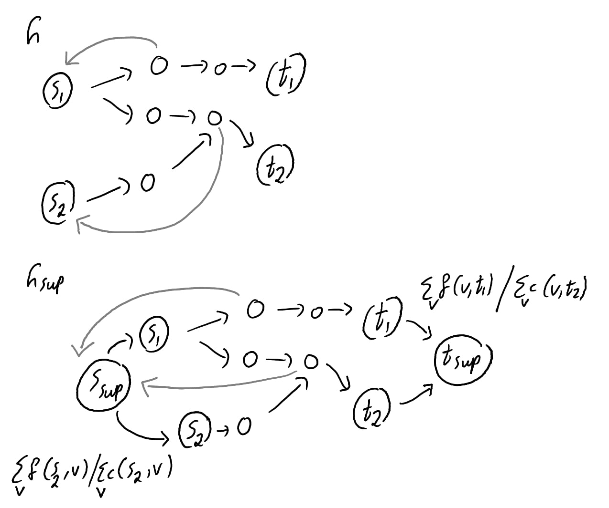

$\newcommand{\ddfrac}[2]{\frac{\displaystyle{#1}}{\displaystyle{#2}}}$

## Exercises

### Ex. 1

Will do while solving the exercises.

### Ex. 2

| Definitions \& Properties | Extended |
|----------------------------|----------|
| Network                    | Instructed below |
| Source s                   | Sources $\{s_1, s_2, \dots, s_{k_s}\}$ |
| Sink t                     | Sinks $\{t_1, t_2, \dots, t_{k_t} \}$ |
| Capacity constraint        | Same |
| Flow conservation          | V - {sources} - {sinks} |
| flow value $\|f\|$         | $\sum_{s_i} ( \sum_v f(s_i,v) - \sum_v f(v, s_i) )$ |

For brevity we illustrate the construction definition by the following
diagram.

Observe $\sum_v f(s_{sup},v) = \sum_{s_i} \sum_v f(s_i, v)$ and $\sum_v f(v,s_{sup}) = \sum_{s_i} \sum_v f(v,s_i)$ which concludes our goal.

### Ex. 3 

Denote $f = \alpha f_1 + (1-\alpha) f_2$. We show $f$ satisfies both definitions of (1) *capacity* and (2) *reservation*.

**(1)** Clearly
\begin{aligned}
  0 \leq \alpha f_1(u,v) &\leq \alpha c(u,v) \\\\
  0 \leq (1-\alpha) f_2(u,v) &\leq (1-\alpha) c(u,v)
\end{aligned}
Which concludes
\begin{aligned}
  \alpha f_1(u,v) + (1-\alpha) f_2(u,v) \leq \alpha c(u,v) + (1-\alpha) c(u,v) = c(u,v)
\end{aligned}

**(2)** Clearly,
\begin{aligned}
  \alpha \sum_v f_1(u,v) &= \alpha \sum_v f_1(v,u) \\\\
  (1-\alpha) \sum_v f_2(u,v) &= (1-\alpha) \sum_v f_2(v,u)
\end{aligned}
Which concludes
\begin{aligned}
  \sum_v \alpha f_1(u,v) + (1-\alpha) f_2(u,v) = \sum_v \alpha f_1(v,u) + (1-\alpha) f_2(v,u)
\end{aligned}

### Ex. 4

Intuitively and without proof, min-cut is $S = \{s, v_1, v_2, v_4\}$ and
$T = \{v_3, t\}$.

### Ex. 5

Comment: I don't feel confident about the solution.

By *Ex. 2* we have a construction procedure from *multiple* to *single*
with the same flow value. Intuitively and without proof, a flow of
*multiple* corresponds to a flow of the same value in *single*. Then
solving the *single* yields a max-flow for *multiple*.

## Problems

### Prob. 1

#### a

**1**\
**Notation.** We say an edge $(u,v)$ is saturated in $F$ if
$f(u,v) = c(u,v)$.

**Fact.** Since $F$ is a max-flow, we know there is no augmenting path
existing in it.

**Lemma.** Based on the fact, Lest a flow greater than $|f|$ gets
constructed in $F$, The following cannot happen in $F'$:

-   Augmenting path, not containing edge $(u,v)$.

-   Augmenting path, containing $(u,v)$, but $(u,v)$ was not *saturated*
    in $F$.

-   Augmenting path, containing $(u,v)$, but $f(u,v)$ is decreased.

**Lemma.** Then, the possible cases of $F'$ are:

-   No augmenting path exists, Then $|f'| = |f|$.

-   Augmenting path exists, containing $(u,v)$, which was saturated in
    $F$, and flow increases it in $F'$. Since $c'(u,v) = f(u,v) + 1$,
    Then by definition of taking the minimum values along the path, It
    is concluded the increase in flow is at most 1.

If an augmenting path is taken in $F'$, Then by the same line of
reasoning, No second augmenting path is possible. Note
$f'(u,v) = c'(u,v)$ now.

**2**\
Similar.

A difference is the increase shall be at most k rather than at most 1,
Following taking the minimum values along the augmenting path.

It is possible to have multiple augmenting paths, but even in that case,
the overall increase shall be upperbounded by $k$.

The same line of reasoning leads to, any existing augmenting path, must
be in the edge $(u,v)$ whose capacity is increased.

**3**\
Symmetric.

**4**\
Similar.

#### b

Intuitively and without a proof, apply *Ford-Fulkerson* method, Searching for paths which only contains edge $(u,v)$ whose capacity is increased. Intuitively that search restriction yields the upperbound $k \cdot (V+E)$.

#### c

Intuitively and without a proof, If the new capacity $c(u,v)$ is less than the flow of $F$, Fix the flow by decreasing flow values of edges which are in paths containing $(u,v)$, Then similarly to *b*, apply *Ford-Fulkerson* but only on paths containing $(u,v)$. Intuitively that search restriction yields the upperbound $k \cdot (V+E)$

### Prob. 2

Out solution is based on intuition not a rigorous proof. Given a
*directed graph* input, Construct a corresponding *flow network* where:
-   A new source vertex $s$ has a new edge with each $s_i$.
-   All edges have a capacity equal to $1$.

Then we run *Ford-Fulkerson* to find the maximum flow. Now observe
-   If max-flow $|f| = k$, output \"Possible\"
-   if max-flow $|f| \neq k$, output \"Impossible\"

The goal of edge-disjoint paths is realized by setting all capacities
to 1. If max-flow is $k$ then each $s_i$ has a path to $t$. If max-flow
is not $k$ then it must be less than $k$ and means some $s_i$ doesn't
have a successful flow to $t$.

### Prob. 3

Observe the following illustrative diagram which models the problem as a
*max-flow* problem.

A customer $a_i$ has an edge with food $b_j$ in our constructed graph,
If we are given $b_j \in A_i$. There is an additional edge for each
customer to the special vertex *10\$*.

Intuitively and without a proof, Maximizing a flow, corresponds to
minimizing the 1-flow value output from each customer to the *10\$*
vertex as it does not reach vertex *t* and hence does not contribute to
increasing the flow.
