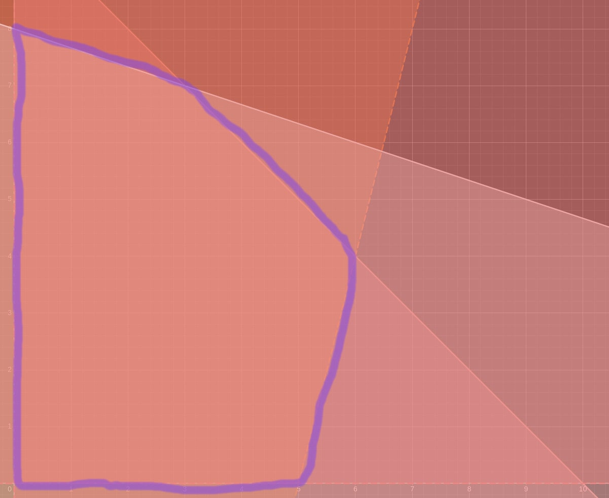
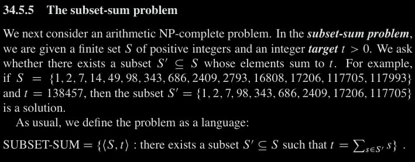

$\newcommand{\ddfrac}[2]{\frac{\displaystyle{#1}}{\displaystyle{#2}}}$

## Exercises

### Ex. 1

Done

### Ex. 2

\begin{aligned}
  \text{Maximize } &d_y \\\\
  \text{Subject to } &d_s = 0 \\\\
               &d_t \leq d_s + w(s,t) \\\\
               &d_y \leq d_s + w(s,y) \\\\
               &d_y \leq d_t + w(t,y) \\\\
               &d_x \leq d_t + w(t,x) \\\\
               &d_t \leq d_y + w(y,t) \\\\
               &d_x \leq d_y + w(y,x) \\\\
               &d_z \leq d_y + w(y,z) \\\\
               &d_z \leq d_x + w(x,z) \\\\
               &d_x \leq d_z + w(z,x) \\\\
               &d_s \leq d_z + w(z,s)
\end{aligned}

### Ex. 3 

\begin{aligned}
    \text{Maximize } \sum_{v \in V} f_{sv} &- \sum_{v \in V} f_{vs} \\\\
    \text{Subject to } f_{s,v_1} &\leq c(s,v_1) \\\\
    f_{s,v_2} &\leq c(s,v_2) \\\\
    f_{v_1,v_3} &\leq c(v_1,v_3) \\\\
    f_{v_2,v_1} &\leq c(v_2,v_1) \\\\
    f_{v_2,v_4} &\leq c(v_2,v_4) \\\\
    f_{v_3,v_2} &\leq c(v_3,v_2) \\\\
    f_{v_3,t} &\leq c(v_3,t) \\\\
    f_{v_4,v_3} &\leq c(v_4,v_3) \\\\
    f_{v_4,t} &\leq c(v_4,t) \\\\
    \\\\
    \sum_{v \in V} f_{v_1v} &= \sum_{v \in V} f_{vv_1} \\\\
    \sum_{v \in V} f_{v_2v} &= \sum_{v \in V} f_{vv_2} \\\\
    \sum_{v \in V} f_{v_3v} &= \sum_{v \in V} f_{vv_3} \\\\
    \sum_{v \in V} f_{v_4v} &= \sum_{v \in V} f_{vv_4} \\\\
    \\\\
    f_{sv_1} &\geq 0 \\\\
    f_{sv_2} &\geq 0 \\\\
    f_{v_1v_3} &\geq 0 \\\\
    f_{v_2v_1} &\geq 0 \\\\
    f_{v_2v_4} &\geq 0 \\\\
    f_{v_3v_2} &\geq 0 \\\\
    \\\\
    f_{v_4t} &\geq 0
\end{aligned}

### Ex. 4

### Ex. 5

## Problems

### Prob. 1

#### a

For the sake of time, We cheat by a drawn graph from
[desmos](https://www.desmos.com/calculator/rfl2epfkpm).

#### b

**Standard Form**

Here $n=2$ and $m=4$.
\begin{aligned}
    \text{Maximize } 4(x_1) &+ 1(x_2) \\\\
    \text{Subject to } 1(x_1) &+ 1(x_2) \leq 10 \\\\
    4(x_1) &+ -1(x_2) \leq 20 \\\\
    1(x_1) &+ 3(x_2) \leq 24 \\\\
    x_1, x_2 &\geq 0
\end{aligned}

**Slack Form**

\begin{aligned}
    \text{Maximize } &4(x_1) + 1(x_2) \\\\
    \text{Subject to } &x_3 = -1(x_1) - 1(x_2) + 10 \\\\
               &x_4 = -4(x_1) + 1(x_2) + 20 \\\\
               &x_5 = -1(x_1) - 3(x_2) + 24 \\\\
               &x_1, x_2, x_3, x_4, x_5 \geq 0
\end{aligned}

#### c

The solution form is $(x_1,x_2,x_3,x_4,x_5)$ where $x_1, x_2$ are basic and $x_3,x_4,x_5$ are non-basic.

Basic solution, by setting basic variables to zeros is $(0,0,10,20,24)$.

Interchange basic $x_1$ with non-basic $x_4$. Solving $x_1$ by the equation of $x_4$, We get $x_1 = 5 + \frac{\displaystyle{1}}{\displaystyle{4}}x_2 + \frac{\displaystyle{-1}}{\displaystyle{4}} x_4$.

Substituting the new equation into remaining ones, We get:
\begin{aligned}
    \text{Maximize } &20 + 2x_2 - x_4 \\\\
    \text{Subject to } &x_1 = 5 + \frac{\displaystyle{1}}{\displaystyle{4}}x_2 +     \frac{\displaystyle{-1}}{\displaystyle{4}}x_4 \\\\
               &x_3 = 5 - \frac{\displaystyle{5}}{\displaystyle{4}}x_2 +             \frac{\displaystyle{1}}{\displaystyle{4}}x_4 \\\\
               &x_5 = 19 + \frac{\displaystyle{-13}}{\displaystyle{4}}x_2 +          \frac{\displaystyle{1}}{\displaystyle{4}}x_4 \\\\
               &x_1, x_2, x_3, x_4, x_5 \geq 0
\end{aligned}

Solution = $(5, 0, 5, 4, 19)$ with objective equal to $20$.

Interchange basic $x_2$ with non-basic $x_3$. Solving $x_2$ by the equation of $x_3$, We get $x_2 = 4 - \frac{\displaystyle{4}}{\displaystyle{5}} x_3 + \frac{\displaystyle{1}}{\displaystyle{5}} x_4$.

Substituting the new equation into remaining ones, We get:
\begin{aligned}
    \text{Maximize } &28 - \frac{\displaystyle{8}}{\displaystyle{5}}x_3 -            \frac{\displaystyle{3}}{\displaystyle{5}}x_4 \\\\
    \text{Subject to } &x_1 = 6 - \frac{\displaystyle{1}}{\displaystyle{5}}x_3 -     \frac{\displaystyle{19}}{\displaystyle{20}}x_4 \\\\
               &x_2 = 4 - \frac{\displaystyle{4}}{\displaystyle{5}}x_3 +             \frac{\displaystyle{1}}{\displaystyle{5}}x_4 \\\\
               &x_5 = 6 + \frac{\displaystyle{13}}{\displaystyle{5}}x_3 -            \frac{\displaystyle{8}}{\displaystyle{20}}x_4 \\\\
               &x_1, x_2, x_3, x_4, x_5 \geq 0
\end{aligned}

Solution = $(6, 4, 0, 0, 6)$ with objective equal to $28$.

Quoting from CLRS, page 868: \"At this point, all coefficients in the
objective function are negative. As we shall see later in this chapter,
this situation occurs only when we have rewritten the linear program so
that the basic solution is an optimal solution.\"

#### d

\begin{aligned}
    \text{Minimize } &10y_1 + 20y_2 + 24y_3 \\
    \text{Subject to } &1y_1 + 4y_2 + 1y_3 \geq 4\\
               &1y_1 - 1y_2 + 3y_3 \geq 1\\
               &y_1, y_2, y_3 \geq 0
\end{aligned}
From *c* we know the optimal value is 28.

### Prob. 2

#### a

Given a $3SAT$ formula $\phi$, Construct $\phi' = \phi \wedge (x_{n+1} \vee x_{n+2})$. Observe every *True* assignment of $\phi$ corresponds to three distinct *True* assignments of $\phi'$. It follows $\phi$ is solvable if and only if $\phi'$ is, and the solution of $3SAT$ is basically the output on $\phi$ in formula of $\phi'$. Therefore $3SAT$ is reduced to *TRIPLE-SAT*.

#### b {#b-1 .unnumbered}

Observe the following illustrative example reducing $3SAT$ to $DONUT$.

-   All profits of vertices equal exactly 1.
-   Every clause is transformed to a complete 3-vertices sub-graph. It
    ensures Every 1 counted of $k$ must be of a distinct sub-graph.
-   $k$, the profit threshold to be satisfied, is equal to the number of
    clauses. It ensures every clause to be satisfied corresponds to
    counting 1 of k.
-   For consistency, There is an edge between every $v_i$ and
    $\neg v_i$, So that we cannot select both of them.
-   It is not problemetic to select $v_i$ multiple times. It is
    interpreted by many clauses being satisfied by the same literal.

Now it is clear, Given a problem instance $x$, The transformed
construction $f(x)$, achieves $x$ is $3SAT$ satisfiable if and only if
$f(x)$ has a subset of profit at least $k$.

#### c

We reduce from *subset-sum* problem in CLRS p.1097.

Given an arbitrary subset-sum set $S$, Transform each integer $i$ to a task with time $i$ and profit $i$. All deadlines are set to the given $t$ of sum aimmed to find. Think of time as a discrete sequence of seconds.

Observe the maximum obtainable profit of machines is $t$. Observe also if that maximum is achieved then the integers corresponding to machines form a subset whose sum is $t$. On the other hand, If machines' profit found does not meet $t$ then there is no subset of integers summing to $t$, As otherwise machines found won't be maximal.

The problem can be stated as a decision problem, by the existince of machines whose profit is at least $k$. The transformation between optimization and decision problems is easily done by a logarithmic binary search. For brevity we omit those details.
