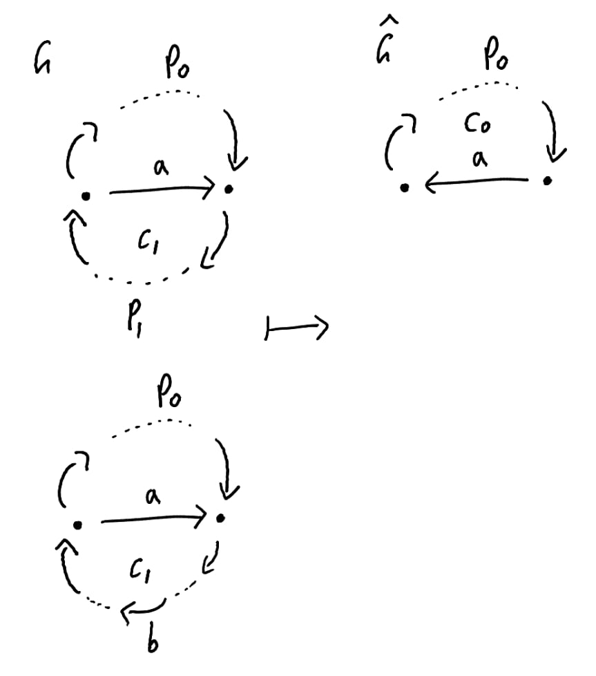
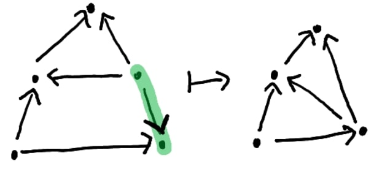
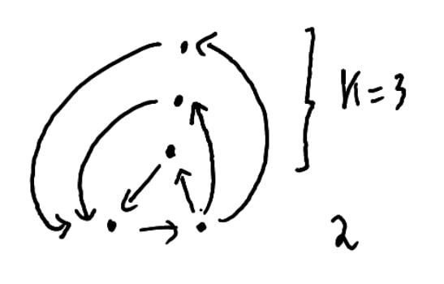

$\newcommand{\ddfrac}[2]{\frac{\displaystyle{#1}}{\displaystyle{#2}}}$

## Exercises

### Ex. 1

### Ex. 2

### Ex. 3 

### Ex. 4

## Problems

### Prob. 1

#### a

Consider $$\begin{aligned}
    A &= \{ 1, 2 \} \\\\
    S &= \{ 1, 50 \} \\\\
    V &= \{ 2, 50 \} \\\\
    B &= 50\end{aligned}$$
Observe the optimal solution is $C = 50$ while *Alg1* is of value $C* = 2$. Therefore the approximation ratio is $2/50 = 1/25$.

It is easy to see the number $50$ can be set arbitrarily larger, and
therefore we can reach the desired unbounded approximation ratio.

#### b

We follow the same convention of assuming the given indices order follow
non-increasing order of their densities.

For the first index $i$ such that $\sum_{j=1}^{i} v_j > B$, denote items up to $i-1$ by *Max-Dens-Items* and $i$th item by *First-Overweight*. For item $a_i$ denote $D(a_i)$ to be the density of $a_i$, i.e the *value* per one unit of *weight*.

Take *D(First-Overweight)* and multiply it by the slack weight in $B$ after consuming weights of *Max-Dens-Items*. Sum the resulting value along values of *Max-Dens-Items* and let $V_{maxDensities}$ denote that sum.

It is very clear $C* \leq V_{maxDensities}$ as we fully utilized the space of $B$ with maximum possible densities.

Let's return to *Alg2* and note how similar it is to the way we defined $V_{maxDensities}$. Remark that $C = max\{ V_{maxDensities}, \textit{value of First-Overweight} \}$. We have two cases:
-   Case 1. Weights of *Max-Dens-Items* $\geq \frac{\displaystyle{B}}{\displaystyle{2}}$.\
    Then $C \geq \frac{\displaystyle{ V_{maxDensities} }}{\displaystyle{2}}$, As *Max-Dens-Items* accounts for more than 50% of $V_{maxDensities}$.
-   Case 2. Weights of *Max-Dens-Items* $< \frac{\displaystyle{B}}{\displaystyle{2}}$.\
    Then the weight of *First-Overweight* is greater than $\frac{\displaystyle{B}}{\displaystyle{2}}$. It follows $V_{maxDensities}$ is contributed only by *Max-Dens-Items* and *First-Overweight*. Observe one of them must contribute at least 50% of $V_{maxDensities}$. By definition, that one shall be selected by *Alg2*, and therefore $C \geq \frac{\displaystyle{ V_{maxDensities} }}{\displaystyle{2}}$.

#### c

That is a standard dynamic programming problem whose solution can be found in any textbook. For brevity we only show the recurrece relation.

Base: $S_{1,v} = w(a_1)$ if $w(a_1) = v$.\
Induction Step: $S_{i,v} = min\{ S_{i-1,v}, w(a_i) + S_{i-1, v-v_i} \}$

#### d

**Polynomial Time Complexity.** Observe the time complexity of $Alg3$ is
$\mathcal{O}(n^2 V)$, As the memoization table is:

  | value\\items |  1 |  ..|   n|
  |-------------- |--- |---- |---|
  |      1 | | | |
  |      .. | | | |
  |      nV | | | |

Since $Alg4$ basically runs $Alg3$ with additional linear operations, Its time complexity is $\mathcal{O}(n^2 V')$, where $V'$ is similarly defined but on scaled values $v_i'$.

Clearly $V' = \lfloor \frac{\displaystyle{V}}{\displaystyle{V}} \cdot \frac{\displaystyle{n}}{\displaystyle{\epsilon}} \rfloor = \lfloor \frac{\displaystyle{n}}{\displaystyle{\epsilon}} \rfloor$. So complexity of $Alg4$ can be re-written as $\mathcal{O}(n^3 \cdot \frac{1}{\epsilon})$.

**Approximation Scheme.** The idea is to use the bound of **b** but on scaled values $v_i'$, then reverse the scaling to reach the intended ratio.

Let $U$ be the upper-bound of optimal solutions which we defined earlier in **b** on given values $v_i$. Let $U'$ be similarly defined but on scaled values $v_i'$. Define function $f$ so that it scales value as mentioned by the author. Let $C$ and $C'$ denote the value of the subset solution obtained by $Alg4$ but on given and scaled values respectively.

From **b**, We know there exists a solution on scaled values $v_i'$ whose approximation ratio is $2$, out of $U'$. Then trivially the optimal solution also can deviate by a ratio of at most $2$ out of $U'$.

Observe if we scaled back a value then the calculated value is no greater than the original given value, since we are taking ceils. In other words, $f^{-1}(v_i') \leq v_i$.

Joining all these remarks: 
\begin{aligned}
    C' &\geq \frac{1}{2} U' \\\\
    C \geq f^{-1}(C') &\geq \frac{1}{2} f^{-1}(U') = U
\end{aligned}
From **b**, That suffices to concluding $Alg4$ is an approximation scheme.

### Prob. 2

#### a

Assume for the sake of contradiction there is a cycle $c_0$ in the reversed graph $\hat{G}$. Then it must contain an edge from $A$. Otherwise $c_0$ would also be in graph $G$ and by definition it must contain an edge from $A$. Call that edge $a$. Returning to $G$, $a$ would be reversed as in the figure below. It is possible to have edges other than $a$ in cycle $c_0$ which would also be reversed in graph $G$ In this case $p_0$ would be constructed by taking the corresponding sub-cycles into it.

Since $A$ is minimal there must be a cycle $c_1$ in graph $G$ which would not be covered if not for $a$. Observe we have cycle $c_2$ constructed by paths $p_0$ and $p_1$. What covers $c_2$ in $G$? Clearly no edge in path $p_0$ would do that since we already considered all edges of $A$ we might encounter and took a sub-cycle avoiding them. Then $c_2$ is covered by edge $b$ in path $p_1$ which is part of the cycle $c_1$. That contradicts $c_1$ being a cycle only covered by edge $a$ $\textbf{QED}$.

#### b {#b-1 .unnumbered}

Remove all isolated vertices as they are irrelevant to cycles. Iteratively *contract* edges if they are not a side of a triangle as in the following figure.

By definition, Each edge of the resulting graph is a side of a triangle. Observe the graph is still equivalent to the previous one, When it comes to cycles. Intuitively we just condensed the length of cycles.

For a single edge $e$, Consider the number of different triangles it is a side of. If the number is greater than $k$ then we must have $e \in S$; Otherwise, To cover all of these triangles, We will need more than $k$ edges. Note any two different triangles can share at most one edge. Remove edge $e$, and *contract* edges as needed if they are no longer a side of a triangle (suffices also to maintain no isolated vertices). Output the resulting graph as $\hat{G}$ but with a capacity
of at most $k-1$ edges to cover all of its cycles.

After repeating this process, We will have a graph where each edge is a side of a triangles, whose count is no more than $k$. Also each vertex is part of a cycle. We show now the number of vertices is upper-bounded by $k^2 + 2k$. They key idea is, If there is an additional vertex, We will have cycles more than what $k$ edges can accommodate.

For a single edge $e$, It can cover at most $k$ cycles. Vertices in those cycles are exactly, $2$ of the edge itself, and $k$ for each cycle. That is a total of $2+k$. See the picture below:

Considering all edges of $A$, The total we get is $k(2+k) = 2k + k^2$.

It is clear now we cannot have vertices greater than that number. As by our graph structure that vertex $v$ would be part of a cycle, and we have already consumed the maximum number of cycles $k$ edges can cover. In other words, We will miss a cycle which contains vertex $v$.

#### c

It suffices to have a polynomial-time algorithm of the kernlization
procedure we illustrated.
-   Degrees of vertices are computed by a linear scan of edges,    $\mathcal{O}(|E|)$.
-   Contracting edges takes at most $\mathcal{O}(|E|^2)$.
-   Computing number of triangles for each edge takes at most $\mathcal{O}(|E| (|E| + |V|))$ by a trivial graph search, made for each edge.
-   Removing edges consumes $\mathcal{O}(|E|)$.

Since each step is polynomial in the size of the input, The sum of these sub-routines is polynomial also.
