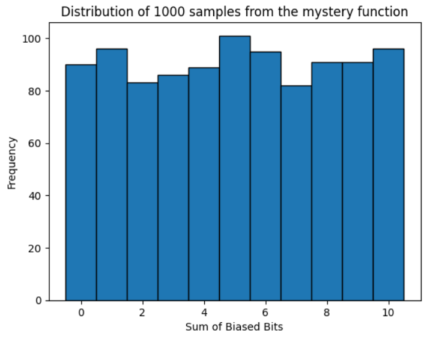
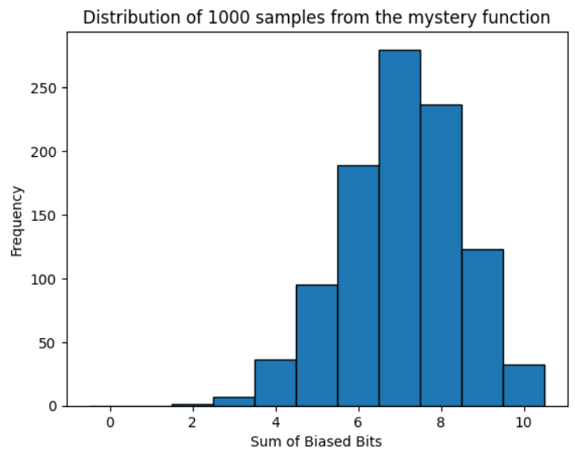
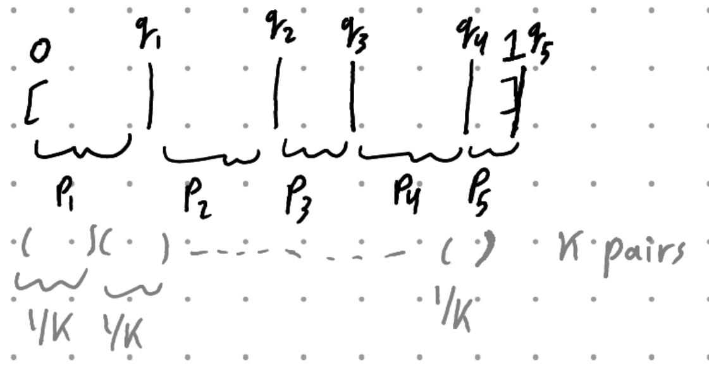
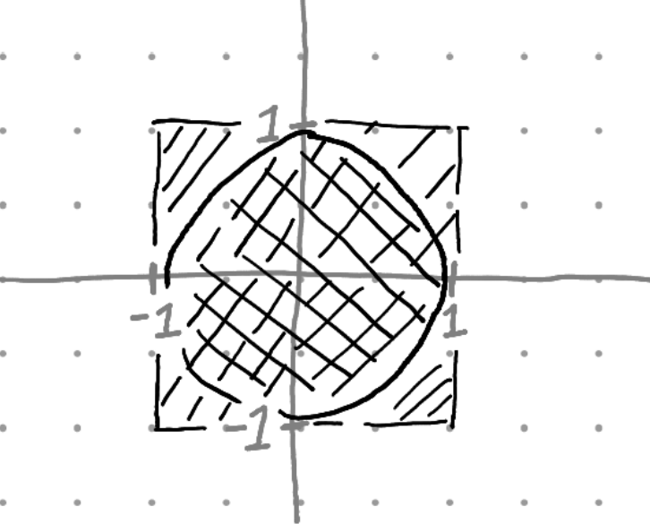

$\newcommand{\nfrac}[2]{\frac{\displaystyle{#1}}{\displaystyle{#2}}}$

## Exercises {#exercises .unnumbered}

### Ex. 1 {#ex.-1 .unnumbered}

#### Part I {#part-i .unnumbered}

Take $m = n-1$, and let $R$ be the algorithm's output. $R = 0$ if and only if $RNG()$ returned $0$ or $n-1$. So $Pr[R = 0] = 2/n$ and $Pr[R = i] = 1/n$ for $i \neq 0$.

#### Part II {#part-ii .unnumbered}

Define $k = \lfloor n/m \rfloor$, So $k$ is the greatest integer such that $mk \leq n$. Define $r = n \mod mk$, so $n = mk + r$ where $0 \leq r < m$.
```
    def goodSampler(m)
      k = floor( n/m )

      do
        r = RNG()
      while r >= mk

      return r mod m
```
**Uniformity**. Assume the algorithm terminates. So we are given $r < mk$ and we want to prove $Pr[r \mod m = i \mid r < mk] = \nfrac{1}{m}$ for $i \in [m]$. Observe
\begin{aligned}
    Pr[r \mod m = i \mid r < mk] &= \nfrac{Pr[r \mod m = i \cap r < mk]}{Pr[r < mk]} \\\\
                                &= \nfrac{k/n}{mk/n} = \nfrac{k}{n} \cdot \nfrac{n}{mk} = \nfrac{1}{m}
\end{aligned}
Recall by uniformity the probability is basically the number of outcomes satisfying the event over all possible outcomes. Clearly the $k$ outcomes of $r$ yielding $i$ by the algorithm are $(0)m + i, (1)m + i, (2)m + i, \dots, (k-1)m + (i)$.

**Time Complexity**. For an iteration of `do-while`, probability of termination is $mk/n$. So in expectation it takes $n/mk$ trials until it terminates. It follows
$$
1 \leq \nfrac{n}{mk} = 1 + \nfrac{r}{mk} < 1 + \nfrac{m}{mk} = 1 + \nfrac{1}{k} \leq 2.
$$
Concluding its time is $\mathcal{O}(1)$.

### Ex. 2 {#ex.-2 .unnumbered}

**Distribution**. see *ex-2.2* notebook.

The distribution of the given psuedo-code seems uniform.



The distribution but with modifying the probability to be hardcoded `p = 0.7` rather than `p = ContinuousUniform()` in line 2, seems normal.



Recall we know in expectation we will get 7 1-bits out of 10 by linearity of random variables.

**Remark**. $X = \sum X_i^n$ is equivalent to number of $1$s tossed.

**Lemma**. Probability of tossing $k$ $1s$.

For some fixed probability of getting 1 $p$, and number of coin tosses $n$, The probability of drawing $k$ $1s$ is $Pr[X = k] = (p)^k (1-p)^{n-k} \dbinom{n}{k}$, Since the distribution of coin tossing is binomial.

### Ex. 3 {#ex.-3 .unnumbered}

#### Part I {#part-i-1 .unnumbered}

**Algorithm.**
```
    # input: Probabilities P[i]
    # output: category sampled
    def categoricalSampler( P[1..k] )

      # initially the universe is all probabilities
      totalProb = sum( P[1..k] )

      # for each ith probability
      for i in 1..k

        # compute P[i] probability in ratio to the universe
        i_prob_uni = (1/totalProb) * P[i]

        # return i by that probability
        if biasedBit( i_prob_uni )
          return i

        # remove P[i] from the universe
        totalProb -= P[i]
```

**Correctness.** Computing a probability out of a subset of probabilities.

We want to compute a probability but in ratio to some subset of probabilities.

For example if $Pr[X = i] = 1/4$ for $i \in \{ 1,2,3,4 \}$, But we are given $X \not\in \{1, 2\}$. Then $Pr[X = 3 \mid X \not\in \{1,2\}] = \nfrac{Pr[X = 3 \cap X \not\in \{1,2\}]}{Pr[X \not\in \{1,2\}]} = \nfrac{1/4}{1/2} = 2 \cdot \nfrac{1}{4}$.

Generally we want to find $x$ where, For sum $S$ of some subset of probabilities, $\nfrac{Pr[X = i]}{S} = \nfrac{x}{1}$, so $x = \nfrac{1}{S} \cdot Pr[X=i]$.

**Correctness.** `categoricalSampler` returns a category.

If the algorithm reached iteration $k$, `i_prob_uni` would be $1$ so `biasedBit` surely fires.

**Time Complexity.** Clearly $\mathcal{O}(k)$.

#### Part II {#part-ii-1 .unnumbered}

**Algorithm**
```
    # input: probabilities P[i]
    # output: cumulative sum of probabilities S[i]
    def cumulativeSum( P[1..k] )
        
        # S[i] is sum up to P[i]
        S = []

        sum = 0

        # compute & append S[i]
        for i in 1..k
            
            # cumulative sum up to P[i]
            sum += P[i]
            
            # append as S[i]
            S.append( sum )

        return S

    # input: probabilities P[i], and cumulative probabilities S[i]
    # output: sampled category i
    def recursiveSampler( P[l..r], S[l..r] )
        # base case. universe is one category so its probability is 1
        if l = r
            return l

        # center index
        mid = floor( (r-l)/2 )

        # total probability of P[l..r]
        totalProb = S[r] - S[l] + P[l]

        # probability of cumulative half of P in ratio to the universe
        prob_uni = (1/totalProb) * S[mid]

        # toss a coin by cumulative probability of half of P
        if biasedBit( prob_uni )

            # if True then the sample is restricted to them
            return recursiveSampler( P[l..mid], S[l..mid] )
        else
            
            # if False then the sample is not any of them
            return recursiveSampler( P[mid+1..r], S[mid+1..r] )

    # input: probabilities P[i]
    # output: sampled category i
    def categoricalSampler2( P[1..k] )
        
        # preprocessing, computing cumulative sum of probabilities
        S = cumulativeSum( P[1..k] )

        # sample a category
        return recursiveSampler( P, S )
```

**Correctness.** `recursiveSampler` won't ever reach array `P` of size zero.

That can only happen if either `mid = r` or `mid = l`, but then `S[mid] = 1` or `S[mid] = 0` respectively. Contradiction.

**Correctness.** The algorithm samples category $i$ with probability $P[i]$.

The remarks from *Part I* holds here. We show a more formal proof.

Let $X = z$ denote the event of sampling category $z$. Let $j_1, j_2, \dots, j_{k-1}$ be the remaining categories. Then $Pr[X = z] = Pr[X \neq j_1 \cap X \neq j_2 \cap \dots \cap X \neq j_{k-1}]$. Partition $j$s on subsets of outcomes $O_1, O_2, \dots, O_{\log k}$.
\begin{aligned}
    Pr[X = z] &= Pr[X \notin O_1 \cap X \notin O_2 \cap \dots \cap X \notin O_{\log k}] \\\\
              &= Pr[X \notin O_1 \mid X \notin O_2 \cap \dots \cap X \notin O_{\log k}] \\\\ &\cdot Pr[X \notin O_2 \mid X \notin O_{3} \dots \cap X \notin O_{\log k}] \cdot .. \cdot Pr[X \notin O_{\log k}]
\end{aligned}

Let $R$ be the algorithm's output, and let $R_i$ correspond to `biasedBit` in iteration $i$. Clearly $Pr[R \in \{l, l+1, \dots, mid\}] = Pr[R_i = True]$ and $Pr[R \in \{mid+1, mid+2, \dots, r\}] = Pr[R_i = False]$. The algorithm samples $z$ if and only if $R_1 = x_1 \cap R_2 = x_2 \cap \dots \cap R_{\log k} = x_{\log k}$ corresponding to $x_i = True$ if $z \notin \{mid+1, \dots, r\} = O_i$. In other words the algorithm satisfies the definition of $Pr[X = z]$.

**Time Complexity**. Clearly `cumulativeSum` takes $\mathcal{O}(k)$ and `recursiveSampler` takes $\mathcal{O}(\log k)$.

### Ex. 4 {#ex.-4 .unnumbered}

**Idea.** See the following sketch for an intuition.



- Compute cumulative sums $q_i$.
-   Construct k intervals, each of size $1/k$.
-   If some $q_i$ is sandwiched in some interval, separate that interval to two pieces.
-   Accordingly label pieces which $p_i$ they belong to.
-   Sample a `UniformLBitInteger` to select a uniformly random interval out of those k intervals.
-   If it is separated, Toss a coin by `BiasedBit` to decide a piece.
-   Output the piece's label.

**Algorithm.**
```
    # input: probabilities P[i]
    # output: cumulative sum of probabilities S[i]
    def cumulativeSum( P[1..k] )
        S = []
        sum = 0
        
        for i in 1..k
            sum += P[i]
            S.append(sum)
        
        return S


    # input: integer k
    # output: k-intervals of size 1/k each
    def kIntervalsConstruction( k )

        # start, end, and separation points, decides a pair of intervals
        # end - start = 1/k
        intervals = [
            [st, end, sep, label]
        ]

        # construct the k intervals
        for i in 1..k
            
            # length of interval is 1/k
            intervals.append(
                [ (i-1)/k, i/k, NULL, NULL ]
            )

        return intervals


    # input: 2d-array of k-intervals, and the cumulative sum S
    # output: None. It modifies the 2d-array to be filled with separators and labels
    def sepPointsFromArray( Inter[1..k, 4], S[1..k] )
        
        # pointer for S
        S_poi = 1

        # for each kth interval
        for i in 1..k

            # if S[S_poi] is contained in the kth interval
            if Inter[i][st] <= S[ S_poi ] <= Inter[i][en]
                
                # set S[S_poi] as the separator
                Inter[i][sep] = S[ S_poi ]

                # consider next index
                S_poi += 1

            # otherwise, leave the separator with NULL

            # in either cases cache S_poi
            # latter case. whole interval is labeled by S_poi
            # former case. first piece is labeled by S_poi and
            #   second piece is labeled by S_poi+1
            Inter[i][label] = S_poi


    # input: k-probabilities P[i]
    # output: k intervals, each of size 1/k, possibly separated to have pairs
    def intervalToPieces( P[1..k] )
        
        # S[i] is cumulative sum up to P[i]
        S = cumulativeSum( P )

        # construct k-intervals of size 1/k each
        intervals = kIntervalsConstruction( k )

        # in-place fill "sep" and "label" cells in intervals
        sepPointsFromArray(intervals, S)

        return intervals


    # input: Probabilities P[i]
    # output: sampled category i
    def sample( P[1..k] )

        # preprocessing is not needed to be called for every sample call
        intervals = intervalToPieces( P )

        # uniform random index of intervals
        randIndex = uniformLBitInteger(lg k)

        # uniform random interval from intervals
        randInterval = intervals[ randIndex ]

        # if it has no separator
        if randInterval[sep] = NULL
            
            # then it belongs to cached label
            return randInterval[label]
        else

        # it has a separator
            
            # compute proportion of separator in ratio to the interval of size 1/k
            prop = (randInterval[sep] - randInterval[st]) / (1/k)

            # toss a coin by a probability proportional to the separator
            if biasedBit(prop)
                
                # if it lands before the separator then we are in a piece labeled by "cached label"
                return randInterval[label]
            else

                # if it lands after the separator then we are in the piece next to one labeled by "cached label"
                return randInterval[label] + 1
```

**Correctness.** No probabilistic claim is outside what we proved and illustrated in previous exercises.

**Time Complexity.** Preprocessing consumes $O(k)$, Since all its subroutines take $O(k)$ each. Sampling consumes $O(1)$ since both `uniformLBitInteger` and `biasedBit` consume $O(1)$.

### Ex. 5 {#ex.-5 .unnumbered}

**Postponed.**

### Ex. 6 {#ex.-6 .unnumbered}

**Note.** It feels weird we derived a solution better than the requested bound.

**Algorithm**
```
    def uniformPrime(n)
        do
            # keep sampling uniform numbers in {1, .., 20n}
            rand = uniformRandom(20n)

        # as long as the sampled is not prime
        while not isPrime(rand)

        # only if we found a prime, we return it
        return rand
```

**Correctness.** We used the technique of *Rejection Sampling* which guarantees the prime number output is uniform. The proof idea is very similar to our previous probability proofs.

**Analysis.** From *Fact A.2.12* (page 226), There are at least $n/\ln n$ primes in $P_n$. So the probability of a successful trial is at least $n/\ln n$. Then the number of trials is at most $\ln n/n$ in expectation by *Fact A.3.20* (page 233). Observe $\ln n / n \leq \log n / n$. Since we are given `isPrime` is $\mathcal{O}(\log^7 n)$, The whole algorithm `uniformPrime` takes at most $\mathcal{O}(\log^8 / n) \subset \mathcal{O}(\log^{10} n)$.

### Ex. 7 {#ex.-7 .unnumbered}

#### Part I {#part-i-2 .unnumbered}



The probability of sampling from $R$ is $\nfrac{\textit{disk-area}}{\textit{square-area}} = \nfrac{\pi(1)^2}{2*2} \approx \nfrac{22}{7} \cdot \nfrac{1}{4} = \nfrac{22}{28}$.

It follows the number of iterations is at most $\nfrac{28}{22} = 1 + \nfrac{3}{11} \leq 2$.

#### Part II {#part-ii-2 .unnumbered}

**Partially Solved.**

Seemingly we just need to compute volumes of both $S$ and $R$ but in $20th$ dimension, and follow exactly the same recipe of *Part I*.
