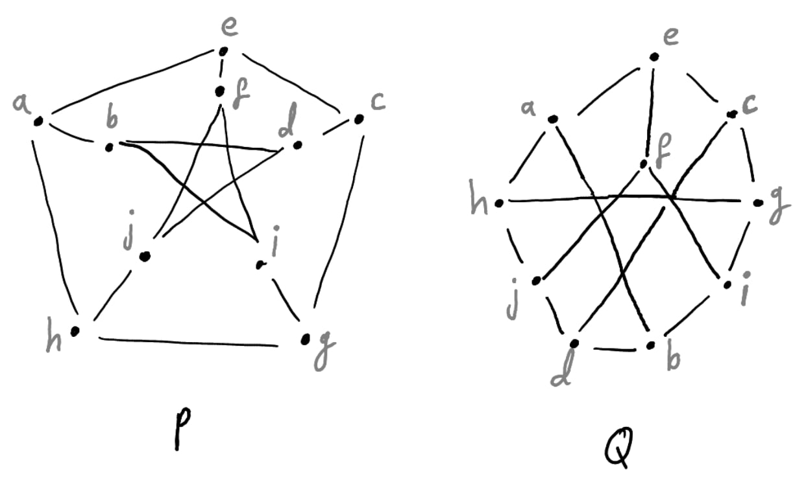
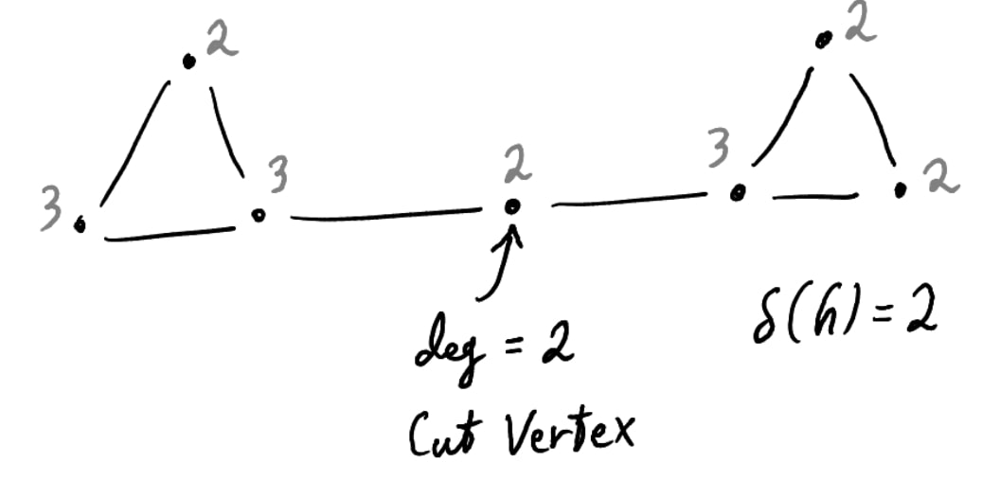

## Exercises {#exercises .unnumbered}

### 1 {#section .unnumbered}

#### (i) {#i .unnumbered}

*Reflexive*. Consider the identity bijection $\varphi: v \mapsto v$,
Which trivially satisfies $\\{uv\\} \in E$ iff
$\varphi(v) \varphi(u) \in E$.

*Symmetric*. Given a bijection $\varphi$, Its inverse $\varphi^{-1}$
exists and clearly is a bijection too. Now we prove $\\{uv\\} \in E$ iff
$\varphi^{-1}(u) \varphi^{-1}(v) \in E$.

Denote $\varphi^{-1}(u) = u'$ and $\varphi^{-1}(v) = v'$.

$(\rightarrow)$. We are given $\\{ uv \\} \in E$, i.e
$\{ \varphi(u') \varphi(v') \} \in E$. By symmetry hypothesis it follows
$\\{ u'v' \\} \in E$, i.e $\\{ \varphi^{-1}(u) \varphi^{-1}(v) \\} \in E$.

$(\leftarrow)$. We are given
$\\{ \varphi^{-1}(u) \varphi^{-1}(v) \in E \\}$, i.e $\\{ u'v' \\} \in E$.
By symmetry hypothesis, $$\begin{aligned}
    \\{ \varphi(u')\varphi(v') \\} &\in E \\\\
    \\{ \varphi \circ \varphi^{-1}(u) \varphi \circ \varphi^{-1}(v) \\} &\in E \\\\
    \\{ uv \\} &\in E
\end{aligned}$$

*Transitive*. Given bijections $\varphi_0$ and $\varphi_1$, Construct a
bijection $\varphi = \varphi_1 \circ \varphi_0$. Given $\\{uv\\} \in E$,
It follows $\\{ \varphi_0(u) \varphi_0(v) \\} \in E$, and in turn
$\\{ \varphi_1 \circ \varphi_0 (u) \circ \varphi_1 \circ \varphi_0 (v) \\} \in E$.
The other way follows analogously.

#### (ii) {#ii .unnumbered}

True.

Let $X$ and $Y$ be the two sets such that for any $\\{uv\\} \in E_G$,
$u \in X$ and $v \in Y$. Consider an arbitrary $e \in H$. By *(i)*,
$\varphi^{-1}(e) = \\{xy\\}$ where $x \in X$ and $y \in Y$. It follows
$\varphi(x) \in \varphi(X)$ and $\varphi(y) \in \varphi(Y)$. So $H$ is
bipartite.

### 2 {#section-1 .unnumbered}

$(\leftarrow)$. Given $G$ is complete. Let $S$ be any subset of
vertices. Consider $G-S$ and let $u,v \in G-S$ be arbitrary. Since $G$
is complete, $G-S$ has the edge $\\{uv\\}$, and hence connected. It
follows $S$ is not a cut-set.

$(\rightarrow)$. If $G$ has no cut-set, Then for any $S \subset V$,
$G-S$ is connected. Consider $S_{uv} = V - \{uv\}$. Since $G - S_{uv}$
is connected, it has some path $(u, u_1, \dots, u_{k-1}, v)$, but the
graph has only vertices $u$ and $v$. Therefore $G - S_{uv}$ has the edge
$\\{uv\\}$, and in turn $G$ has $\\{uv\\}$ also. That concludes $G$ is
complete.

### 3 {#section-2 .unnumbered}

#### (i) {#i-1 .unnumbered}

$P \cong Q$.

#### (ii) {#ii-1 .unnumbered}

#### (iii) {#iii .unnumbered}

**Not Solved.**

Brute-forcing all possible mappings seems non-elegant.

### 4 {#section-3 .unnumbered}

False. Here is a counter-example.

