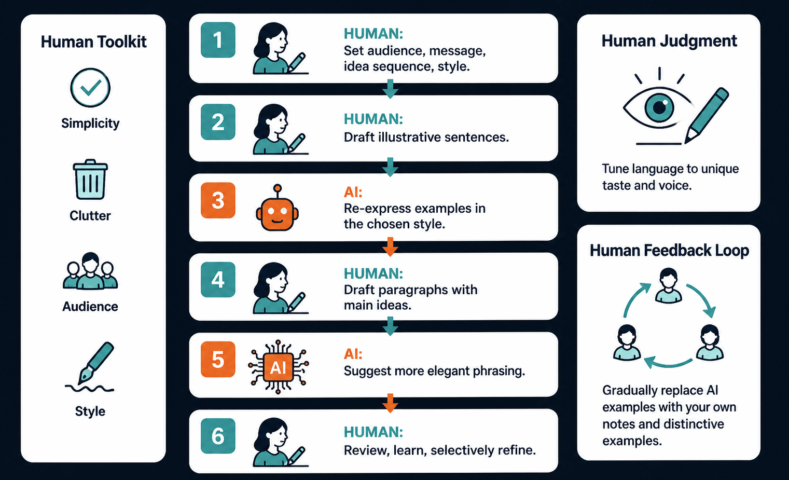
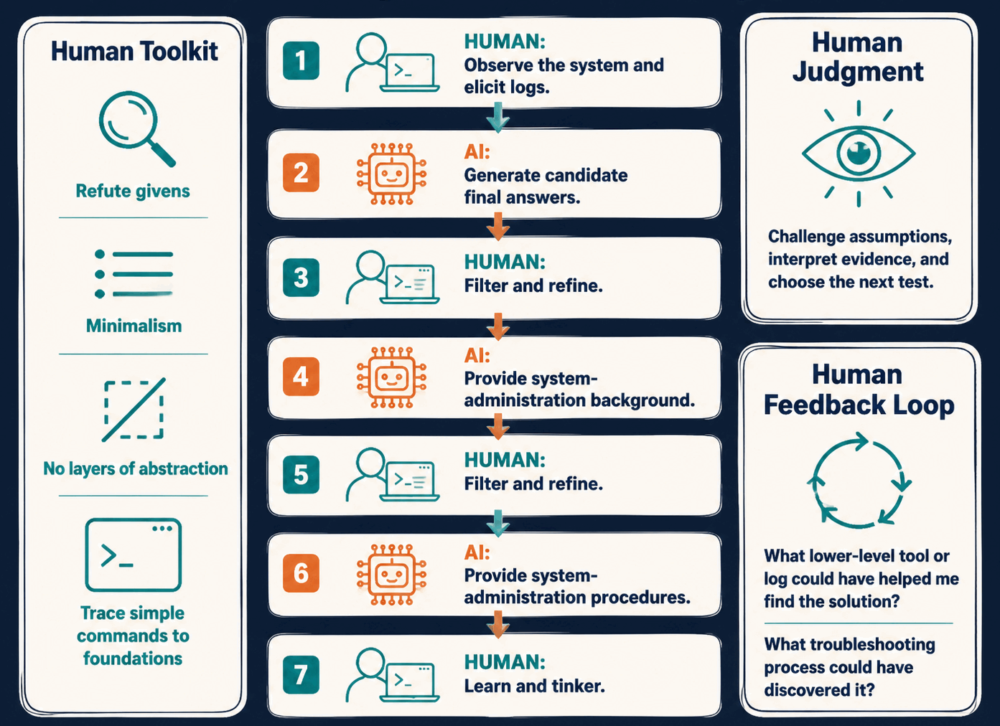

## Foreward

The word workflow is reminiscent of agentic workflows. _Lean Reduction_ advocates for a different kind of an AI workflow, centered on humans. AI workflows typically contain feedback loops to train AI. A human-centered AI workflow contains a human feedback loop to boost a human's ability to evaluate AI's output. Humans are ought to seek control by steering the AI workflow. The more the human learns to evaluate and steer AI, the more useful AI becomes.

We propose the following components:
- Preliminary
- Human Toolkit
- Human Judgment
- Human Feedback Loop

_Preliminary_ are skills and backgrounds a human must learn before adopting the workflow. _Human Toolkit_ are first-principles through which a human evaluates. Those could be guidelines, policies, pieces of knowledge, or resources. _Human Judgment_ specifies the decisions taken by a human following her intuition. _Human Feedback Loop_ specifies what the human is supposed to learn and refine. At the end of a loop, a human may ask himself: How could I have solved this in less time? What kind of knowledge do I need the next time? Is there a higher-quality solution?

Let's take examples.

## Writing

Relying on LLMs for writing is observed to strip away the author's distinct style and leaves the readers disconnected. A human-centered workflow enforces a writer's unique voice by setting him in control by deciding and evaluating the phrasing, message, style, flow of ideas, and the target audience.

| Component | Sub | Details |
|-|-|-|
| Preliminary |  | Writing a sentence similar to another given one.|
| Human Toolkit | Guidelines | Simplicity. Rely on few clear sentences to communicate the idea. Remove any redundancy which won't affect the reader's understanding. |
|  |  | Clutter. Keep each paragraph focused on cohesive ideas, and ensure ideas flow progressively without steep leaps. |
|  |  | Audience. Consider the group of readers you intend to reach, and the message you want to communicate to them. |
|  |  | Style. Formal, conversational, humorous, narrative, lyrical, and technical. |
|  | Reference | On Writing Well by William Zinsser |
| Human Judgment |  | Tuning a given sentence so that it conforms to unique taste and voice. |
| Flow |  | 1. Human: Decide target audience, message, sequence of ideas, and style. |
|  |  | 2. Human: Decide some illustrative sentences. |
|  |  | 3. AI: Re-express the sentences of (2) following the style chosen in (1). |
|  |  | 4. Human: Quickly write each paragraph and include the main ideas. Get inspired by (3) but don't exactly repeat the sentences. |
|  |  | 5. AI: Re-express each paragraph more elegantly. |
|  |  | 6. Human: Review, learn, and selectively refine the writing of (4). |
| Human Feedback Loop |  | Progressively, reduce the reliance on (3), and write in place of it your own notes and examples of unique style. |
|  |  | What kind of background I should have to write sentences of (6) without (5) aid? |

## Linux Power User

Relying on LLMs or QnA forums for troubleshooting linux is useful but many users miss a central educational opportunity. Their usage becomes naive like "solve my problem" instead of utilizing resources as a tool to augment human thinking. A human-centered workflow enforces the user to learn lower-level toolkit to troubleshoot and build.

  
| Component | Sub | Details |
|-|-|-|
| Preliminary |  | Brian Ward. How Linux Works: What Every Superuser Should Know |
| Human Toolkit | Guidelines | Refute givens and invent by your own style. |
|  |  | Prefer minimal and simple designs. |
|  |  | Don't create many layers of abstractions for hiding. Design so that no higher-level abstraction is needed. |
|  |  | Prefer that solving a related problem utilizes a common ground. |
| | | Given an unfamiliar piecee, learn simple facts and commands surrounding it. Trace it back to fundamental notions and toolkit. |
| | | Follow an unfamiliar solution only if you can reverse it. |
|  | Reference | [Arch Wiki](https://wiki.archlinux.org/) |
| Human Judgment |  |  |
| Flow |  | 1. Human: Observe system and elicit relevant logs. Recall a relevant event causing the problem. Form a hypothesis. |
|  |  | 2. AI: Generate final answers. |
|  |  | 3. Human: Filter and refine. |
|  |  | 4. AI: Generate system administration background. |
|  |  | 5. Human: Filter and refine. |
|  |  | 6. AI: Generate system administration maintainance procedures. Consider packages, kernel modules, and system services. Consider setup, observation and logs tools, health checking, and testing. |
| | | 7. Human: Learn and tinker your system. Connect unfamiliar solutions of (2) to system administration notions and toolkit of (6). |
| Human Feedback Loop |  | What lower toolkit or logs could have assisted me to figure the solution? |
|  |  | What kind of troubleshooting process could have discovered this? |

## TBD
