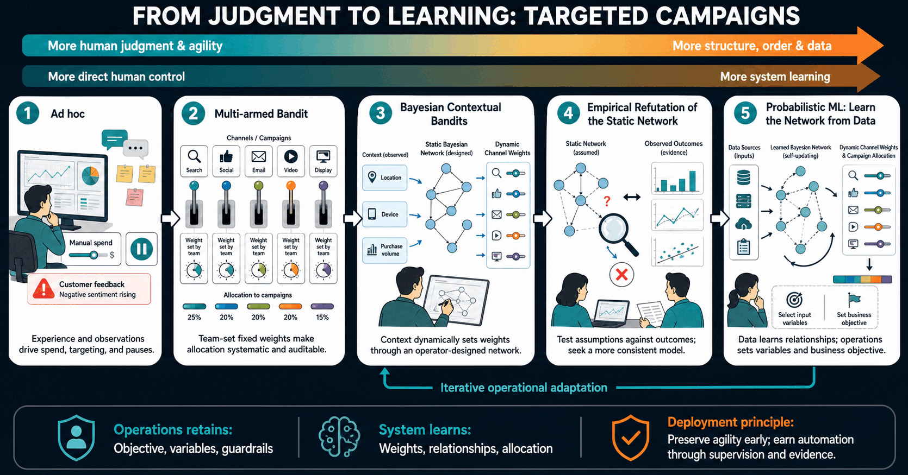

We illustrate various modeling constructions where early stages rely more on judgment call and intuition and later stages rely more on structure, order, and data. That enables quick deployment even if the operation team is not yet ready to give up on the agility and flexibility enjoyed by human judgment call. The motivation is to iteratively adapt the operation team to transition away from judgment calls, by learning how to supervise and utilize a structured workflow.

## Multi-armed Bandits for Targeted Campaigns

**Ad hoc**

Campaign targeting is mainly by a member's experience and interpretation of some observations. The operation member may increase spend on a channel that recently performed well, or pause a segment based on a negative customer feedback.

**Multi-armed Bandit**

Each target segment or channel is interpreted as an arm with a fixed weight decided by the operation's experience. Rather than deciding every channel manually every time, the team sets fixed weights for campaigns allocation. Execution becomes systematic and auditable.

**Bayesian Contextual Bandits**

A contextual multi-armed bandit adds context, such as customer location, device, and purchase volume, which decide the weight of each arm. A static Bayesian network represents how assumptions about how these variables relate to an arm's weight, i.e campains allocated for a channel. Human involvement declines further: Operation members no longer assign channel targeting static weights; they design a static map through which the system dynamically computes weights.

**Empirical Refutation of the Static Network**

The designed network is treated as a hypothesis to test whether assumed dependencies conform to data. The operation team compares model's predictions with observed outcomes, seeks to refute the static network, to figure a more consistent alternative. Human intuition takes a step backward, where data starts to gain authority.

**Probabilistic machine learning: learning the network from data**

Probabilistic machine learning finds the Bayesian network structure itself. It updates how variables relate to deciding channels weights. Human judgment is no longer involved in setting the network's weights. The operation still decides the data variables and the business objective to be optimized.

## TBD
