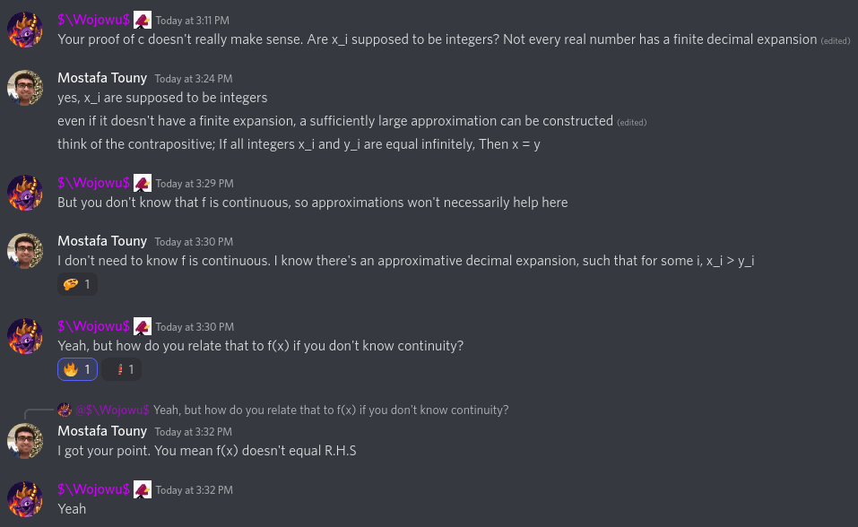

## Problem 1

**Definition.** *simplest-fraction*\
We call $\frac{\displaystyle{x}}{\displaystyle{y}}$ a *simplest-fraction* when it is in its simplest form. i.e cannot be reduced by eliminating a common fraction.

**Fact.** If there are no common factors between $x$ and $y$, Then $\frac{\displaystyle{x}}{\displaystyle{y}}$ is a *simplest-fraction*.

**Lemma.** If $\frac{\displaystyle{x}}{\displaystyle{y}}$ is a *simplest-fraction*, Then so is
$\frac{\displaystyle{x^2}}{\displaystyle{y^2}}$\
Observe any common factor among the numerator and denominator is going to necessarily divide both $x$ and $y$.

**Theorem.** Main Problem\
It's possible to set
$\sqrt{\frac{\displaystyle{m}}{\displaystyle{n}}} = \frac{\displaystyle{a}}{\displaystyle{b}}$
where $\frac{\displaystyle{a}}{\displaystyle{b}}$ is a *simplest-fraction*. On $\frac{\displaystyle{m}}{\displaystyle{n}} = \frac{\displaystyle{a^2}}{\displaystyle{b^2}}$
It follows by *fact 2* and *lemma 3*, Both $\frac{\displaystyle{m}}{\displaystyle{n}}$ and $\frac{\displaystyle{a^2}}{\displaystyle{b^2}}$ are *simplest-fractions*. By uniqueness of such forms, $m = a^2$ and $n = b^2$. QED

## Problem 2

Assume for the sake of contradiction, There's an order < defined in the complex field, Which turns it into an ordered field.

By definition, It's an ordered set also, and hence the following fact applies to it: For any $s, r \in F$ exactly one of:
- $(i) \, s=r$,
- $(ii) \, s<r$,
- $(iii) \, s>r$ is true.

Particularly we have exactly one of the following cases to be true:

**(i)** $\sqrt{-1} = 0$\
Then $-1 = \sqrt{-1} \sqrt{-1} = 0 \cdot 0 = 0$. A contradiction.

**(ii)** $\sqrt{-1} > 0$\
Then $-1 = \sqrt{-1} \sqrt{-1} > \sqrt{-1} \cdot 0 = 0$. Also $1 < 0$ and $\sqrt{-1} = \sqrt{-1} \cdot 1 < \sqrt{-1} \cdot 0 = 0$. A contradiction.

**(iii)** $\sqrt{-1} < 0$\
Then $-1 = \sqrt{-1} \sqrt{-1} > \sqrt{-1} \cdot 0 = 0$. Also $1 < 0$ and $\sqrt{-1} = \sqrt{-1} \cdot 1 > \sqrt{-1} \cdot 0 = 0$. A contradiction.

## Problem 3

The proof of complex numbers being an ordered set follows immediately by the obvious/natural properties of real numbers' order and enumerating cases.

A counter-example is given to the claim, that the orderd-set of complex numbers have the least-upper-bound property. Let $E = \set {(1/x, y) \mid x>1\}$, which is clearly bounded by any element of the set $B = \set {(1, y) \mid y \in \mathcal{R}\}$. But set $B$ has no least element.

## Problem 4

### a

$f(0) = f(0+0) = f(0) + f(0)$. Then $f(0) - f(0) = f(0) + f(0) - f(0)$, implying $0 = f(0)$.

$f(1) = f(1 \cdot 1) = f(1) \cdot f(1)$. Let $x = f(1)$, Then $x = x^2$ which implies $x(x-1) = 0$, and finally either $x = 0$ or $x = 1$.

### b

**Lemma.**   $f(n) = n f(1)$\
$f(n) = f(n-1 + 1) = f(n-1) + f(1)$, implying $f(n) = f(0) + n \cdot f(1)$.

**Lemma.**   $f(n/m) = (n/m) f(1)$\
$f(n/m) = f(n \cdot 1/m) = n \cdot f(1/m) \cdot f(1)$. But $f(1) = f(1/m + 1/m \dots + 1/m) = f(1/m) + f(1/m) + \dots + f(1/m) = m \cdot f(1/m)$, which leads to $f(1/m) = f(1)/m$. Finally, Multiply both sides by $n$.

**Corollary.** Main Problem\
The final conclusion follows immediately by cases of $f(1)$ being equal to $0$ or $1$.

### c

**Lemma.**   $f(x) \geq 0$ if $x \geq 0$\
Since $x$ is a non-negative, we know $\sqrt{n}$ exists. Observe $f(x) = f(\sqrt{x} \cdot \sqrt{x}) = f(\sqrt{x}) \cdot f(\sqrt{x})$. But any square cannot be a negative number.

**Theorem.**   Main Problem\
If $x > y$, Then $x-y > 0$. By *Lemma. 1*, $f(x-y) \geq 0$. But $f(x-y) = f(x) + f((-1) \cdot y) = f(x) - f(y)$.

**Note.** This problem had been solved by the aid of good friends. My original flawed solution is below.

### c (Flawed)

**Note.** The flaw here is discovered by a good friend.

If $x > y$, Then the decimal expansion of

$$x = \frac{x_0}{10^0} + \frac{x_1}{10^1} + \frac{x_2}{10^2} + \dots + \frac{x_k}{10^k}$$
$$y = \frac{y_0}{10^0} + \frac{y_1}{10^1} + \frac{y_2}{10^2} + \dots + \frac{y_k}{10^k}$$

has some $x_i > y_i$. Assume $i$ is the least such index.

It follows by *b*
$$f(x) = f(1) \left [ f(\frac{x_0}{10^0}) + f(\frac{x_1}{10^1}) + f(\frac{x_2}{10^2}) + \dots + f(\frac{x_k}{10^k}) \right ] = f(1) \left [ \frac{x_0}{10^0} + \frac{x_1}{10^1} + \frac{x_2}{10^2} + \dots + \frac{x_k}{10^k} \right ]$$
$$f(y) = f(1) \left [ f(\frac{y_0}{10^0}) + f(\frac{y_1}{10^1}) + f(\frac{y_2}{10^2}) + \dots + f(\frac{y_k}{10^k}) \right ] = f(1) \left [ \frac{y_0}{10^0} + \frac{y_1}{10^1} + \frac{y_2}{10^2} + \dots + \frac{y_k}{10^k} \right ]$$

Considering both cases of $f(1)$ from *a*, The inequality $f(x) \geq f(y)$ follows.

Note even if $x$ or $y$ were periodic, i.e the expansion does not end, some sufficiently large $k$ would still exist fulfilling our construction.

### d

**Case.**   $f(1) = 0$\
For any real number $x$ we can pick-up two rational numbers $q_0$ and $q_1$ such that $q_0 \leq x \leq q_1$, But we know $f(q_0) = f(q_1) = 0$ from *b*, and $f(q_0) \leq f(x) \leq f(q_1)$ from *c*.

**Case.**   $f(1) = 1$\
For any real-number $x$, We know there are rational numbers $q_{1a}, q_{2a}, \dots$ which arbitrarily get closer to $x$ from above, and similarly we know there are rational numbers $q_{1b}, q_{2b}, \dots$ which arbitrarily get closer to $x$ from below. So we have $q_{ib} \leq x \leq q_{ia}$ for $i = 1, 2, \dots$.

From *c*, We get $f(q_{ib}) \leq f(x) \leq f(q_{ia})$, and by *b*, $q_{ib} \leq f(x) \leq q_{ia}$, which suffices to prove $f(x) = x$.
