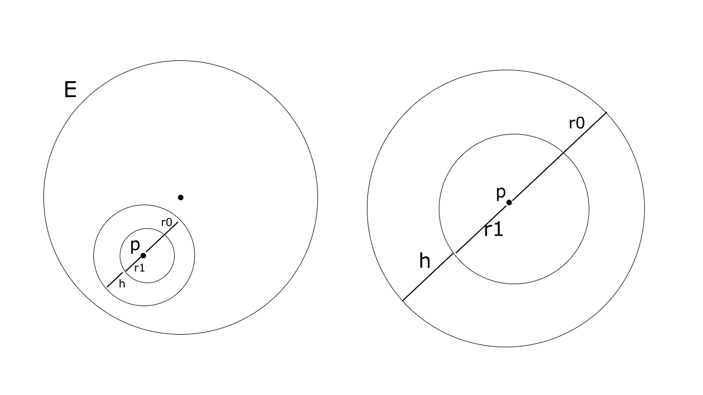

## Problem. 1 {#problem.-1 .unnumbered}

We prove each axiom as listed by *Rudin* in page 5.

**A1** $(a_0+a_1) + \sqrt{2} (b_0+b_1) \in \mathcal{Q}(\sqrt{2})$, As $(a_0+a_1), (b_0+b_1) \in \mathcal{Q}$.

**A2** Follows immediately by properties of $\mathcal{Q}$.

**A3** Follows immediately by properties of $\mathcal{Q}$.

**A4** $0_{\mathcal{Q}(2)}$ here is the number $0 + \sqrt{2} \; 0 = 0_{\mathcal{R}}$.

**A5** For an $x_{\mathcal{Q}(2)}$, $-x_{\mathcal{Q}(2)} = -a + \sqrt{2} (-b)$.

**M1** The product is $(a_0a_1 + 2b_0 b_1) + \sqrt{2} (a_0 b_1 + a_1 b_0)$, Where the formed $a$ and $b$ are in $\mathcal{Q}$.

**M2** Following properties of $\mathcal{Q}$, The product we formed in *M1* is the same in cases of $xy$ and $yx$.

**M3** Following properties of $\mathcal{Q}$, The product we formed in *M1* is the same in cases of $(xy)z$ and $x(yz)$.

**M4** $1_{\mathcal{Q}(\sqrt{2})}$ here is $1_{\mathcal{R}} \neq 0_{\mathcal{R}} = 0_{\mathcal{Q}(2)}$.

**M5** If $x_{\mathcal{Q}(\sqrt{2})} \neq 0_{\mathcal{Q}(2)} = 0 + \sqrt{2} \cdot 0$, Then we know either $a \neq 0$ or $b \neq 0$, and hence $x_{\mathcal{Q}(\sqrt{2})} = a + b \sqrt{2} \neq 0$. Define $x_{\mathcal{Q}(\sqrt{2})}^{-1} = \frac{\displaystyle{1}}{\displaystyle{a + b \sqrt{2}}}$. What is remaining is to show $\frac{\displaystyle{1}}{\displaystyle{a + b \sqrt{2}}} \in \mathcal{Q}(2)$ by a multiplication by its conjugate. Observe:
$$
\begin{aligned}
  &\frac{\displaystyle{1}}{\displaystyle{a + b \sqrt{2}}} \\\\
  = &\frac{\displaystyle{1}}{\displaystyle{a + b \sqrt{2}}} \cdot \frac{\displaystyle{a - b \sqrt{2}}}{\displaystyle{a - b \sqrt{2}}} \\\\
  = &\frac{\displaystyle{a - b \sqrt{2}}}{\displaystyle{a^2 + 2 b^2}} = (\frac{\displaystyle{a}}{\displaystyle{a^2 + 2b^2}}) + (\frac{\displaystyle{-b}}{\displaystyle{a^2 + 2b^2}}) \sqrt{2}
\end{aligned}
$$
And clearly
$(\frac{\displaystyle{a}}{\displaystyle{a^2 + 2b^2}}), (\frac{\displaystyle{-b}}{\displaystyle{a^2 + 2b^2}}) \in \mathcal{Q}$.

**D** Follows by a trivial algebra.

## Problem. 2 {#problem.-2 .unnumbered}

Let's look at the special case of $z = (x, 0)$. Then for any $r > 0$, there exists a complex number $w = (x/r, 0)$, such that $rw = z$.

From now on we focus on $z = (x, y)$ assuming $y \neq 0$. Before proceeding, we develop a central lemma.

**Lemma.**   For any complex number $w = (a, b)$, $|w| = 1 \leftrightarrow a^2 + b^2 = 1$.\
Follows immediately by setting $w \cdot \overline{w} = 1$ and multiplying.

**Lemma.**   Given any $x$ and $y \neq 0$, Finding reals $r, a, b$ such that $r \cdot a = x$, $r \cdot b = y$ satisfies $z = (x, y) = r \cdot (a, b) = rw$\
Follows immediately by a trivial algebra.

**Theorem.**   Main Problem\
Now we combine *Lemma 1* and *Lemma 2* to satisfy both requirements by forming a combined system of equations, Given any $z = (x, y)$ where $y \neq 0$.
$$
\begin{aligned}
  r \cdot a &= x \\\\
  r \cdot b &= y \\\\
  a^2 + b^2 &= 1
\end{aligned}
$$
It can be solved by substitution where:
$$
\begin{aligned}
  a &= \sqrt{1 - b^2} \\\\
  r &= y/b \;\;\; \text{valid as b isn't zero} \\\\
  3/b \cdot \sqrt{1-b^2} &= x
\end{aligned}
$$
Note $b \neq 0$ lest $r \cdot b = r \cdot 0 = 0 = y$, Contradicting our assumption.

The system uniquely determines the values
$$
\begin{aligned}
  b &= \frac{\displaystyle{3}}{\displaystyle{\sqrt{x^2 + 9}}} \\\\
  r &= \frac{\displaystyle{y}}{\displaystyle{3}} \cdot \sqrt{x^2 + 9} \\\\
  a &= \sqrt{1 - \frac{\displaystyle{9}}{\displaystyle{x^2+9}}}
\end{aligned}
$$

## Problem. 3 {#problem.-3 .unnumbered}

### a {#a .unnumbered}

We show if arbitrary $p \in E^o$ then $p$ is an interior of $E^o$. By definition $p$ is an interior of $E$. So $N_{r_0}(p) \subset E$ for some $r_0 > 0$. Let $r_1 = r_0/2$ and $h = r_0 - r_1$. It suffices to show $N_{r_1}(p) \subset E^o$.

Consider $N_h(p')$ for any $p' \in N_{r_1}(p)$. Through the picture it is clear this new neighbourhood shall be bounded by $N_{r_0}(p)$ and hence falls completely within $E$. That shows $p' \in E^o$ and in turn completes our proof.

In greater details, Observe $\forall q \in N_h(p')$, $d(q, p) \leq d(q, p') + d(p', p) < h + r_1 = (r_0 - r_1) + r_1 = r_0$, and hence $q \in N_{r_0}(p) \subset E$.

### b {#b .unnumbered}

$(\leftarrow)$ Trivial by *a*.

$(\rightarrow)$ Trivially $E^o \subset E$. By hypothesis, The definition of open $E$ immediately concludes $E \subset E^o$.

### c {#c .unnumbered}

Any $p \in G$ is an interior point of $G$ by definition. So there is a neighbourhood $N_{r_0}(p) \subset G$ for some $r_0 > 0$. But we know $G \subset E$, So $N_{r_0}(p) \subset E$, $p$ is an interior point of $E$.

### e {#e .unnumbered}

I guess Yes. We struggled with a formal proof though.

## Problem. 4 {#problem.-4 .unnumbered}

**Definition.**   Given a point $p \in X$, Define $V_p = \{ x > p \; | \; [p,x] \subset X \} \cup \{ x < p \; | \; [x, p] \subset X \}$.\

**Remark.**   $V_p$ constitutes a largest segment $(a,b)$, Given $X$ is an open-set.\
Assuming $V_p = (a, b]$ derives an immediate contradiction as $b$ won't be an interior point of $X$.

A more rigorous argument for showing $V_p$ is a segment can be made by constructing a segment $(inf \, V_p, sup \, V_p)$ but for brevity we ignore it.

**Lemma.**   Given an open-set $X$ and some $V_p \subset X$, For any $q \neq p$, Either $V_p = V_q$ or $V_p \cap V_q = \phi$.\
Easily proven by considering the equivalent logical form of $V_p \cap V_q \neq \phi \rightarrow V_p = V_q$.

**Lemma.**   Given a non-empty open-set $X$ and some $V_p \subset X$, $X_1 = X - V_p$ is either empty or a non-empty open-set.\
If $V_p = X$ then $X_1$ is empty. Consider $V_p$ as a strict or proper subset of $X$. Then $X_1$ is non-empty.

We show now $X_1$ is an open-set. Let $q$ be an arbitrary point of $X_1$, Then also $q \in X$. Since $X$ is an open-set we know there's some neighbour $N_{r0}(q) \subset X$. Clearly $N_{r0}(q) \subset V_q$. By *Lemma 3* and since $q \not\in V_p$, It follows $N_{r0}(q) \cap V_p = \phi$. So $N_{r0}(q) \subset X_1$ and $q$ is an interior point of $X_1$.

**Corollary.**   Countable $\{V_i\}$\
Follow the same procedure of *Lemma 4* but let the taken point $p_i$ to be a rational number. Take some real number $z_i$ in non-empty $X_i$; As it is interior there is a neighbour such that for any $q$ where $d(z_i, q) < r_0$ for some $r_0 > 0$, $q \in X$. By the density of rational numbers, there is a rational $p_i$ which satisfies $d(z_i, p_i) < r_0$. Hence $p_i \in X_i$.

We now know every distinct $V_{p_i}$ corresponds to a distinct rational number $p_i$. So the cardinality of $\{V_{p_i}\}$ is *at most countable*.

**Theorem.**   Main Problem\
Following the procedure of *Lemma 4* and by *Corollary 5* we can keep constructing $V_{p_1}$, $V_{p_2}$, ..etc, which in turn are *at most countable*. There are two cases:

- \(i\) We reach some empty $X_i$, So $\{V_i\}$ is finite. Or
- \(ii\) We do not ever reach an empty $X_i$, and $\{ V_i \}$ is *countable*.

**Note.** I received the following support before being able to solve the problem. I admit it was totally unlikely to think of the formulation $(q-\delta, q+\epsilon) \subset X$ on my own. I admit the problem is completely spoiled.

