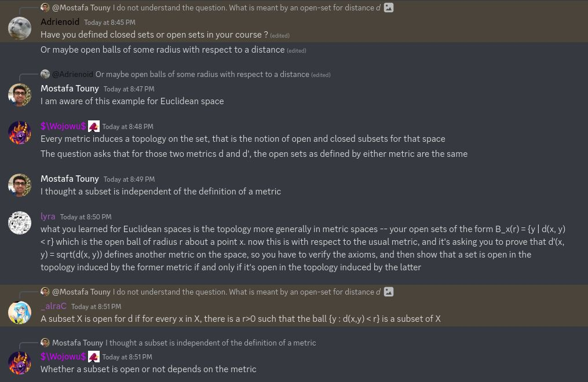
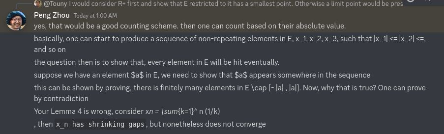
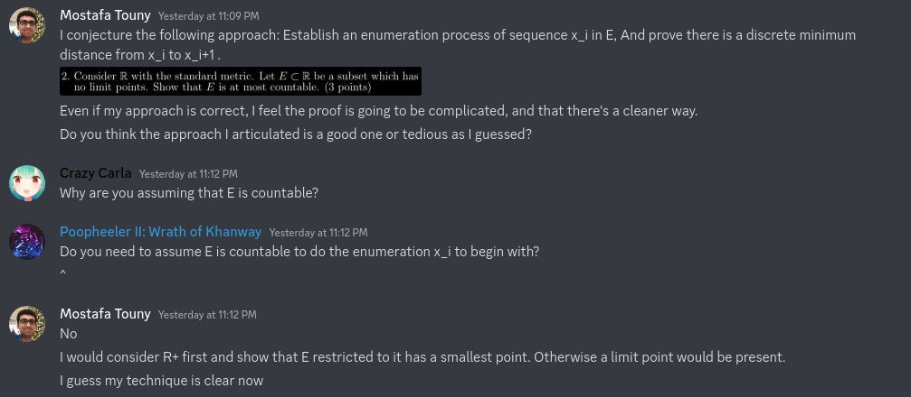

## Problem 1

The required conditions follow naturally as:
- $d'(x,x) = \sqrt{d(x,x)} = \sqrt{0} = 0$.
- If $d(x,y) > 0$ then $d'(x,y) > 0$ as the square root of non-zero is non-zero. Otherwise $0^2 = 0$ contradicting the fact $d'(x,y) > 0$.
- $d'(x,y) = \sqrt{d(x,y)} = \sqrt{d(y,x)} = d'(y,x)$.
- $d'(x,y) = \sqrt{d(x,y)} \leq \sqrt{d(x,r) + d(r,y)} \leq \sqrt{d(x,r)} + \sqrt{d(r,y)} = d'(x,r) + d'(r,y)$.

For an arbitrary open-set of $d$, $\{ y | d(x,y) < r \}$ there is an equivalent open-set of $d'$, $\{ y | d'(x,y) < \sqrt{r} \}$. For an arbitrary open-set of $d'$, $\{ y | d'(x,y) < r \}$, there is an equivalent open-set of $d$, $\{ y \mid d(x,y) < r^2 \}$.

**Note.** Some good friends assisted in solving this problem.

## Problem 2

**Lemma.**   For any point $p$ in $R$, There exists a smallest element in the set $\{ q \in E | q > p \}$\
Assume to the contrary that no smallest element exists. Then as the set is bounded below, the *infimum* exists, and is a limit point. That contradicts our hypothesis of no limit points in $E$.

**Corollary.**   $E \cap R^+ = E^+$ has a smallest element\
By the above lemma set $p = 0$.

**Corollarly.**   Given $x_i \in E^+$ there exists a smallest element among $E^+ \cap \{y | y > x_i\}$\
By the above lemma set $p = x_i$.

Now we have a counting scheme on $E^+$. What is remaining now is to prove every element in $E$ will be hit eventually. The following lemma suffices.

**Lemma.**   there are finitely many elements in $E \cap [- |a| , |a|]$\
Assuming the contrary for the sake of contradiction, We get infinite elements in $E \cap [ -|a|, |a| ]$. Those are present in both $E$ and $[ -|a|, |a| ]$ by definition. Since $[ -|a|, |a| ]$ is compact we know any infinite subset has a limit point (*Theorem 2.41, p. 40* in *baby-rudin*). But then we get a limit point in E. Contradiction.

Similarly we can prove $E \cap R^- = E^-$ is countable, and hence $E$ is countable also.

**Note. 1** Professor Peng Zhou hinted the solution approach

**Note. 2** Through chatting with good friends a cleaner alternative proof can be made as, \"Because E has no limit points it is closed.
Assume E is uncountable. Then there is an integer n such that intersection with \[n,n+1\] is also uncountable. This intersection is closed and bounded, thus compact. So we can take a sequence inside this intersection and it will have a convergent subsequence contradicting the assumption on limit points\"

## Problem 3

Assume for the sake of contradiction that the process does not stop after a finite number of steps. Then the sequence $x_i$ is infinite. Consider the infinite subset $\{x_i\} = S_\delta$; By hypothesis it has a limit point in $X$, Call it $p$. So for neighbourhood $N_{\delta/4}(p)$, some point $q_1 \neq p$ is in that neighbourhood. Let $r_1 = d(p, q_1)$. Consider neighbourhood $N_{r_1/2}(p)$; Clearly $q_1$ is not in it. So there is a point $q_2 \neq q_1$ in it. We have now distinct points $q_1,q_2 \in S$ such that $d(p,q_1) \leq \delta/4$ and $d(p,q_2) \leq \delta/4$. It follows $d(q_1,q_2) \leq d(q_1,p) + d(p,q_2) \leq \delta/4 + \delta/4 = \delta/2$. But the construction of sequence $x_i$ stipulates every pair of points is of distance at least $\delta$. Contradiction.

It follows by the above lemma, that for any point $p$ in $X$, the distance between it and some $x_i$ of $S$ is strictly less than $\delta$. Therefore $p$ is covered by $N_\delta{x_i}$.

Now we prove $X$ is separable. We know for each $\delta = 1/n$, The corresponding subset $S_{1/n}$ is finite. Clearly $\cup_n S_{1/n} = S$ is countably infinite. It suffices to show, For a point $p \in X - S$, it can get arbitrarily close to points of $S$. Consider arbitrary $\delta > 0$ and its corresponding neighbourhood $N_\delta(p)$.

Take $\delta' = \delta/2$, and $n' > 0$ such that $1/n' < \delta'$. Consider $N_{\delta'}(p)$. There are two cases.\
Case 1: A point $q \in S_{1/n'}$ is in $N_{\delta'}(p)$, Then it is also in $N_{\delta}(p)$.\
Case 2: No point $q \in S_{1/n'}$ is in $N_{\delta'}(p)$. Then for any $z \in N_{\delta'}(p)$ some point $q \in S_{1/n'}$ exists such that $d(z,q) < 1/n'$. It follows $\delta = \delta/2 + \delta/2 > \delta' + 1/n' > d(p,z) + d(z,q) \geq d(p,q)$. In other words, $q \in N_{\delta}(p)$.

## Problem 4

**Proposition 1.** The distance function $d: X \times X \rightarrow R$ in a metric space $X$ is continuous.

_Proof._ Fix $(a,b)$. Let $\epsilon > 0$. We can take small enough $\delta$ such that $d(a,x) < \epsilon/2$ and $d(b,y) < \epsilon/2$. By the triangular inequality $d(x,y) \leq d(x,a) + d(a,b) + d(b,y)$. Hence $| d(x,y) - d(a,b) | < | d(x,a) + d(b,y) | < \epsilon$.

**Proposition 2.** The function $g(x) = d(x,f(x))$ is continuous over $X$.

_Proof._ Define a vector-valued function $h(x) = ( h_1(x), h_2(x) )$ where $h_1(x) = x$ is the identity and $h_2(x) = f(x)$. Then $h$ is continuous, and so is the composite function $g = d \circ h$.

**Theorem.** Problem statement.

_Proof._ As before let $g: X \rightarrow \mathbb{R}$ by $x \mapsto d(x, f(x))$. The image $\{ d(x, f(x)) \mid x \in X \}$ is lower-bounded by $0$. Since $X$ is non-empty and $\mathbb{R}$ has the \textit{greatest-lower-bound property}, It follows $inf \, X = m$ exists. Assume for contradiction $m > 0$. By \textit{thm 4.16, p 89, rudin}, there is a point $p_0 \in X$ where $g(p_0) = m = d(p_0, f(p_0))$. But we are given $d(f(p_0), f^2(p_0)) < m$, i.e $g(f(p_0)) < g(p_0)$. Contradiction. Therefore $inf \, X = 0$ and there's a point $p$ such that $g(p) = d(p, f(p)) = 0$, implying $f(p) = p$.
