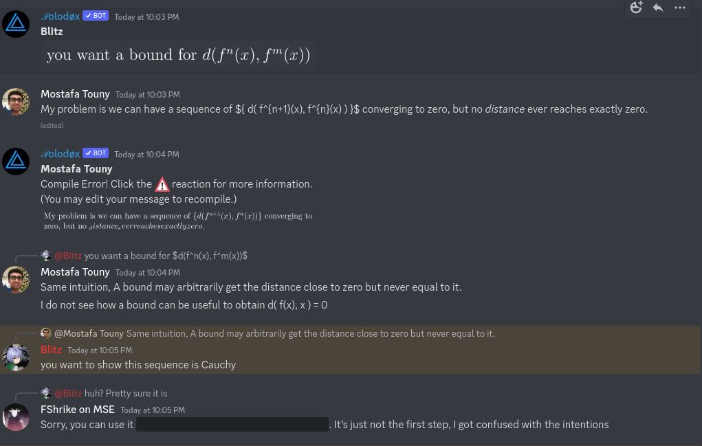

## Problem. 1

**Lemma.** If $x_{n+1} \leq \lambda x_n$, where $0 \leq \lambda < 1$,
Then the sequence $\{x_n\}$ gets artbitrarily small.

Clearly $x_{1+k} \leq \lambda^k x_1$, by substituting successive terms
in the inequality. Given $\epsilon > 0$ we can reach
$\lambda^k x \leq \epsilon$ by setting $k \geq \log_\lambda y/x$.

Fix any x in the metric space, Then construct the following sequence:
$\{f^n(x)\} = f^0(x), f^1(x), f^2(x), \dots$. We prove it is cauchy.
Consider $d(f^n(x),f^m(x))$ of some tail where $n < m$. By the
*triangular inequality*, We know the distance is upper-bounded by
$d(f^n(x),f^{n+1}(x)) + d(f^{n+1}(x),f^{n+2}(x)) + \dots + d(f^{m-1}(x),f^m(x)) \leq (m-n+1) \; \lambda^{n-1} \; d(f^1(x),f^2(x))$.
By *Lemma 1* and substituting distances by a sequence $\{x_n\}$ our
intended result is concluded.

Given $X$ is *complete* we know our sequence $\{f^n(x)\}$ converges.
Call it $q$. We show it converges also to $f(q)$, and by the uniqueness
of limits, The main theorem of $f(x) = x$ for some $x$ is concluded.
Observe $d(f^{n+1}(x),f(q)) \leq d(f^n(x),q)$, but the right hand side
of the inequality is arbitrarily small.

**Note.** This problem was solved with assistance by wonderful friends.
The main key idea of using the uniqueness of limits was given by them.
See the following chat:

## Problem. 2

Suppose $(x_k)$ converges to $q$. Let $\epsilon > 0$ be arbitrary. We
already have $N_0$ where for any $k \geq N_0$ $x_k - q < \epsilon$. For
a given permuted sequence $(x_{g(k)})$, We now show there's $N_1$ where
for any $n \geq N_1$, $x'_{n} - q < \epsilon$.

Observe $x_1, \dots, x_{N_0-1}$ are finite. Consider indices
$g(1), \dots, g(N_0-1)$ and take the maximum. Call it $g_{max}(N_0-1)$.
Clearly for any index $i$ greater than it, we know $x_i'$ is not equal
to any one of $x_1, \dots, x_{N_0-1}$. So it is contained in the trail
$x_{N_0}, x_{N_0+1}, \dots$. Thus, $x_i' - q < \epsilon$ for any
$i > g_{max}(N_0-1)$.

It is not true if we dropped the assumption that $g$ is one-to-one. A
counter example is a permutation function whose range is exactly one
element of $\mathcal{N}$.

## Problem. 3

The is exactly the same as theorem 3.4 in Rudin's page 50.

## Problem. 4

**Lemma.** $v_p( p^k + p^{ k+1 } + \dots + p^{ k+m } ) = k$.

Observe
$p^k + p^{ k+1 } + \dots + p^{ k+m } = p^k ( 1 + p^1 + \dots + p^m )$.
Moreover $p \nmid ( 1 + p^1 + \dots + p^m )$ as
$p \mid ( p^1 + \dots + p^m )$. It holds if $m = 0$.

**Theorem.** $( x_i ) = \sum_{ j=0 }^i p^i$ is a cauchy sequence.

Let $\epsilon > 0$ be arbitrary. By the Archimedean property
$\exists N, 1/N < \epsilon$. Set $H_\epsilon = N$ and
$n,m \geq H_\epsilon$.

if $n = m$, then $d( x_n, x_m ) = 0 \leq \epsilon$.

WLOG assume $n > m$. It follows
$$
\begin{aligned}
    d( x_n, x_m ) &= \left |\sum_{ j=0 }^n p^j - \sum_{ j=0 }^m p^j \right |_p = \left |\sum_{ i=m+1 }^n p^i \right |_p \\
    v_p \left ( \sum_{ j=m+1 }^n p^j \right ) &= v_p ( p^{ m+1 } + p^{ m+2 } + \dots + p^{ n } ) = m+1
\end{aligned}
$$
Hence $d( x_n, x_m ) = p^{ -( m+1 ) } \leq \frac{\displaystyle{1}}{\displaystyle{m+1}} \leq \frac{\displaystyle{1}}{\displaystyle{N}} < \epsilon$,
for all $n,m \geq N$.

**Theorem.** Convergence when $p = 2$.

Observe $(x_i) = \sum_{j=0}^i 2^i = 2^{i+1} - 1$, $\forall i \geq 0$.

Then
$d(x_i, -1) = d(2^{i+1} - 1, -1) = |2^{i+1} - 1 - (-1)|_2 = |2^{i+1}|_2 = 2^{-(i+1)}$.

Now as $i \rightarrow \infty$, $d(2^{i+1} - 1, -1) \rightarrow 0$, i.e
$\lim_{ i \rightarrow \infty } 2^{ i+1 } - 1 = -1$.

A more careful proof. set $\epsilon > 0$, then by the Archimedean
property $\exists N, 1/N < \epsilon$. Set $H_\epsilon = N$. Then for
$i \geq H_\epsilon$, $2^{ -( i+1 ) } \leq 1/N \leq \epsilon$.
