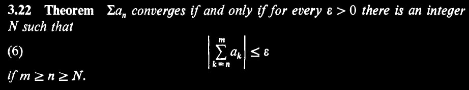

## Problem. 1 {#problem.-1 .unnumbered}

By boundedness we get $|f(x)| \leq M_f$ and $|g(x)| \leq M_g$. Clearly there is $N_g$ such that for $n \geq N_g$, $|g_n(x)| \leq M_g + \epsilon_g$.

Let $\epsilon > 0$ be arbitrary. Define $\epsilon_0 = \frac{\displaystyle{\epsilon}}{\displaystyle{2(M_g + \epsilon_g)}}$ and $\epsilon_1 = \frac{\displaystyle{\epsilon}}{\displaystyle{2(M_f)}}$.

By hypothesis we have can take $N_{max}$ considering also $N_g$ to get
\begin{aligned}
  |f_n(x) - f(x)| < +\epsilon_0 \\\\
  |g_n(x) - g(x)| < +\epsilon_1
\end{aligned}
By multiplication,
\begin{aligned}
  |f_n(x) g_n(x) - f(x) g_n(x)| < +\epsilon_0 \cdot |g_n(x)| \\\\
  |f(x) g_n(x) - f(x) g(x)| < +\epsilon_1 \cdot |f(x)|
\end{aligned}
Now observe:
\begin{aligned}
  |f_n(x) g_n(x) - f(x) g(x)| &= |f_n(x) g_n(x) - f(x) g_n(x) + f(x) g_n(x) - f(x)   g(x)| \\\\
  &\leq |f_n(x) g_n(x) - f(x) g_n(x)| + |f(x) g_n(x) - f(x)g(x)| \\\\
  &< \epsilon_0 |g_n(x)| + \epsilon_1 |f(x)| \\\\
  &\leq \epsilon_0 (M_g + \epsilon_g) + \epsilon_1 (M_f) \\\\
  &= \epsilon/2 + \epsilon/2 = \epsilon
\end{aligned}
The second line follows by triangular inequality.

## Problem. 2 {#problem.-2 .unnumbered}

**Lemma.** $\hat{f}$ is of the same class.

By definition, The domain of $\hat{f}$ is the same as $f$. Clearly $\hat{f}(0) = \frac{\displaystyle{1}}{\displaystyle{4}} f(2 \cdot 0) = \frac{\displaystyle{1}}{\displaystyle{4}} f(0) = \frac{\displaystyle{1}}{\displaystyle{4}} (0) = 0$ and $\hat{f}(1) = \frac{\displaystyle{3}}{\displaystyle{4}} f(2 \cdot 1 - 1) + \frac{\displaystyle{1}}{\displaystyle{4}} = \frac{\displaystyle{3}}{\displaystyle{4}} f(1) +\frac{\displaystyle{1}}{\displaystyle{4}} =          \frac{\displaystyle{3}}{\displaystyle{4}} (1) + \frac{\displaystyle{1}}{\displaystyle{4}} = 1$.

The continuity of $\hat{f}$ follows by the continuity of $f$. Consider arbitrary $\hat{f}(q)$ and $\epsilon > 0$. Consider the case of $\hat{f}(q) = \frac{\displaystyle{3}}{\displaystyle{4}} f(2q-1) + \frac{\displaystyle{1}}{\displaystyle{4}}$ and note the other case is symmetric. Take $\grave{\epsilon} = \frac{\displaystyle{4}}{\displaystyle{3}} \epsilon$. By continuity of $f$, There exists $\delta$ such that for any $r$, if $| r - p | < \delta$ then $| f(r) - f(p) | < \grave{\epsilon}$. Define $\grave{\delta} = \frac{\displaystyle{\delta}}{\displaystyle{2}}$, and observe for any $r$:
\begin{aligned}
    \text{If  }       & | r - q | < \grave{\delta} = \frac{\displaystyle{\delta}}{\displaystyle{2}} \\\\
    \text{Then  }     & | (2r+1) - (2q+1) | < \delta \\\\
    \text{By Continuity  }    & | f(2r+1) - f(2q+1) | < \grave{\epsilon} = \frac{\displaystyle{4}}{\displaystyle{3}} \epsilon \\\\
    \text{Then  }     & | (\frac{\displaystyle{3}}{\displaystyle{4}} f(2r+1) + \frac{\displaystyle{1}}{\displaystyle{4}}) -                         (\frac{\displaystyle{3}}{\displaystyle{4}} f(2q+1) + \frac{\displaystyle{1}}{\displaystyle{4}}) | < \epsilon \\\\
    \text{By definition  }    & | \hat{f}(r) - \hat{f}(q) | < \epsilon
\end{aligned}

## Problem. 3 {#problem.-3 .unnumbered}

We use the following theorem found in Rudin's book in page 59.

Fix $x \in [a,b]$. The theorem follows by the following lemmas
- \(i\) $\sum_{k=n}^m f_k(x) \geq 0$ for odd $n$.
- \(ii\) $\sum_{k=n}^m f_k(x) \leq 0$ for even $n$.
- \(iii\) Given $f_n(x) = +M$ for odd $n$ and non-negative $M$, $\sum_{k=n}^m f_n(x) \leq M$.
- \(iv\) Given $f_n(x) = -M$ for even $n$ and non-negative $M$, $\sum_{k=n}^m f_n(x) \geq -M$.

**Proof.**

(i). Follows by a strong form of induction. Observe for odd $n$, $|f_n(x)| \geq |f_{n+1}(x)|$ yields $f_n(x) + f_{n+1} \geq 0$. The induction step is to show $\sum_{k=n}^{m+2} f_k(x) \geq 0$ given $\sum_{k=n}^{m} f_k(x) \geq 0$ and $\sum_{k=n}^{m+1} f_k(x) \geq 0$.

(ii). Symmetric to (i).

\(iii\) Expand to $f_n(x) + \sum_{k=n+1}^m f_k(x)$, Then it follows immediately by (ii)

(iv). Symmetric to (iii).

**Theorem.** These lemmas conclude, Given $f_n(x) = M$ regardless $n$ is even or odd, $|\sum_{k=n}^m f_k(x)| \leq |M|$. But we are given $f_n(x)$ converges to 0, So we can substitute $M$ by any $\epsilon > 0$.
