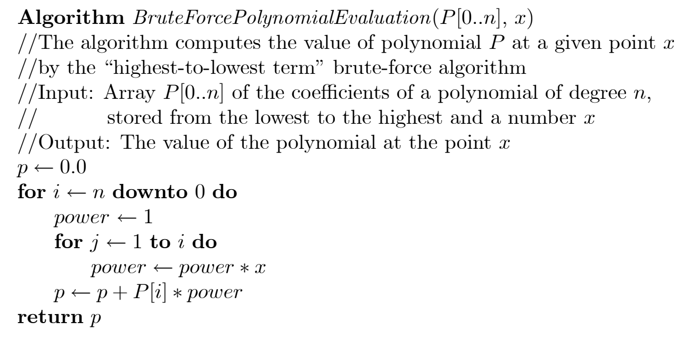
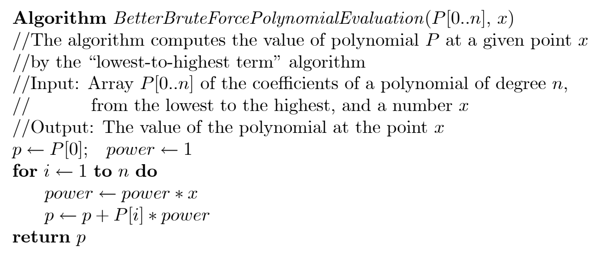

$\newcommand{\nfrac}[2]{\frac{\displaystyle{#1}}{\displaystyle{#2}}}$

## Exercises {#exercises .unnumbered}

### 3.1.4 {#section .unnumbered}

*Hints*
- Observe we can derive $x^i$ from $x^{i-1}$, so we don't need to recompute

*Solution*

Same as manual:





### 3.1.14 {#section-1 .unnumbered}

**Homework**

### 3.2.8 {#section-2 .unnumbered}

*Hints*
- Following the definition, If you knew $S[i] = A$, and $S[j] = S[z] = B$ for $j,z > i$, What can you infer?
- Utilize that observation in algorithm design.
- Consider a flag which stores whether character $A$ is read.
- Generalize for a variable that counts how many $A$ was read.

*Solution*

**(a)**
```
    def count_substrings_starting_with_a_ending_with_b(S[0..n-1]):
      count = 0

      for i in 0..n-2
          if S[i] == A
              for j in i+1..n-1
                  if S[j] == B
                      count = count + 1

      return count
```

The number of basic operations is upperbounded by $\sum_{i=0}^{n-2} \sum_{j=i+1}^{n-1} 1 = \mathcal{O}(n^2)$.

**(b)**

```
    def count_substrings_starting_with_a_ending_with_b(S[0..n-1]):
      count_a = 0  # Count of 'A' characters encountered so far
      count_ab = 0  # Count of substrings starting with 'A' and ending with 'B'

      for i in 0..n-2:
          if S[i] == A
              count_a = count_a + 1
          else if S[i] == B
              count_ab = count_ab + count_a

      return count_ab
```

$\sum_{i=0}^{n-2} 1 = \Theta(n)$. Observe count of basic operations is exactly 1 per iteration.

### 3.2.9 {#section-3 .unnumbered}

**Homework**

### 3.3.3 {#section-4 .unnumbered}

**Homework**

### 3.3.9 {#section-5 .unnumbered}

*Hints*
- Think of a unique property about extreme points, in terms of coordinates.
- What can you conclude about the point of maximum $x$ or $y$ coordinates?

*Solution*
```
    # input: array of points, each point is a tuple of x and y coordinates
    # output: a list of exactly two extreme points
    def find_extreme_points(P[0..n]) # given n >= 2

      # Initialize extreme points with the first point in the set
      min_x_point, min_y_point = P[0]
      max_x_point, max_y_point = P[0]

      # Iterate through the remaining points
      for i in P[1..n]
          x, y = i

          # Update max_x_point and max_y_point if needed
          if x > max_x_point:
              max_x_point = x
              max_y_point = y
          else if x == max_x_point and y > max_y_point:
              max_y_point = y

          # Update min_x_point and min_y_point if needed
          if x < min_x_point:
              min_x_point = x
              min_y_point = y
          else if x == min_x_point and y < min_y_point:
              min_y_point = y

      return [(min_x_point, min_y_point), (max_x_point, max_y_point)]
```

### 3.4.6 {#section-6 .unnumbered}

We assume the problem would always have a solution. We leave it as an exercise for students to detect the case of the non-existince of any solution.

*Hints*
- What can you conclude about the total sum of the whole set, given we have a partition of two subsets, each of total sum $p$?
- If we selected a subset whose sum is $k$, How do we compute the total sum of the remaining elements?
- Consider the special case of finding a single subset whose total sum is $p$.
- Design your algorithm to only rely upon searching through the domain of subsets.

*Solution*

There is an elegant generator based on binary numbers. Since this is not the core focus of the question, We show an easier to understand code by recursion.

```
    def generate_subsets(A[0..n-1]):
      if n == 0:
          return [ [] ]

      # Generate subsets without the last element
      subsets_without_last = generate_subsets( A[0..n-2] )

      # Add the last element to each subset in subsets_without_last
      subsets_with_last = [ subset + [A[n-1]] for subset in subsets_without_last ]

      # Concatenate subsets with and without the last element
      return subsets_without_last + subsets_with_last
```

### 3.4.9 {#section-7 .unnumbered}

**Homework.**

### 3.5.7 {#section-8 .unnumbered}

**Homework**

### 3.5.8 {#section-9 .unnumbered}

*Hints*
-   The hinted picture of 2-colorable might be more useful.
-   Try to construct a 2-colorable labeling on given graphs. Observe by symmetry you can start anywhere and with any colour.
-   What if a vertex must be coloured with two different colours from two different vertices? Can we conclude colouring impossibility?

*Solution*

**(a)**

modify $dfs$ function in page 124 to maintain a two colours switching for each level, rather than $count$.

```
    def switchColour(input_colour)
      if input_colour is white
        return black
      if input_colour is black
        return white

    def dfs(v, current_colour)
      if v.colour == NULL
        v.colour = current_colour
      else
        return v.colour == current_colour

      for each vertex w in V adjacent to v
        if not dfs( w, switchColour(current_colour) )
          return False
      
      return True
```

**(b)**

modify $bfs$ to maintain the depth alongside the vertex in the queue, and then colour according to whether the depth is even or odd.

```
    def colourByDepth(depth_input)
      if depth_input is even
        return white
      if depth_input is odd
        return black

    def bfs(v)
      set v.depth = 0
      v.colour = colourByDepth(v.depth)
      initialize a queue with v
      
      while the queue is not empty do
        for each vertex w in V adjacent to the front vertex f
          if w.colour == NULL
            w.depth = f.depth + 1
            w.colour = colourByDepth(w.depth)
            add w to the queue
          else
            if w.colour != colourByDepth(f.depth+1)
              return False

        remove the front vertex from the queue

      return True
```
