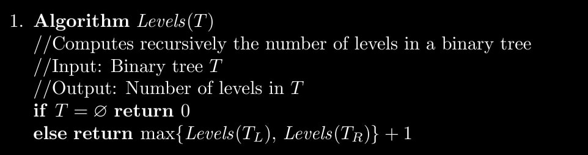
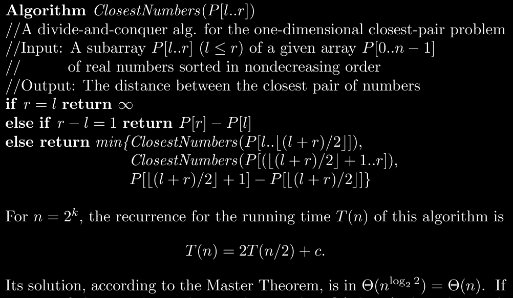

$\newcommand{\nfrac}[2]{\frac{\displaystyle{#1}}{\displaystyle{#2}}}$

## Exercises {#exercises .unnumbered}

### 5.1.3 {#section .unnumbered}

*Hints*
- you can use floors and ceils as subroutines.

*Solution*

**(a)**
```
    def divConqPower(a,n)
      if n = 1
        return a
      return divConqPower(a, floor(n/2)) * divConqPower(a, ceil(n/2))
```

**(b)**

Time of basic operations $T(n)$ are $T(n) = T( \lfloor n/2 \rfloor ) + T( \lceil n/2 \rceil) + 1$. Assuming $n = 2^k$, We get $T(n) = 2T(n/2) + 1$. By master theorem,
$T(n) = \Theta(n)$.

For general cases of $n$, Observe $n = 2^{\log n} \leq 2^{\lceil \log n \rceil}$, So by master theorem $T(n) \leq \mathcal{O}(2^{\lceil \log n \rceil}) \leq \mathcal{O}(2^{\log n + 1}) = \mathcal{O}(n)$. Similarly $T(n) \geq \Omega(2^{\lfloor \log n \rfloor}) = \Omega(n)$. That concludes $T(n) = \Theta(n)$ for any $n$.

Complexity proof by substitution. Recurrence is
\begin{aligned}
    T(1) &= 0 \\\\
    T(n) &= 2T(n/2) + 1
\end{aligned}
It follows
\begin{aligned}
    T(n) &= 2T(n/2) + 1 \\\\
         &= 2^2 T(n/2^2) + 2^1 + 2^0 \\\\
         &= 2^3 T(n/2^3) + 2^2 + 2^1 + 2^0 \\\\
         &= 2^k T(n/2^k) + 2^{k-1} + \dots + 2^0 \\\\
         &= 2^{\log n} T(n/2^{\log n}) + 2^{(\log n) - 1} + \dots + 2^0 \\\\
         &= 2^{\log n} T(1) + 2^{(\log n) - 1} + \dots + 2^0 \\\\
         &= 2^{(\log n) - 1} + \dots + 2^0 \\\\
         &= 2^{\log n } - 1 = n - 1 = \Theta(n)
\end{aligned}

P.S. Generally speaking we can ignore floors and ceilings in asymptotic notation (see page 885 in MIT's Math for CS).

**(c). Homework**

### 5.1.10 {#section-1 .unnumbered}

**Homework**

### 5.2.8 {#section-2 .unnumbered}

**Homework** Consider pivot to be zero.

### 5.2.9 {#section-3 .unnumbered}

**Homework**

### 5.3.1 {#section-4 .unnumbered}

*Hints*
- Recall in a binary tree, a node has at most two leaves. Apply the strategy on them
- Given the height of subtrees, What can you conclude about height of the main tree?
- What is subtrees have different heights?

*Solution*

Same as solution manual:



Analysis. We know each node is going to count 1 operation. If we assumed total number of nodes to be $n$, then $T(n) = \Theta(n)$. If we assumed like the book the total number of internal nodes to be $n$ and leaves to be $x$, then $x + n = 2n$, so $T(n) = \Theta(n)$.

P.S. The book considers checking whether tree is empty to be the basic operation. My intuition tells me it is the max operation.

### 5.3.2 {#section-5 .unnumbered}

*Hints*
-   Consider the problem size to be level of a node, not number of nodes.
-   Consider the base case as the tree being a single node (leaf).
-   Assume you can query the tree's root, and its children.
-   Recall a binary tree has at most two children for each node. Given counts of both, what can we conclude?

*Solution*

Commentary on the given algorithm in the question. It is flawed. Given the solution of an empty tree, we reach a flawed claim about the tree of size 1 node. Remarkably we shouldn't consider problem size to be the number of nodes, but rather the height.

Correct algorithms:
```
    # input: tree T with access to its root
    # output: count of leaves
    def leafCounter (Tree T)
      # base case: the tree is empty
      if T is empty
        return 0

      # base case: the tree is a leaf node
      if T.root.children == []
        return 1
      
      # recursive step
      return leafCounter(T_left) + leafCounter(T_right)
```

Analysis. We count one summation operation for each non-leaf node. Following the notation given in the book, $n$ as number of non-leaf nodes and $x$ as leaves, We get $T(n) = n$.

Alternatively we can consider $n$ to be total number of nodes. But we know $n = 2i+1$ where $i$ is number of non-leaf nodes. So $T(n) \approx n/2 = \Theta(n)$.

### 5.4.3 {#section-6 .unnumbered}

**Homework** Proving exponent rules is not germane to the course.

### 5.4.8 {#section-7 .unnumbered}

**Homework** Uses geometric series.

### 5.5.1 {#section-8 .unnumbered}

*Hints*
-   Among pairs of right and left subsets, What are the least-distance ones?
-   Use the given sorted property to deduce the least-distance pair.

*Solution*

Like the solution manual.



### 5.5.9 {#section-9 .unnumbered}

**Homework**
