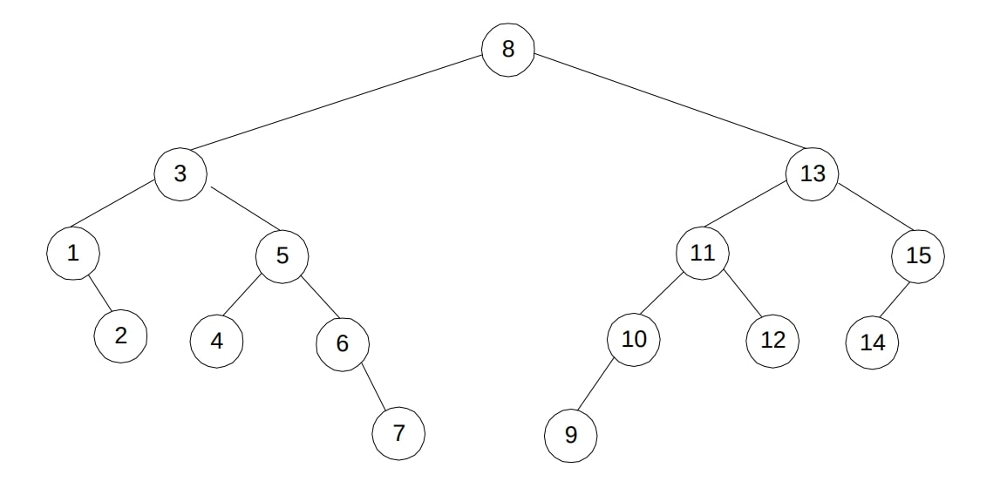

$\newcommand{\nfrac}[2]{\frac{\displaystyle{#1}}{\displaystyle{#2}}}$

## Exercises {#exercises .unnumbered}

### 6.1.1 {#section .unnumbered}

**(a).**

*Hints*
- Sort the array as a preprocessing step.
- Given a sorted array, and an adjacent pair $A[i],A[i+1]$, Could the distance between $A[i]$ and $A[j]$ where $j > i+1$, be strictly less?
- Use that to design your algorithm.

*Solution*
```
    # input: Array of integers
    # output: minimum distance between any pairs
    def ClosestDistance(A[0..n-1])

        # Transformation: Sort the array
        A.sort()

        # Initialize minimum distance to | A[0] - A[1] |
        minDistance = abs( A[0] - A[1] )

        # Iterate and compute the distance between adjacent elements
        for i in 1..n-1:
            currentDistance = | arr[i] - arr[i + 1] )

            # Update the minimum distance if the current distance is smaller
            if currentDistance < minDistance:
                minDistance = currentDistance

        # Return the minimum distance
        return minDistance
```

**(b). Homework**.

### 6.1.2 {#section-1 .unnumbered}

**Homework**.

### 6.2.4 {#section-2 .unnumbered}

We ask students whether $\Theta(n^3) - \Theta(n^3) + \Theta(n^3) = \Theta(n^3)$.

*Hints*
- Try to given a counter example where coefficients cancel each other.

*Solution*

We show it is not true in general true by the counter example $T_1(n) = n^3$, $T_2(n) = 2 n^3$, and $T_3(n) = n^3$.

Analysis of the algorithm is left as a **homework**.

### 6.2.5 {#section-3 .unnumbered}

**Homework**.

### 6.3.5 {#section-4 .unnumbered}

**(a)**

*Hints*
-   The idea is similar to binary search tree

*Solution*
```
    # input: non-empty graph, by its root
    # output: smallest element
    def find_smallestKey(root):
        node = root

        while node.left is not None
            current = current.left

        return current.key

    # input: non-empty graph, by its root
    # output: largest element
    def find_largestKey(root):
        node = root

        while node.right is not None:
            node = node.right

        return current.key

    # input: non-empty graph, by its root
    # output: difference between largest and smallest elements
    def range(root)
        return find_largestKey(root) - find_smallestKey(root)
```

Complexity is $2 \log n = \Theta( \log n )$

**(b)**

*Hints*
- For the largest, Note we can step down on left children. Similarly for the smallest, we can step down on right children.

*Solution*

False. Counter example from the solution manual.



### 6.3.9 {#section-5 .unnumbered}

*Hints*
- Very similar to binary search tree

*Solution*

Like the previous previous exercise we traverse left-most and right-most nodes. The difference is we consider left key and right key of these nodes, respectively.

```
    def range(root)
        leftMost = find_leftMostNode(root)
        rightMost = find_rightMostNode(root)

        return rightMost.rightKey - leftMost.leftKey
```

### 6.4.2 {#section-6 .unnumbered}

**Homework.**

### 6.4.5 {#section-7 .unnumbered}

Students will be given the following subroutines.

```
    # input: heap as an array, node by its index
    # output: None. Given heap is modified in-place
    def siftUp(heap, index):

        # cannot sift-up root node
        while index > 0:

            # parent of the node
            parentIndex = (index - 1) // 2
          
            # parental dominance is satisfied
            if heap[index] <= heap[parentIndex]
                break

            # if not satisfied, swap with parent
            swap(heap[index], heap[parentIndex])

            # set the cursor to the parent, and repeat
            index = parentIndex

    # input: heap as an array, node by its index
    # output: None. Given heap is modified in-place
    def siftDown(heap, index):

        # Children indices
        leftChild_index = (2 * index) + 1
        rightChild_index = (2 * index) + 2


        # Find the largest out of index, leftChild_index, and rightChild_index

        # Initially set
        largest = index

        # Check if the left child exists. if larger, update largest
        if leftChild_index < len(heap) and heap[leftChild_index] > heap[largest]
            largest = leftChild_index

        # Check if the right child exists. if larger, update largest
        if rightChild_index < len(heap) and heap[rightChild_index] > heap[largest]:
            largest = rightChild_index


        # If the largest element is one of the children.
        if largest != index:

            # swap the child with parent
            swap( heap[index], heap[largest] )

            # recursively heapify the smaller tree
            siftDown(heap, largest)


        # parental dominance is satisfied here, whether recursion is called or not, so we are done
        return
```

**(a). Homework**.

*Hints*
- The approach is very similar to _Maximum Key Deletion_ in Levitin.

Hint. Same logic of _b_ but notably restrict search of the min element on leaves, $H[ \lfloor n/2 \rfloor + 1 ], \dots H[n]$. Also since the minimum is in leaves, we will only call \verb#siftUp#.

```
  def delMin(heap H)
    # find the minimum node's index in leaves
    minElIndex = min(H[n/2 .. n])

    # swap the minimum with last node
    swapWithLast(minElIndex)

    # remove the last node
    removeLast()

    # sift-up the node in the index, previously containing the minimum
    siftUp(minElIndex )
```


**(b).**

*Hints*
- Use the element removal subroutine, given in the book. Call it `removeLast`.
- Use the swap with last indexed node trick, given in the book. Call it `swapWithLast`.

*Solution*
```
def findElementIndex(heap, target)
    for each element i of heap
        if i == target
            return i.index

def removeIndexNode(heap, index)

    # swap the indexed node with the last node
    swapWithLast(heap, index)

    # remove the last node
    removeLast(heap)

    # One of them must terminate in constant time
    siftDown(heap, index) # swapping downwards
    siftUp(heap, index) # swapping upwards

def removeElementNode(heap, target)

    # get the index of target by a linear scan
    index = findElementIndex(heap, target)

    # remove the element at found index
    removeIndexNode(heap, index)
```

It is easy to verify, that one of `siftDown` and `siftUp` must terminate in $\mathcal{O}(1)$, given the structure properties of the heap.

Complexity is $\mathcal{O}(n) + \mathcal{O}(1) + \mathcal{O}(1) + \mathcal{O}(\log n) = \mathcal{O}(n)$, respectively, of `findElementIndex` and `removeIndexNode`.


### 6.5.1 {#section-8 .unnumbered}

**Homework**.

### 6.5.9 {#section-9 .unnumbered}

We ask students how to compute the binary representation of a given number n.

```
    def binaryRepresentation(n)
      
        # list storing binary representation
        # b[i] corresponds to ith digit
        binRep = []

        # by definition we know left-most digit is not 0
        # n becomes 0, only when last digit is computed
        while n != 0
          # fetch right-most digit
          b = n mod 2
          # eliminate right-most digit
          n = floor( n/2 )

          binRep.append(b)

        return binRep
```

Finally we hint to them, algorithm `RightToLeftBinaryExponentiation` in page 238 can be modified, so that it does not require list b(n) as an input.

### 6.6.5 {#section-10 .unnumbered}

**Homework**.

### 6.6.6 {#section-11 .unnumbered}

**Homework**.

### 6.6.+ {#section-12 .unnumbered}

You are given an array of positive integers. Find the maximum element but without using > operator.

*Hints*
- Think of a related algorithm that uses < operator
- Is the knowledge of minimum element useful in anyway?
- What if we transformed all elements to their negation?

*Solution*
```
    def negationOfArray(A[0..n-1])
        for i in 0..n-1
            A[i] = -(A[i])

    def minElement(A[0..n-1])
        minElement = A[0]
        
        for i in 1..n-1
            if A[i] < minElement
                minElement = A[i]

        return minElement

    def maxElementByReduction(A[0..n-1])
        # transform
        negationOfArray(A)

        # conquer
        min = minElement(A)

        # solve the main problem
        return -(min)
```
