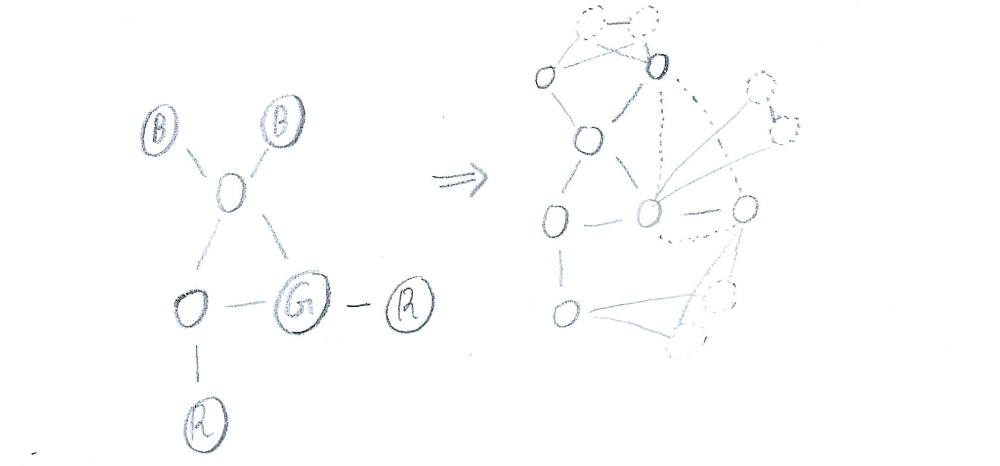

## Ex. 1 

Here is a very illustrative example.

The procedure of encoding *3COL-UNARY* to *3COL* is as:
-   \(i\) For each group of nodes labeled with some colour *x*, create
    two additional connected nodes *x1* and *x2*, and connect each node
    coloured *x* to both of them.
-   \(ii\) For each two distinct groups of colours *x* and *y*, connect
    some node from *x* with some node from *y*.

When encoded input is run on *3COL*,
-   Procedure (i) ensures all nodes coloured *x* will have the same
    colour, even if that colour is not exactly *x*.
-   Procedure (ii) ensures groups of labeled nodes will have different
    colours.

Notably the colours outputted by *3COL* may not match the given original
labeled colours. Since colours are symmetric, i.e can be exchanged
without tampering any required condition, an encoded graph $f(w)$ is
accepted by *3COL* if and only if graph $w$ is accepted by *3COL-UNARY*.

## Ex. 2

The goal is to show any language in NP can be polynomially reduced to
*IMPLICIT-4COL*. The exponentiality of number of vertices of graph $G_C$
is the central key of testing all possible certificates and in turn
determining whether a given *w* belongs to *L* language.

By cook-levin we know any NP language can be encoded in terms of SAT,
and hence we can construct a corresponding circuit. Since the circuit's
input is of length 2n, we can think of it as partitioned into two
n-length inputs. The first one is problem's input (like a graph) and the
second is a potential certificate (like a graph-route). The circuit
evaluates whether a given input along some literals assignments
(cirtificate) yields true (satisfiable).

We assume any language input is prefixed with 0, and any certificate
input is prefixed with 1. If the circuit is given an invalid encoding it
immediately outputs *FALSE*. In other words, If a circuit accepts some
input pair, we are ensured the first one indicates a language input and
the second indicates a possible certificate.

Now we can think of graph $G_C$ as being partitioned into two groups;
One for language inputs and the other for all possible certificates. If
a vertix prefixed with 0 is connected to a vertix prefixed with 1, we
can immediately conclude the language input is satisfiable, and
otherwise it is unsatisfiable.

Given any language $L$ we can construct a corresponding $C$, and by
*IMPLICIT-4COL* a corresponding $G_C$. For any input $w$ which we wish
to check whether it belongs to $L$, We can see whether its encoded
vertex in $G_C$ is connected to any other vertex.

## Ex. 3

**Notation.**
-   NAE-Constraint: $N_i = (x_1, x_2, x_3)$
-   $XOR(x_i, x_j) = (x_i \vee x_j) \wedge (\neg x_i \vee \neg x_j)$
-   $GXOR(x_i, x_j, x_k) = XOR(x_i, x_j) \wedge XOR(x_i, x_k) \wedge XOR(x_j, x_k)$

Recall an $XOR$ means exactly one of two literals is true

**Lemma.**   $GXOR$ is unsatisfiable.\
Observe each two $XORs$ intersect a literal $x_i$. So either:
-   $x_i$ is *False*, and $x_j$ and $x_k$ are both *True*. Or
-   $x_i$ is *True*, and $x_j$ and $x_k$ are both *False*

But that contradicts the third $XOR$ stipulating exactly one of $x_j$
and $x_k$ is *True*.

**Lemma.**   5 clauses of $GXOR$ are satisfiable.\
Following the same line of reasoning of the previous lemma, It's clear
by ignoring some clause of the 6 clauses of $GXOR$, we can have $x_j$
and $x_k$ both assigned to the same boolean value.

**Lemma.**   Equivalence of NAE constraint and 5 clauses of $GXOR$.\
It is clear from the previous discussion that satisfying any 5 clauses
of $GXOR$ is equivalent to satisfying an NAE constraint. Clearly,
*Not-All-Equal* constraint is exactly the same as either two literals
are *True* and one is *False*, or two literals are *False* and one is
*True*.

**Theorem.**   An *NAE-3SAT:* $N_1, N_2, \dots, N_r$ is equivalent to
corresponding *MAX-2SAT:* $GXOR_1, GXOR_2, \dots, GXOR_r$ with at least
$5r$ clauses to be satisfied.\
\
If *MAX-2SAT* is going to satisfy exactly 5 clauses of each $GXOR_i$,
Then we are guaranteed of satisfying all $N_i$. In fact, This is the
only feasible distribution of satisfied clauses. Otherwise all 6 clauses
of some $GXOR_i$ must be satisfied, contradicting *Lemma 2*.

On the other hand, It's clear if a given *NAE-3SAT* instance is
satisfiable, then so is the corresponding *MAX-2SAT*.

## Ex. 4

"not confident of the solution"

### a

As mentioned by the instructor we follow the verifier-based definition
of NP. Our goal is to show $$\begin{aligned}
<M, x, 1^w, 1^t> \in TS \leftrightarrow \exists u \, s.t \, S(<M, x, 1^w, 1^t>, u)   \, \text{certifies} \, <M, x, 1^w, 1^t> \in TS\end{aligned}$$

By $S$ we mean an algorithm which simulates $M$ on $(x, u)$, untill it
accepts on $t$ steps.

The definition trivially concludes our intended goal. Note if
$<M, x, 1^w, 1^t> \, \not\in \, TS$ then obviously there's no any
certificate $u$, such that any $M$ computes $(x, u)$ in time bounded by
$t$.

