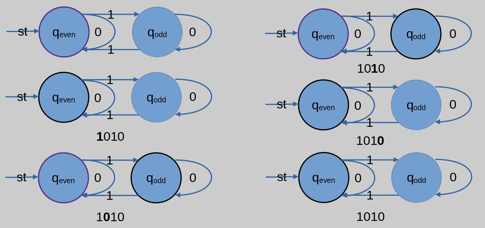
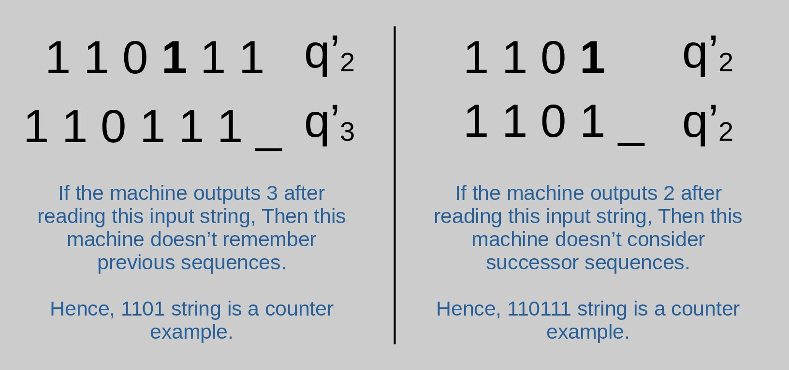
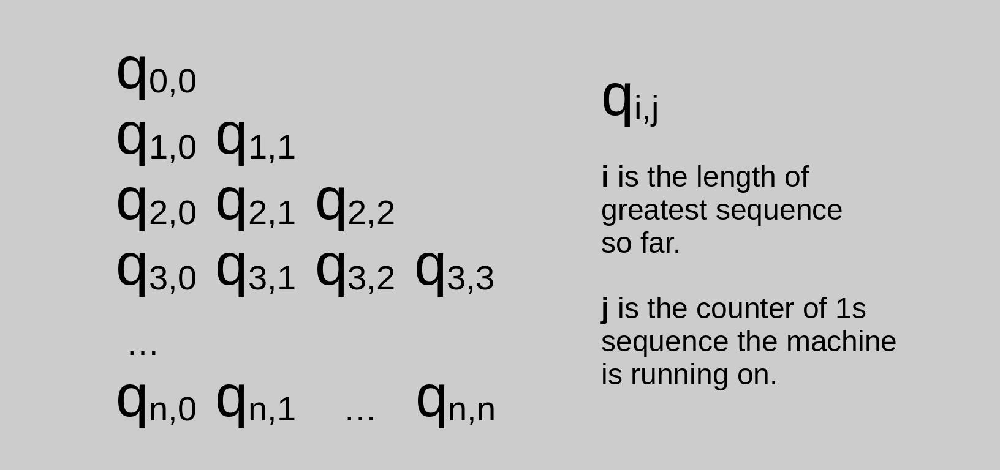
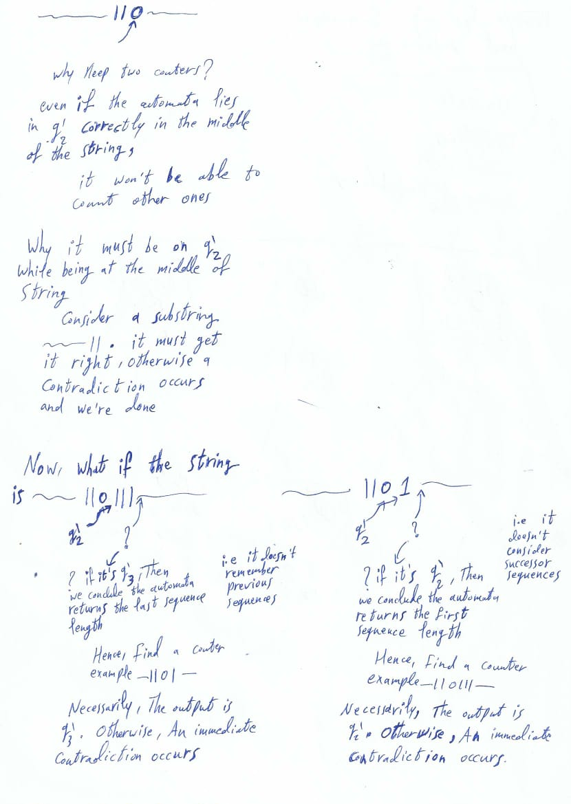
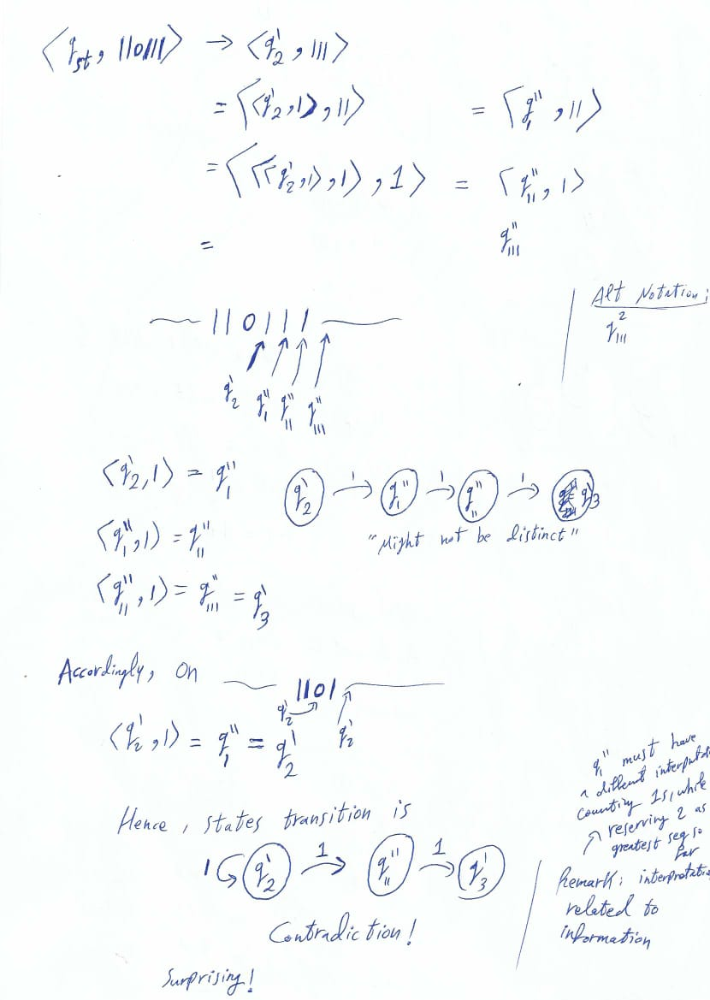

## Overview
In this post we contrive a new kind of Automata, Then prove a space lower-bound on it, for a contrived problem. We begin with an example which shall motivate our whole approach, Then we imagine a thought experiment which is the basis of the proof, Finally we present the formal proof itself. The most beautiful moment I have felt while working on this problem was when a pure deductive reasoning yielded a reasonable approach, which in turn yielded a logic-based established truth. This is why I wrote a separate section called _Thought Experiment_. In addition, We strongly recommend the reader not to miss $appendix, fun facts$ section.
___

## Table of Contents
- [Overview](#overview)
- [Motivating Example](#motivating-example)
    - [Usual DFA](#usual-dfa)
    - [A New Definition For A New Problem](#a-new-definition-for-a-new-problem)
    - [First Remark On Solving The New Problem](#first-remark-on-solving-the-new-problem)
- [Thought Experiment](#thought-experiment)
    - [Information-reserving Definition?](#information-reserving-definition)
    - [Surprise Moment](#surprise-moment)
    - [Interpreting Derived Proof](#interpreting-derived-proof)
- [Informal Proof](#informal-proof)
- [Formal Proof](#formal-proof)
    - [Definitions](#definitions)
    - [Proof](#proof)
- [References](#references)
- [Appendix](#appendix)
    - [Fun Facts](#fun-facts)
    - [Paper Notes of Surprise Moment](#paper-notes-of-surprise-moment)
___

## Motivating Example
### Usual DFA

The problem the above $\textit{deterministic finite automata}$ ($\textit{DFA})$ solves is finding whether the number of ones in the input binary string is even or odd. The $\textit{DFA}$ is defined in the usual straight-forward way.

### A New Definition For A New Problem
Now, Let's think of a different problem for the $\textit{DFA}$ which shall motivate a different definition. Namely, Finding the length of the longest 1-bit sequence. For instance, the string's 0111011 longest 1-bit sequence is 3. But the usual $\textit{DFA}$ outputs either $\textit{accept}$ or $\textit{reject}$, So how could it accommodate outputting a number? We tune its construction/definition as follows: We define a labeled set of states $\textit{F}$ such that if the machine halted on any of them, The output is the label of the state the machine halted on. In our case, We designate a labeled state for each possible longest-length solution.

For the above diagram of $\textit{usual DFA}$ section, We could ignore $q_{even}$ as an $\textit{acceptance state}$, and think of the labels $\textit{even}$ and $\textit{odd}$ as the output of the machine.

### First Remark On Solving The New Problem
Given $n$ is the length of the input string, An initial thought might be settling states $q_0, q_1, \dots, q_n$ where state $q_i$ transitions to $q_{i+1}$ if bit 1 is read, and stays the same if bit 0 is read.

Accordingly, On $w = 10110$, and after reading $10$ the machine is supposed to be at $q_1$ indicating it counted a sequence of length one. But what about counting the other ones? If the machine started counting again, It forgets the sequence of length one it counted before. If it reserved saving the first sequence length, and did not count other sequences, Then certainly the machine fails.

This discussion somehow suggests a state must reserve both the count of longest sequence length and the count of the sequence the machine is running on. This is the central key element our space lower-bound proof is based on.

## Thought Experiment

### Information-reserving Definition?
Personally, My first reaction was: If I proved a state must reserve two these informations, Then a $\Omega(n^2)$ lower-bound straight-forwardly follows. That as you need $n+1$ states for each possible 1-bit sequence length, and for each of these states, You need $n+1$ states for counting a sequence the machine is running on. So, $(n+1)(n+1)$ states are needed.

But how on earth I shall develop a definition of information reserving? No answer. Also, I did not explore $\textit{information theory}$ enough to figure a clue. At this point, I was skeptic whether the problem is going to solved at all.

Surprisingly for me, Eventhough I did not define $\textit{information-reserving}$, Via the intuition captured from it, I formulated a conjecture which worked at the end!

### Surprise Moment

We desginate two strings and conjecture a counter-example yielded from each of both. Namely, Either the machine fails to remember previous counted sequences length, or fails to consider new sequences.

For the sake of brevity and this post's proof readability, We omit the left string 110111. After reading the other string 1101, The machine must yield $q_{2}'$, An output state whose label indicates the automata's output is $2$, When the machine halts on it.

But on the input string 110, The machine outputs also $q_{2}'$. So on input 1101, after reading 110 and while the machine is pointing on last 1 bit, it is on state $q_{2}'$.

It is clear now before and after reading the last 1-bit of 1101, The machine is on state $q_{2}'$. As a result, We conclude the machine state's stays the same if it is on $q_{2}'$ and read 1. 

Now, on string 110111, It is very easy to prove the automata outputs $q_{2}'$ after reading it, and a contradiction occurs as the machine outputs the false answer!

### Interpreting Derived Proof
I must admit, For the proof I have just outlined, It was not intuitive for me why does it work! In this section, I try to interpret the proof in terms of the remark I mentioned before in $\textit{Information-reserving Definition?}$ section.

On input string 110, What the machine could learn is only the longest sequence of 1s is 2. As the machine halts on $q_{2}'$ upon reading it, We might like to think of the state's information content as indicating only the longest sequence of 1s is 2.

On input string 1101, The machine halts on $q_{2}'$. However, Reading this string should yield more information content than the one we specified and restricted $q_{2}'$ on. Namely, The $\textbf{last}$ counter of 1s sequence is one. As the machine ignores the information of counting 1s sequence it is running on, It failed!

## Informal Proof

We give informal proofs of concrete examples, Then we show how clear and easy is it to generalize them.

The approach is as follows: We show the existince of n+1 $q_{i,0}$ states. For each state, the label $i$ indicates output $i$ in case the machine halted on its corresponding state. We pick-up each state of those $q_{i,0}$, and prove the existince of more states. That is proved by picking-up a designated string, Then show a contradiction occurs in case we had a less number of states $q_{i,j}.$ Finally, We show those states' uniqueness.

On the following, We assume $M$ to be an arbitrary automata which solves longest 1s sequence problem.

### Notations
Special states $q_{i,j}$ also indicate output $i$ in case a machine halted on them, Even if $j \neq 0$. Also, For convenience, We just say $q_{i,j}$ outputs $i$. We say also machine $M$ output $q_{i,j}$ to mean it output $i$, halting on state $q_{i,j}$. We pinpoint configuration $w_0^*qw_1^*$ if the machine read string $w_0^*$ and is pointing at the first bit of $w_1^*$. if $w_1^*$ is null, Then implicitly the machine completed reading.

### n+1 $q_{i,0}$ States
Clearly, We need n+1 distinct states for each possible solution of longest sequence of 1s. Given an input string $\textit{w}$ of size $\textit{n}$, It is clear there are $\textit{n+1}$ possible solutions. Namely, $0, 1, \dots, n$. Exemplary strings include $0^n, 10^{n-1}, 110^{n-2}, \dots, 1^n$, respectively. So, the automata must include n+1 distinct labeled states, Covering all possible solutions. We call them $q_{0,0}, q_{1,0}, \dots, q_{n,0}$.

### State $q_{1,1}$
We already know there is a state $q_{1,0}$ which outputs $1$. Let's assume for the sake of contradiction there is no state other than $q_{1,0}$ which outputs $1$. Consider the string $1011$. Clearly the machine reaches configuration $\textbf{(1)}$ $101q_{1,0}1$. That is attributed to the fact $M$ must output $q_{1,0}$ on reading input string $101$, By definition of $M$. Note also $q_{1,0}$ is the only state which outputs $1$. A similar reasoning leads to configuration $\textbf{(2)}$ $10q_{1,0}11$. From $\textbf{(1)}$ and $\textbf{(2)}$ we conclude $\delta(q_{1,0}, 1) = q_{1,0}$. As a result, $M$ outputs $1$ on string $1011$, which in turn is a contradiction. It contradicts our assumption, or $M$'s definition, That it solves longest 1s sequence problem correctly. Hence, there is a state other than $q_{1,0}$ which outputs $1$. We call it $q_{1,1}$.

### State $q_{2,1}$
An exact reasoning to proof of state $q_{1,1}$, but on string $110111$, Concludes there is a state other than $q_{2,0}$ which outputs $1$. We call it $q_{2,1}$

### State $q_{2,2}$
We already know there are two distinct states $q_{2,0}$ and $q_{2,1}$ which output $2$. Let's assume for the sake of contradiction there is no state other than $q_{2,0}$ and $q_{2,1}$ which outputs $2$. On input string $110111$, It is clear after the discussion of State $q_{1,1}$, Machine $M$ reaches configuration $110q_{2,0}111$. state $q_{2,0}$ is selected here without the loss of generality. $M$ reaches also configuration $1101q_{2,1}11$. The state here must be different from $q_{2,0}$. Otherwise, A contradiction occurs. So, state $q_{2,1}$ is concluded. On configuration $11011q_{k}1$, It is clear the state $q_{k}$ must output $2$, i.e $q_{k} = q_{2,i}$ for some $i$, As $M$ outputs $2$ upon reading string 11011. As we assumed there are only two states which output $2$, Then $q_{k} = q_{2,0}$ or $q_{k} = q_{2,1}$. In either cases, A contradiction occurs, whereby $M$ outputs $2$ upon reading $110111$.

### Other States in Same Manner
It is clear we could continue in this manner untill state $q_{n,n}$ is proved to exist, in the arbitrary machine $M$. There is only one remaining caveat we must fulfill. It is proving the uniqueness of states $q_{i,j}$.

### Uniqueness
Let $q_{i,j}$ and $q_{i',j'}$ be any two arbitrary states, such that it is not the case $i=i' \wedge j=j'$. So, Either $i \neq i'$ or $j \neq j'$. For the former, It is obvious $q_{i,j} \neq q_{i',j'}$. Otherwise, A sole state would output both $i$ and $i'$. That does not conform with our notion of a state outputting a unique label. Let's consider the latter, $j \neq j'$. It is safe to assume $i = i'$ as we handled the case $i \neq i'$. If $q_{i,j} = q_{i,j'}$, Then the number of states which output $i$ is less than $i+1$. From the discussion above, It is clear that leads to a contradiction.

### Space Bounds
At this point, We have shown there are $1+2+3+\dots+(n+1) = \frac{(n+2)(n+1)}{2} = \Omega(n^2)$ distinct states. It is easy to see that it is possible to construct a machine of $\frac{(n+2)(n+1)}{2} = \mathcal{O}(n^2)$ states, As shown in this section's diagram, That solves finding longest 1s sequence problem. Hence, A space tight-bound $\Theta(n^2)$ is proved. 

## Formal Proof
Instead of proving concrete examples as we did before, We present here a general proof. But we do not prove states' uniqueness as we see the discussion of $\textit{informal proof}, {uniqueness}$ sufficies for that. Here we aim to provide a more mathematically matured illustration of states' existince proof.

Before doing so, We give precise definitions of the finite automata and the problem we have been working through.

### Definitions
#### State-Output Deterministic Finite Automata
$\textit{State-Output Deterministic Finite Automata}$ ($SODFA$) is a 6-tuple $(Q, \Sigma, \delta, q_0, F, L)$ where:
- $Q$ is a finite set called the states,
- $\Sigma = \set{0, 1}$ is a finite set called the alphabet,
- $\delta:Q \times \Sigma \rightarrow Q$ is the transition function,
- $q_{st} \in Q$ is the start state, and
- $F \subseteq Q$ is the set of accept states.
- $L: F \rightarrow \set{0, 1, \dots}$ is a function which maps accept states to natural number. This function formalizes our intuitive notion of a state $q_{i,j}$ to output i.

The $SODFA$ either accepts or rejects an input string $w$. In case of acceptance, It outputs $L(q')$ where $q'$ is the state the machine has halted on.

#### Longest 1s Sequence Problem
For an input binary string $w = \set{0, 1}^*$ of length $n \in \mathcal{N}$, It could be re-written as $0^{k_1}1^{k_2} \dots 0^{k_{n-1}}1^{k_{n}}0^{k_{n+1}}$, such that $\Sigma_i k_i = n$. $0^{k_{n+1}}$ is added so that this representation accommodates $w$ in case its first bit is 1.

The $\textit{Longest 1s Sequence}$ problem asks for a $SODFA$ machine to halt on an accept state $q'$ such that $L(q') = max \hspace{2mm} \set{\hspace{2mm} k_i \hspace{1mm} | \hspace{1mm} 1^{k_i} \hspace{0.5mm}\ \text{is a substring of} \hspace{2mm} w \hspace{2mm}}$.

### Proof
We show:

For an arbitrary $SODFA$ machine $M$, if it solves $\textit{Longest 1s Sequence Problem}$ for inputs of size $n$, Then:
For any $0 \leq i \leq n$,
- (1) $q_{i, j} \in M(Q)$ for $0 \leq j \leq i$

We solve (1) under the stated assumption.

**(1)**

Consider string $1^i01^{i+1}$. On configuration $1^i0q1^{i+1}$ for some $q$, $L(q)=i$. This conclusion is attributed to the fact that $M$ outputs $i$ upon reading $1^i0$. We call this $q_{i,0}$. If you are super math nerd, Then you might like to develop an $\textit{extended delta function}$ and solve this step more carefully by recursion.

For configurations $1^i01q1^{i}$, $1^i011q1^{i-1}$, ..., $1^i01^{i}q1$, all states $q$ have the property that $L(q)=i$ for the exact same reason. We call them respectively $q_{i,1}, q_{i,2}, \dots, q_{i,i}$.

Those $q_{i,j}$ are distinct. For the sake of contradiction assume the contrary. Then there are two $q_{i,j0}$ and $q_{i,j1}$ equal to each other. Without the loss of generality let $j0 < j1$. Now there is a sequence of states $q_{i,j0}, \dots, q_{i,j1}$ such that reading $1$ bit while the machine is on any of them reaches the next one. If the machine reached $q_{i,j1}$ then it is in fact returned back again to $q_{i,j0}$. As a result, no matter how much $1$ bits are read, The machine's state is going to be within that sequence of states, and it would output $i$. So, Running $M$ on whole $1^i01^{i+1}$ string outputs $i$ which contradicts our definition of $M$ that it yields the correct answer.

Again, If you are super math nerd, Pick-up $q_{i,j0}$ then show by a trivial induction on z that the machine always outputs $i$ after reading $1^z$.

## References
- **[MS]** Michael Sipser. Introduction To The Theory of Computation. Cengage Learning.

___

## Appendix

### Fun Facts
I came upon the $\textit{DFA}$ which finds whether the number of 1 bits in a string is even or odd in $\textbf{[MS]}$'s superb book. Then I thought of an obvious extension to it. A machine which finds the remainder of dividing on any number. Basically, For number $\textit{m}$, Designate $\textit{m}$ states, $q_0, q_1, \dots, q_{m-1}$ such that halting on $q_i$ indicates the remainder is $i$. This is where the new machine's construction of output came from!

Afterward, I tried to think of problems which are elegantly modeled on a $\textit{DFA}$ but lost hope due to the tedious work of encoding/decoding objects. Since automata works on binary bits, It seemed it is best to work on arithmetic problems. An obvious immediate one is finding the maximum number of an array. This is where the problem of finding the longest sequence of 1 came from!

Even more notably, I did not pick-up $\textbf{[MS]}$'s book to find lower-bounds, As I know proving them is hard!

### Paper Notes of Surprise Moment

$\require{textmacros}$
