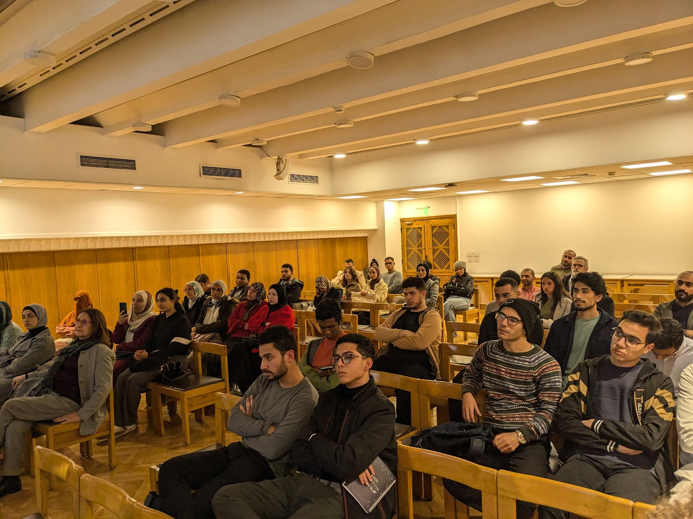
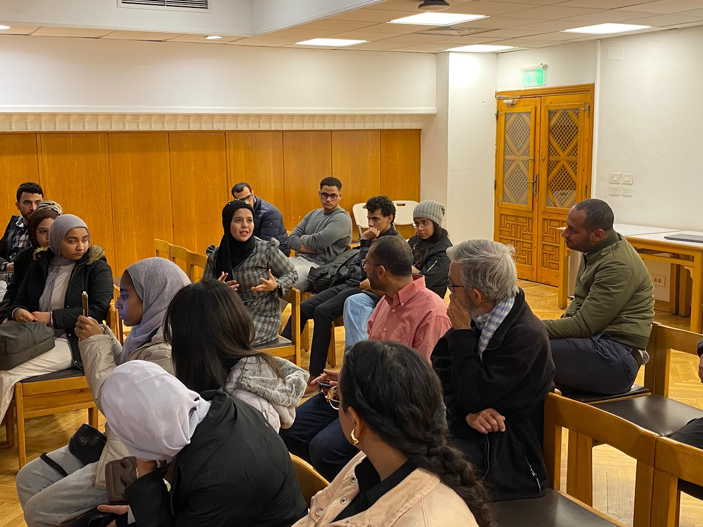
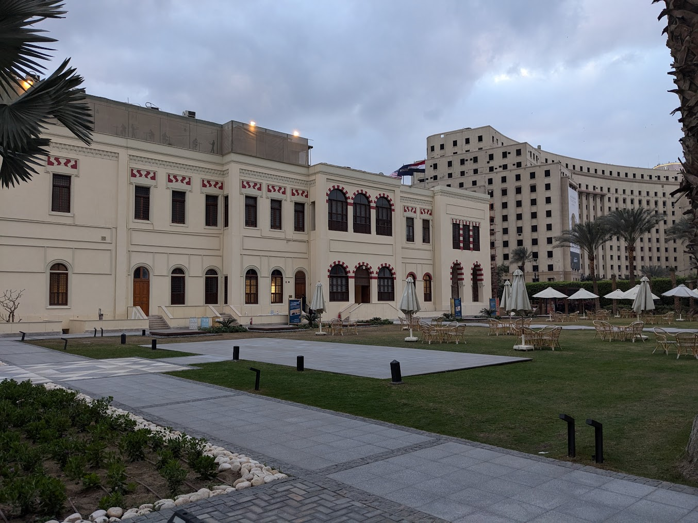
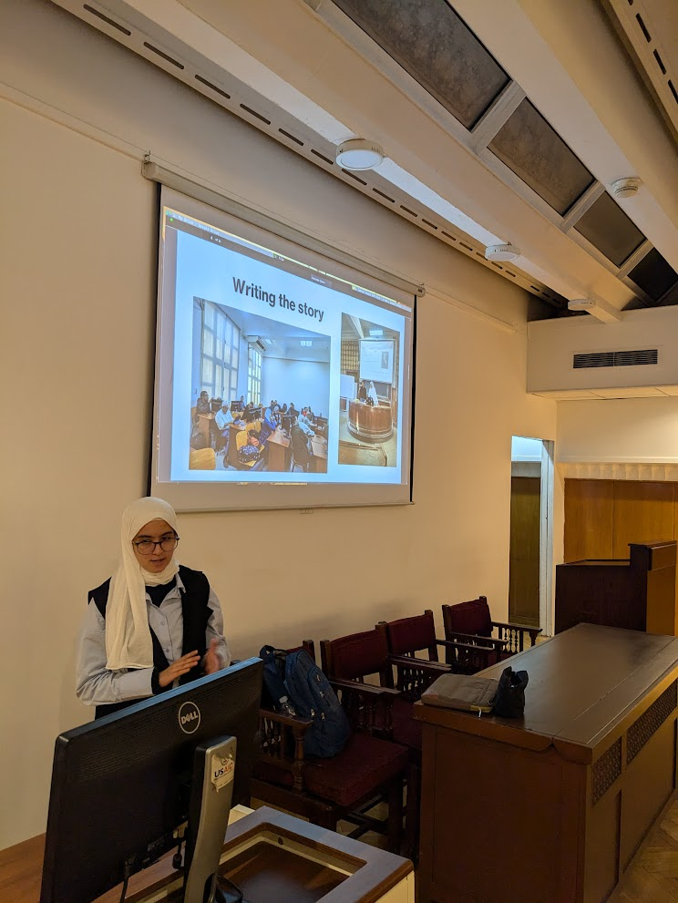
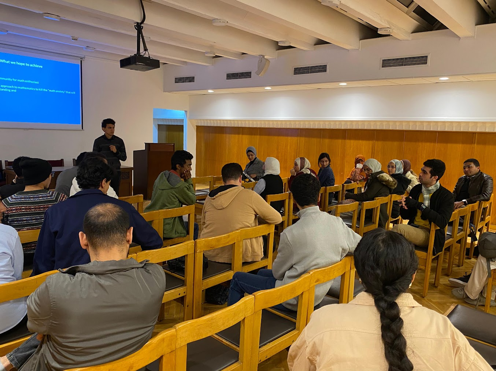

## Forward

The Math community in Egypt had gathered to advocate for research driven by pure intellect, regardless of immediate practical applications. A proposal written to the government is presented here.

## Slides

Downloaded from [here](./slides-economic-useless-progress.pdf).

## Proposal

**Disclaimer.** Opinions here are personal and do not reflect the institutes attendees are affiliated with.

**Forward.** The government had launched wonderful initiatives for boosting contributions driven by practical useful applications like _ITIDA_, _Gen Z_, ..etc. This passage argues for another direction, not driven by useful applications, yet mandatory for sustainability, novelty, and talent attraction. Namely, foundational pure and applied mathematics. It aims to shift Egypt from consumption to innovation.

**Why Math?**
- For an individual, it sharpens abstract thinking. _Open AI_ engineers like [Dan Roberts](https://danintheory.com/) do both _Theoretical Physics_ and _AI Engineering_. If not for their highly matured mathematical background, and curiosity-driven taste, they wouldn't have sparked the new revolution wave in AI.
- For workforce, it attracts talents as highly-motivated workforce look to challenge themselves. A workforce driven by solving big hard problems, even if not immediately applicable, is more likely to inspire and train skilled practitioners. _EPFL_ university posted [Basic science research is also a source of new talents for society](https://www.epfl.ch/about/facts/basic-science-research-is-also-a-source-of-new-talent-for-society/) where it mentions: _"Contrary to popular belief, not all scientists trained at EPFL follow an academic career"_ and _".. source of highly skilled labour for Switzerland"_. _Liang_, CEO of _DeepSeek_, says: _"What we lack isn’t capital but confidence and the ability to organize high-caliber talent for effective innovation"_ in a featured [Fortune](https://fortune.com/2025/01/27/deepseek-founder-liang-wenfeng-hedge-fund-manager-high-flyer-quant-trading/) article.
- For an economy, it paves the way for future practical applications. Without a theoretical backbone, practical applications cannot be both sustainable and scalable. _The World Economic Forum_ posted [Here's why we need to fund fundamental scientific research](https://www.weforum.org/stories/2023/01/here-s-why-fund-fundamental-scientific-research-davos2023/) and _The International Monetary Fund_ posted [Why Basic Science Matters for Economic Growth](https://www.imf.org/en/Blogs/Articles/2021/10/06/blog-ch3-weo-why-basic-science-matters-for-economic-growth), where it mentions: _"We find that basic scientific research affects more sectors, in more countries and for a longer time than applied research (commercially oriented R&D by firms)"_.

**Egypt Now.**
- Almost no one believes in the value of mathematical foundations. Students and juniors are hurried for quick success; they are not willing to invest time in learning a skill if its impact is not quickly seen. _Maryam Mirzakhani_, the first women to be awarded the Fields Medal says: _"The beauty of mathematics only shows itself to more patient followers"_.
- Egyptian talents seek abroad opportunities as they do not find a community they can learn from and get challenged by. As a result, their contributions are usually very limited to their homeland.
- Economy degraded. One problem is that, Egypt is a consumer of technology but not an innovator. Egyptians may use modern _Generative AI_ to develop applications on top of it, but they don't compete with _OpenAI_ or _DeepSeek_. Economy degrades as Egyptians are not producing a worthwhile value.

**Goals.**
- Assist individuals to learn Math and abstract thinking, boosting their skills for both academic and industrial environments.
- Build-up up a community, that raises talents in Egypt, attracts external cooperations, and guides the right person to the right path. We aim to initiate a communication channel with Egyptian Mathematicians in abroad countries.
- Cooperate with the government in its aspired economic and educational developments.

**Short-term.** China is an excellent role model, shifting from a technology consumer, to a threatening US competitor. One example is [Andrew Yao's Class](https://iiis.tsinghua.edu.cn/en/yaoclass/). It sparked student award scholarships by _MIT_, _Stanford_ and other prestigious universities. It is one of China’s endeavors to cultivate innovative talents. As Mathematics needs nothing but lots of pencils and papers, _Yao_ was able to compete with the US using minimal resources. On the short-term we shall follow _Yao_'s model.

**Challenges.**
- (1) Offering transportations all over Egypt. Our initiative is meant to be inclusive of all Egyptians, not only those who are residing in Big Cairo.
- (2) Accommodating the diversity of mathematicians's domains and motivations, yet under a cohesive framework.
- (3) Gap between the kind of support students need, and on the other hand, what qualified workforce do expect from students.

**Request.** On behalf of the government, we request the following:
- Transporations and national universities network to gather students all over Egypt.
- A gathering place hosted by the Egyptian government.
- A communication channel with the government for a fruitful cooperation.

**Conclusion.** The problem is not in the lack of resources. The problem is in the utilization of human power.

## Pictures

