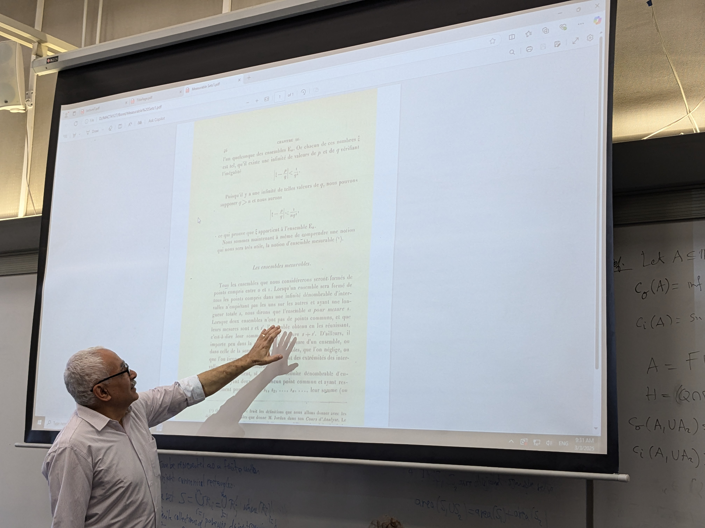

## Instructor
- [Hany El-Hosseiney](https://www.linkedin.com/in/hany-hosseiny-382380206/)

## Syllabus
- [PDF](./syllabus.pdf)

## Materials
- Kolmogorov. Introductory Real Analysis.
- Bear. A Primer of Lebesgue Integration.
- Ponnusamy. Foundations of Mathematical Analysis.

## Pictures

## Problem Set

### Homework 01

- Homework 01: [PDF](./pset-01.pdf)
- Solution: [PDF](./pset-01-sol.pdf)

#### 1

**(b) $\rightarrow$ (a).** For arbitrary $\epsilon$ we are given a subdivision $z_0(\epsilon)$ with $|z_0(\epsilon)| < \delta_0$ for some $\delta_0$ such that $|R(f, z_0(\epsilon) - A)| < \epsilon$. For any finer subdivision $w$, $|w| \leq |z_0(\epsilon)| < \delta_0$. By hypothesis $|R(f,w) - A| < \epsilon$. $\blacksquare$

**(a) $\rightarrow$ (b).**

**Insight.** The idea is, given a subdivision $z$, we can take a small enough modulus for $z_0$, so that it has subdivision points arbitrarily close to points $z$. With boundedness, the Riemann integral of both shall be close.

**Proposition 1.** If $f$ is bounded on $[a,b]$ then $\exists M'$ such that $| f(t) - f(y) | \leq M'$ for arbitrary $t, y \in [a,b]$.

*Proof.* Since $f$ is bounded, the $sup_{t \in [a,b]} \{ f(t) \} = M$ exists. Thereby $|f(t) - f(y)| \leq |f(t)| + |-f(y)| = |f(t)| + |f(y)| \leq M + M = M'$.

**Definition.** For a subdivision $z$, define $d_{min}(z) = \min \{x_k - x_{k-1} \}$.

**Procedure 2.** Given any subdivisions $z = (x_0, x_1, \dots, x_n)$ and $w$ where $|w| \leq d_{min}(z)/2$. Assign to each $x_i$ a nearest $y_i$ in $w$. It follows $|x_i - y_i| < d_{min}(z)/4$ and in turn no $y_i$ will be assigned twice.

**Lemma.** $\forall \epsilon \forall z = (x_0, \dots, x_n) \exists \delta > 0$, s.t if $w = (y_0, \dots, y_n)$ is a subdivision with $|x_k - y_k| < \delta$ then $|R(f, z \vee w) - R(f, (z-\{x_q\}+\{y_q\}) \vee w)| < \epsilon$ for any $x_q \in x$.

*Proof.* Observe $(z - \{x_q\} + \{ y_1 \}) \vee w = (z - \{ x_q \}) \vee w$.

Set $\delta = \epsilon / M'$. Let $w = (y_i)$ be any subdivision such that $|x_k - y_k| < \delta$.

Call $y_q$ the point nearest to $x_q$. If $y_q > x_q$ consider $x_{q-1}$ and if $y_q < x_q$ consider $x_{q + 1}$. WLOG consider the former. Denote $\xi_0 \in [a, x_q]$ and $\xi_1 \in [x_q, y_q]$. When $x_q$ gets removed, these two are replaced by $\xi_0 \in [a,y_q]$. In other words, $\xi_0 (x_q - a) + \xi_q (y_q - x_q)$ in $R(f, z \vee w)$ will be $\xi_0 (y_q - a)$ in $R(f, z-\{x_q\} \vee w )$.

Therefore, $$\begin{aligned}
    |R(f, z \vee w) - R(f, z \vee w - {x_q})| &= |\xi_0 (x_q - a) + \xi_q (y_q - x_q) - \xi_0 (y_q - a)| \\
    &= | \xi_0 (x - a - y_q + a) + \xi_1 (y_q - x_q) | \\
    &= | \xi_1 (y_q - x_q) - \xi_0 (y_q - x_q) | \\
    &= | (\xi_1 - \xi_0) (y_q - x_q) | < | (\xi_1 - \xi_0) \cdot \epsilon / M' | \leq |\epsilon| = \epsilon \end{aligned}$$

**Lemma.** $\forall \epsilon > 0 \forall z = (x_0, x_1, \dots, x_n) \exists \delta$, s.t if $w = (y_0, y_1, \dots, y_n)$ with $|x_k - y_k| < \delta$ then $|R(f, z \vee w) - R(f,w)| < \epsilon$.

*Proof.* Consider an arbitrary $\epsilon > 0$. Substitute $\epsilon/n$ in the previous lemma. Apply the lemma $n$ times substituting $x_q$ by $y_q$ in $z$ to get $\forall k = 1, \dots, n$ $$| R(f, z - \{x_{\pi_1}, \dots, x_{\pi_{k-1}} \} \vee w ) - R(f, z - \{x_{\pi_1}, \dots, x_{\pi_{k}} \} \vee w ) | < \epsilon/n$$ By the triangular inequality $|R(f,z \vee w) - R(f,w)| \leq \epsilon/n + \epsilon/n + \dots + \epsilon/n = \epsilon$.

**Corollary 3.** $\forall \epsilon > 0 \forall z = (x_0, \dots, x_n) \exists \delta > 0$, s.t if $w'$ is any subdivision finer than $w = (y_0, \dots, y_n)$ with $|x_k - y_k| < \delta$, then $|R(f, z \vee w') - R(f, w')| < \epsilon$.

**Theorem.** Main problem.

Let $f$ be Riemann integrable. By *proposition (1)* we take $M'$.

Take arbitrary $\epsilon > 0$. By hypothesis we are given a subdivision $z = (x_0, \dots, x_n)$, s.t $\forall w$ finer, $|R(f,w) - A| < \epsilon / 2$.

In *corollary (3)* substitute $\epsilon/2$ and $z$ to get $\delta_0$. Take $\delta = \min \{ \delta_0, d_{min}(z)/2 \}$. Consider an arbitrary subdivision $z_0$ with $|z_0| < \delta$. By *procedure (2)* we are given a coarser subdivision $w = (y_0, y_1, \dots, y_n)$ in $z_0$, s.t $|x_k - y_k| < \delta/2 < \delta$. By *corollary (3)*, $|R(f, z \vee z_0) - R(f, z_0)| < \epsilon / 2$.

By triangular inequality $$\begin{aligned} | R(f,z_0) - A + R(f, z \vee z_0) - R(f, z \vee z_0 ) |
    &\leq | R(f, z_0) - R(f, z \vee z_0) | + | R(f,z \vee z_0) - A | \\
    &\leq \epsilon/2 + \epsilon/2 = \epsilon \; \blacksquare \end{aligned}$$

**Limit equivalence.** No. A counter-example is the Dirichlet function. Any value of the form $a + \dfrac{k(b-a)}{n}$ is rational.

#### 2

**(i)**

Following the given hint $$\begin{aligned}
    2 \sin x \sin (\dfrac{b-a}{n}) &= \cos (x - \dfrac{b-a}{n}) - \cos (x + \dfrac{b-a}{n}) \\
    2 \sin (a + k \cdot \dfrac{b-a}{n}) \sin (\dfrac{b-a}{n}) &= \cos (a + (k-1) \dfrac{b-a}{n}) - \cos (a + (k+1) \cdot \dfrac{b-a}{n}) \end{aligned}$$ Denote $g(k) = \cos (a + k \cdot \dfrac{b-a}{n})$. Then $$\begin{aligned}
    \sum_{k=1}^n &\cos (a + (k-1) \dfrac{b-a}{n} - \cos (a + (k+1) \dfrac{b-a}{n} \\
    &= \sum_{k=1}^n g(k-1) - g(k+1) \\
    &= g(0) - g(2) \\
    &+ g(1) - g(3) \\
    &+ .. \\
    &+ g(n-2) - g(n) \\
    &+ g(n-1) - g(n+1) \\
    &= g(0) + g(1) - g(n) - g(n+1) \end{aligned}$$ It follows $$\begin{aligned}
    \sum_{k=1}^n &2 \sin (a + k \cdot \dfrac{b-a}{n}) \sin (\dfrac{b-a}{n}) \\
    &= 2 \sin (\dfrac{b-a}{n}) \sum_{k=1}^n \sin (a + k \cdot \dfrac{b-a}{n}) \\
    &= \cos (a) + \cos (a + \dfrac{b-a}{n}) - \cos (b) - \cos (a + \dfrac{n+1}{n} \cdot (b-a)) \end{aligned}$$ Observe $$\begin{aligned}
    \lim_{n \rightarrow \infty} \cos (a + \dfrac{b-a}{n}) &= \cos(a) \\
    \lim_{n \rightarrow \infty} \cos (a + \dfrac{n+1}{n} \cdot (b-a)) &= \cos (a + b - a) = \cos (b) \end{aligned}$$ Thereby $$\sum_{k=1}^n \sin (a + k \cdot \dfrac{b-a}{n}) = 1 / \sin (\dfrac{b-a}{n}) \cdot (\cos (a) - \cos (b))$$

**(ii)** **Not solved**

The Riemann sum is $$\sum_{k=1}^n \dfrac{b-a}{n} \sin (a + k \cdot \dfrac{b-a}{n}) = \dfrac{b-a}{n} \sum_{k=1}^n \sin (a + k \cdot \dfrac{b-a}{n}) = \dfrac{n}{(b-a) \sin(\dfrac{b-a}{n})} ( \cos(a) - \cos(b) )$$

#### 3

**(i)** The statement does not hold in general. As a counter-example, consider $f: [0,1] \rightarrow \mathcal{R}$ where $f(x) = 1/x$ and $x \neq 0$. For any $[0, x_1]$, we can choose $\xi_1$, so that $| f(x) \cdot (x_1 - 0) - f(\xi_1) \cdot (x_1 - 0) |$ is lower-bounded by some constant.

**(ii)** Depending on choices of $\xi$, each partial sum can be either $0$ or $1$. Thereby the function $g_{z,t}(x)$ could be $0$ or $1 * (b-a) = b - a$ for example.

### Homework 02

- Homework 02: [PDF](./pset-02.pdf)
- Solution: [PDF](./pset-02-sol.pdf)

#### 1

Let $D$ be the points of discontinuity. For $\varepsilon > 0$ set $\eta = \min(\varepsilon, \varepsilon/2(b-a))$. Observe $D_\eta$ is negligible as $D$ is negligible. Take $M,m$ to be an upper and lower bound of $f$ respectively.

By negligibility $D_\eta$ is coverable by a family $(J_m)_{m \in N^*}$ of open intervals such that $\sum_{m=1}^\infty \ell(J_m) < \varepsilon/2(M-m)$. Since it is closed and bounded, by *Hein-Borel* we take a finite cover $J_1, \dots, J_N$ where $J_m = ]a_m, b_m[$ and $b_{m-1} \leq a_m$. Observe $D_\eta \subseteq \bigcup_{m=1}^N J_m$.

It follows if $x \notin \bigcup_{m=1}^N J_m$ then $w(f;x) < \eta$. Then there exists $\delta_x > 0$ such that $w_\delta(f;x) < \eta$. Call the corresponding open set $S_x$. Then $| \sup S_x - \inf S_x | < \eta$. Observe $(\bigcup_{m=1}^N J_m)^\complement \subseteq \bigcup_x S_x$. By *Hein-Borel* we can take finite $\{ S_x \}$. Among their corresponding $\{\delta_x\}$, take the smallest and call it $\delta$.

Subdivide $[b_{m-1}, a_m]$ into finite intervals $I_1^{(m)}, \dots, I_{r_m}^{(m)}$, each of length less than $\delta$. Take $z_\varepsilon$ to be a subdivision of $[a,b]$ containing all $I_k^m$ for $m = 1, \dots, N$ and $k = 1, \dots, r_m$.

Now for any $S_k = [y_{k-1}, y_k]$, either

-   **Case 1.** $S_k \subseteq J_m$. Then $M_k - m_k \leq M - m$. Denote those intervals by $B$.
-   **Case 2.** $S_k \subseteq I_r^{(m)}$. Then $M_k - m_k \leq \eta$. Denote those intervals by $G$.

We show $U(f;w) - L(f;w) < \varepsilon$ $$\begin{aligned}
    U(f;w) - L(f;w) &= \sum_{k=1}^n (M_k - m_k) (y_k - y_{k-1}) \\
    &= \sum_{k \in G} (M_k - m_k) (y_k - y_{k-1}) + \sum_{k \in B} (M_k - m_k) (y_k - y_{k-1}) \\
    &\leq \eta \sum_{k \in G} (y_k - y_{k-1}) + (M - m) \sum_{k \in B} (y_k - y_{k-1}) \\
    &\leq \eta (b-a) + (M-m) \frac{\varepsilon}{2(M-m)} \\
    &\leq \frac{\varepsilon}{2(b-a)} (b-a) + \frac{\varepsilon}{2} = \varepsilon \end{aligned}$$

#### 2

**Lemma.** $\int^b_{\rule{0.4cm}{0.4pt} a} f(x) dx \leq c_i(S(f))$

For any $L(f;z)$, the corresponding rectangles could be re-interpreted as a finite union of disjoint rectangles, reserving exactly the same area. Thereby 
$$\begin{aligned}
    \{ L(f;z) \mid \text{subdivision } z \} &\subseteq \{ area(B) \mid B \subseteq A, B \text{ is a simple set} \} \\
    \sup \{ L(f;z) \mid \text{subdivision } z \} &\leq \sup \{ area(B) \mid B \subseteq A, B \text{ is a simple set} \} \\
    \int^b_{\rule{0.4cm}{0.4pt} a} f(x) dx &\leq c_i(S(f))
\end{aligned}$$

**Lemma.** $c_i(S(f)) \leq \int^b_{\rule{0.4cm}{0.4pt} a} f(x) dx$

Since $f$ is bounded on a closed interval $[a,b]$, $area(S(f)) = \int^b_{\rule{0.4cm}{0.4pt} a} f(x) dx$. But for any simple set $B \subseteq S(f)$, we know $area(B) \leq area(S(f))$. It follows
$$
\begin{aligned}
    \sup \{ area(B) \mid \text{simple set B} \} &\leq \int^b_{\rule{0.4cm}{0.4pt} a} f(x) dx \\
    c_i(S(f)) &\leq \end{aligned}
$$

#### 3

##### (i)

Consider a function $f$ induced by a line segment. Then it is bounded on a closed interval, and hence Riemann integrable. Observe $U(f;z) - L(f;z)$ induces rectangles which do cover the line. Since $| U(f;z) - L(f;z) | \rightarrow 0$, it follows there are simple sets of disjoint rectangles $S_1, S_2, \dots$ such that $area(S_i) \rightarrow 0$. Therefore, the outer Jordan content is $c_o(PQ) = 0$. Since $c_i(PQ) \leq c_o(PQ)$ it follows also $c_i(PQ) = 0$.

##### (ii)

Observe $area(R_n) = \left ( \dfrac{1}{2^n} - \dfrac{1}{2^{n+1}} \right ) \cdot n2^{n+1} = n$. Since $\{ R_n \}$ is a pairwise disjoint set of rectangles, $$\begin{aligned}
    area(R_1 \cup R_2 \cup \dots \cup R_n) &= area(R_1) + \dots + area(R_n) \\
    area \left ( \bigcup_{i=1}^N R_n \right ) &= 1 + 2 + \dots + N = \dfrac{N(N+1)}{2} \\
    c_i \left (\bigcup_{i=1}^N R_n \right ) = c_o \left ( \bigcup_{i=1}^N R_n \right ) &= \end{aligned}$$

Therefore $c_i \left ( U_{i=1}^\infty R_n \right ) = c_o \left ( U_{i=1}^\infty R_n \right ) = \infty$.

##### (iii)

#### 3

##### (i)

Holds. For any $A$, and $p_n$, we have $t_n \nless 0$. Hence $\sum_{p_n \in A} t_n \nless 0$.

##### (ii)

Holds. if $A \subset B$, then
$$\begin{aligned}
    \sum_{p_n \in B} t_n &= \sum_{p_n \in A} t_n + \sum_{p_n \in B - A} t_n & &\text{since } A \cap (B-A) = \phi\\
    &= v(A) + v(B - A) \\
    &\geq v(A) & &\text{since } v(B-A) \geq 0 \text{ by } (i)
\end{aligned}$$

##### (iii)

Holds.
$$\begin{aligned}
    v(A \cup B) &= \sum_{p_n \in A \cup B} t_n \\
                &= \sum_{p_n \in A} t_n + \sum_{p_n \in B} t_n & &\text{since } A \cap B = \phi \\
                &= v(A) + (B)
\end{aligned}$$

##### (iv)

### Homework 03

- Homework 03: [PDF](./pset-03.pdf)
- Solution: [PDF](./pset-03-sol.pdf)

#### 1

**Lemma.** ${ \mu(\lim \sup_n A_n) \geq \lim \sup_n \mu(A_n)}$

Set $A'_n = \bigcup_{k \geq n} A_k$ and observe it is a decreasing sequence $A'_n \supseteq A'_{n+1}$ where $\mu(A'_1) < \infty$ by hypothesis. It follows 
$$\begin{aligned}
    \mu(\bigcap^\infty_{n=1} A'_n) &= \lim_{n \rightarrow \infty} \mu(A'_n) = \lim_{n \rightarrow \infty} \mu(\bigcup_{k \geq n} A_k) \; (1)\\
    \mu(\bigcap^\infty_{n=1} (\bigcup_{k \geq n} A_k)) &= \end{aligned}$$
Fix $n$ and observe $\forall k \geq n \; \mu(\bigcup_{k \geq n} A_k) \geq \mu(A_k)$ as $\forall k \geq n \; \bigcup_{k \geq n} A_k \supseteq A_k$. It follows for any $n$, $\mu(\bigcup_{k \geq n} A_k) \geq \sup_{k \geq n} \mu(A_k)$. Therefore $\lim_{n \rightarrow \infty} \mu(\bigcup_{k \geq n} A_k) \geq \lim_{n \rightarrow \infty} \sup_{k \geq n} \mu(A_k)$ (2).

By (1) and (2), the intended result follows.

**Lemma.** $\mu(\lim \inf_n A_n) \leq \lim \inf_n \mu(A_n)$

Set $A'_n = \bigcap_{k \geq n} A_k$ and observe it's increasing $A'_k \subseteq A'_{k+1}$. Then
$$\begin{aligned}
    \mu(\bigcup^\infty_{n=1} A'_n) &= \lim_{n \rightarrow \infty} \mu (A'_n) \\
    \mu(\bigcup^\infty_{n=1} \bigcap_{k \geq n} A_k) &= \lim_{n \rightarrow \infty} \mu (\bigcup_{k \geq n} A_k) \; (1)
\end{aligned}$$

Clearly $\forall n \forall k$, $\bigcap_{k \geq n} A_k \subseteq A_k$, implying $\mu(\bigcap_{k \geq n} A_k) \leq \mu (A_k)$. It follows $\forall n \; \mu(\bigcap_{k \geq n} A_k) \leq \inf_{k \geq n} \mu(A_k)$. Hence
$$\begin{aligned}
    \lim_{n \rightarrow \infty} ( \mu (\bigcap_{k \geq n} A_k) ) \leq \lim \inf_k \mu (A_k) = \lim_{n \rightarrow \infty} \inf_{k \geq n} A_k \; (2)
\end{aligned}$$
By (1) and (2), the intended result follows.

**Example.** Equality.

Take $(A_k)_k$ pairwise disjoint where $\mu(A_k) \rightarrow 0$. Then $\bigcap^\infty_{n=1} \cup_{k \geq n} A_k = \phi$ where $\mu (\phi) = 0$, for the left hand side. On the right hand side, $\lim \sup_n \mu(A_n) = 0$.

**Lemma.** Borel-Cantelli.

Since $\sum_{n=1}^\infty \mu(A_n) = c$ for some constant $c$, clearly $$\begin{aligned}
    \forall n \; \sum_{k \geq n}^\infty \mu(A_k) &= c - \sum_{k=1}^{n-1} \mu(A_k) \\
    \lim_{n \rightarrow \infty} \sum_{k \geq n}^\infty \mu (A_k) &= c - \lim_{n \rightarrow \infty} \sum_{k=1}^{n-1} \mu (A_k) \\
    &= c - c \\
    &= 0 \quad (1)
\end{aligned}$$
By measure's sub-additivity
$$\begin{aligned}
    \forall n \; \mu (\bigcup_{k \geq n} A_k) &\leq \sum_{k \geq n}^\infty \mu (A_k) \\
    \lim_{n \rightarrow \infty} \mu (\bigcup_{k \geq n} A_k) &\leq \lim_{n \rightarrow \infty} \sum_{k \geq n}^\infty \mu(A_k) \quad (2)
\end{aligned}$$

By (1) and (2), $\mu (\bigcap_{n=1}^\infty \cup_{k \geq n} A_k) = \lim_{n \rightarrow \infty} \mu (\bigcup_{k \geq n} A_k) \leq 0$. $\blacksquare$

#### 2

$\phi$ is not in the domain, so the set of singletons is not a semi-ring.

#### 3

**Partially Solved**

Note we are given $\mu(\Omega) = v(\Omega)$.

**Lemma.** $\mu(E^c) = v(E^c)$.
$$\begin{aligned}
    \mu(E) &= v(E) \\
    \mu(\Omega \setminus E^c) &= v(\Omega \setminus E^c) \\
    \mu(\Omega) - \mu(E^c) &= v(\Omega) - v(E^c) \\
    \mu(E^c) &= v(E^c)
\end{aligned}$$

#### 4

**Partially Solved**

**a.**

**Lemma.** $\mathcal{B}(\mathbb{R}^2) \subseteq \mathcal{B}(\mathbb{R}) \otimes \mathcal{B}(\mathbb{R})$

It suffices to show, the generating set of the L.H.S is a subset of the generating set of the R.H.S. Let $S$ be an arbitrary open set of $\mathbb{R}^2$. Then we can take points $p_i \in S \cap \mathbb{Q}$ covered by open balls. Take rectangles $R_i$ subset of those open balls, and note $p_i \in R_i \subseteq S$ implying the countable union $\bigcup_i R_i = S$ by the density of rationals. Denote $R_i = [a_i, b_i[ \times [c_i, d_i[$. Since $[a_i, b_i[, [c_i, d_i[ \in \mathcal{B}(\mathbb{R})$ it is clear $R_i$ is in the generating set of $\mathcal{B}(\mathbb{R}) \otimes \mathcal{B}(\mathbb{R})$ implying $\bigcup_i R_i \in \mathcal{B}(\mathbb{R}) \otimes \mathcal{B}(\mathbb{R})$.

**Lemma.** For any open sets $A$ and $B$ in $\mathbb{R}$, it follows $A \times B \in \mathcal{B}(\mathbb{R}^2)$.

Take any element $(a,b) \in A \times B$ and observe there are open neighbourhoods whereby $a \in \; ]x, x'[ \; \subseteq A$ and $b \in \; ]y, y'[ \; \subseteq B$. Then $R_{a,b} = \; ]x,x'[ \; \times \; ]y,y'[ \; \subseteq A \times B$ and $\bigcup_{a,b} R_{a,b} = A \times B$. Since each $R_{a,b}$ is open in $\mathbb{R}^2$, it follows $A \times B \in \mathcal{B}(\mathbb{R}^2)$.

**b.**

By *a*, measure $(m \otimes m)$ is defined on $\mathcal{B}(\mathbb{R}^2)$. For any element $[a,b[ \times [c,d[$ of the generating set of $\mathcal{B}(\mathbb{R}^2)$, we know $m^2( [a,b[ \times [c,d[ ) = (b-a)(d-c) = m([a,b[) \cdot m([c,d[) = (m \otimes m)([a,b[ \times [c,d[)$. By Caratheodory's uniqueness, the intended result follows.

#### 5

**Unsolved**

### Homework 04

- Homework 04: [PDF](./pset-04.pdf)
- Solution: [PDF](./pset-04-sol.pdf)

#### 1

For $\min(f, g)$ we want to show $\int \min(f,g)^+$ and $\int \min(f,g)^-$ are finite.

For $\varphi \leq \min(f,g)^+ = min(f^+, g^+) \leq f^+$, it follows $\varphi \leq \int f^+$ upperbounded. Hence $\sup \{ \varphi \mid \varphi \leq \min(f,g)^+ \} = \int \min(f,g)^+$ is finite.

For $\varphi \leq min(f,g)^- = \max(f^-, g^-)$, observe $\int \max(f^-, g^-)$ is finite as both $\int f^-$ and $\int g^-$ are finite. It follows $\varphi \leq \int \max(f^-, g^-)$ upperbounded. Hence $\{ \varphi \mid \varphi \leq \min(f,g)^- \}$ is finite.

#### 2

#### 3

#### 4

#### 5
