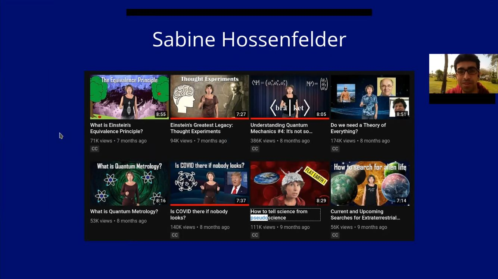
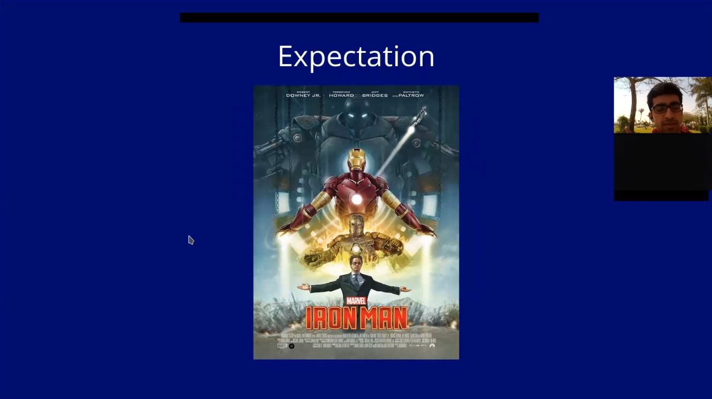
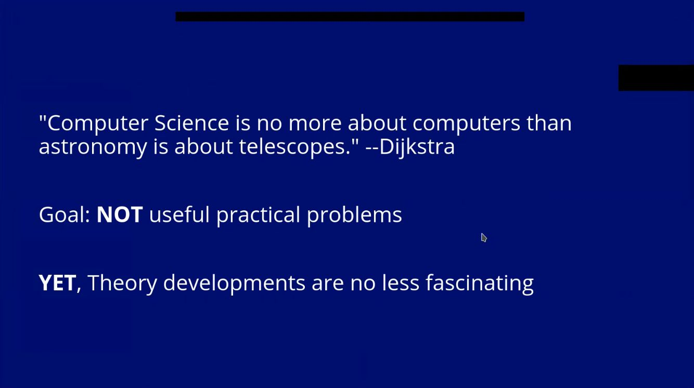
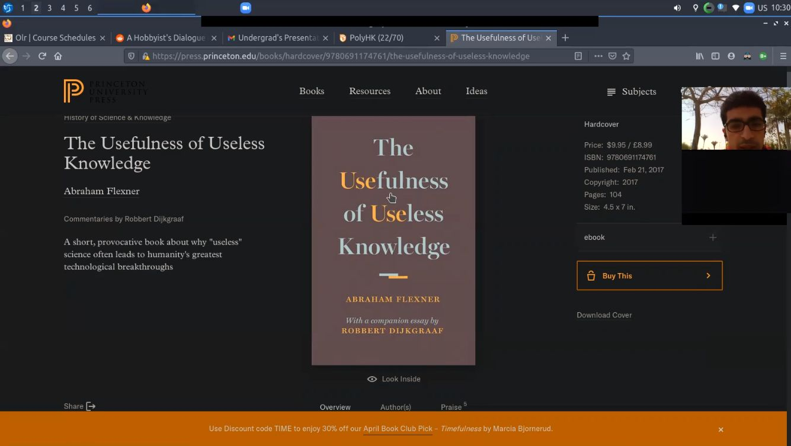
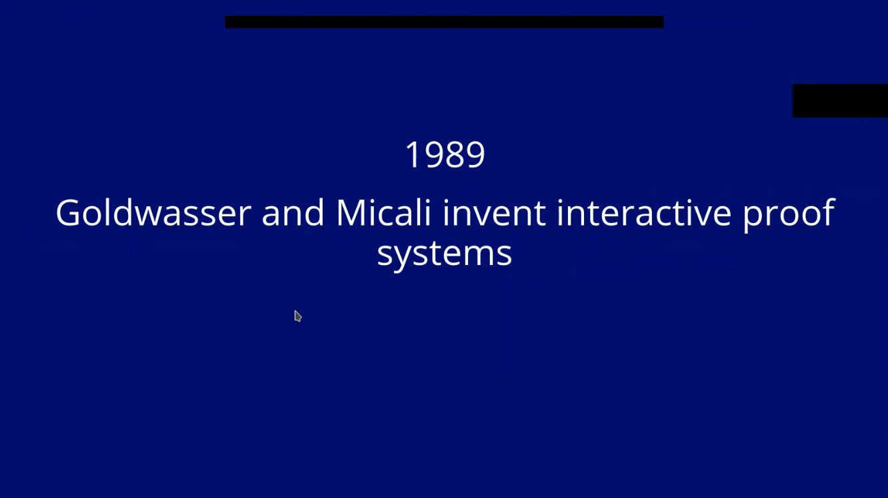
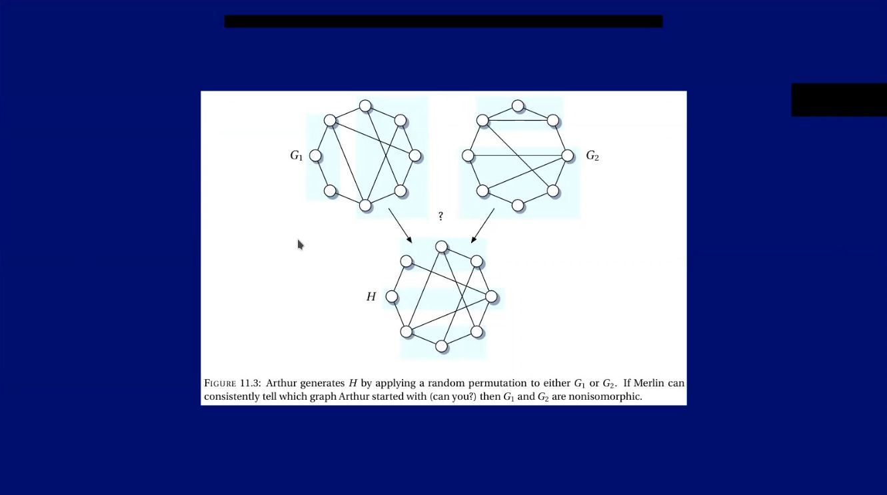
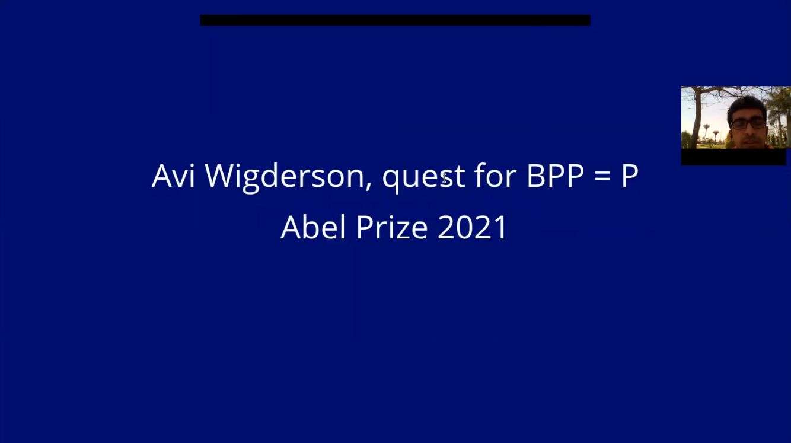

## Playing The Video
[Here](https://shared02.opsone-cloud.ch/index.php/s/KQnNAwP4KCxfr4Y)

## Talk Abstract

If people thought of something fascinating about computers, Then it would usually be about some fancy practical application. In this talk we tackle computers, but their theory or pure-math perspective. A central goal is to show everyone that theory developments are no less exciting and fascinating than practical computing. We hope to expose attendees to wear different shoes for theoretical CS. Particularly, We give an overview of computational complexity theory, which deals with classes of computational problems as a whole, not concrete individual problems like algorithms. The talk assumes no technical background, and is composed mainly of historical developments. The speaker is an undergrad student, and he is in no way an expert or authorized in this field. Rather, We give more personal reflections and hope for the talk to be as interactive as possible.

You can see the slides [here](https://cryptpad.fr/slide/#/2/slide/view/-Z+uoSIn9G+3Zrpqf+H39fkUaBs55djg68doVzEVOzU/)

___

## Table of Contents

- [Talk Abstract](#talk-abstract)
- [How it All Started](#how-it-all-started)
- [Good Shots](#good-shots)

___

## How it All Started

It all started with a linkedin chat message I sent to [Larry](https://www.linkedin.com/in/laurence-bordowitz-053b573a), For making an online-based study group with other hobbyists from [compsci-subreddit](https://www.reddit.com/r/compsci/). Unfortuantely, The study group did not sustain. While we were speaking together, I mentioned how cool [prof. Steven Skiena](https://www.cs.stonybrook.edu/people/faculty/StevenSkiena) is. It turned out he was Larry's professor back when Larry was an undergrad student at Stony Brook university!. It was very kind of Larry that he wanted to support me by joining me in Stony Brook's Algorithms seminar.

Then I sent an email to the seminar's mailing list, Expressing my wish to give a talk on history of computational complexity, Inspired by [Fortnow's and Homer](https://www.researchgate.net/profile/Lance-Fortnow/publication/220530495_A_Short_History_of_Computational_Complexity/links/0deec52bd7ab603fef000000/A-Short-History-of-Computational-Complexity.pdf) brief historical survey. prof. Skiena emailed me (yaay!) informing that there is no space for me to give the talk and that even grad students who attend the seminar taking credit for it, Do not usually present anything.

Luckly, My email sent to Stony Brook's mailing list, Was received by [Bo Li](https://www4.comp.polyu.edu.hk/~bo2li/), A previously PhD student at Stony Brook. Then I received an email from him, Where he expressed he wishes me to give the talk for him!. It was very kind and encouraging for me, That he allowed me to give the talk with all his PhD students.

## Good Shots

### Physicists Success in Popular Science

### Why Not an Engineer?

### Theory is No Less Fascinating

### The Usefulness of Useless Knowledge

### Shafi and Silvio's Seminal Paper

### Interactive Proof System

### Avi's Abel Prize 2021 Award

