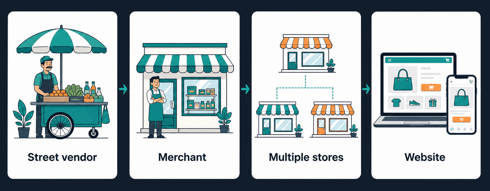
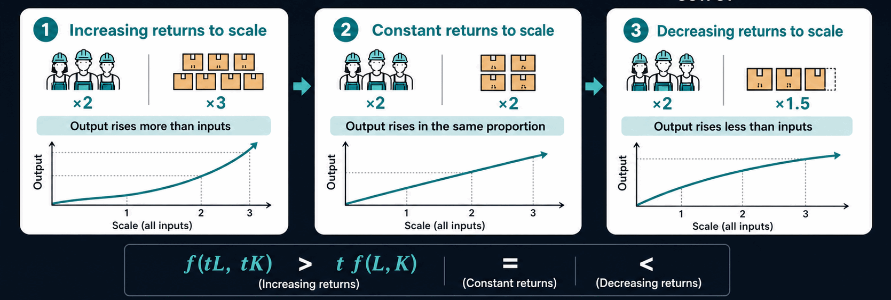
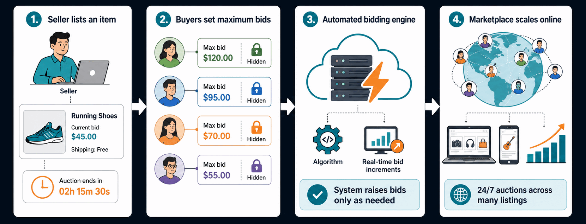
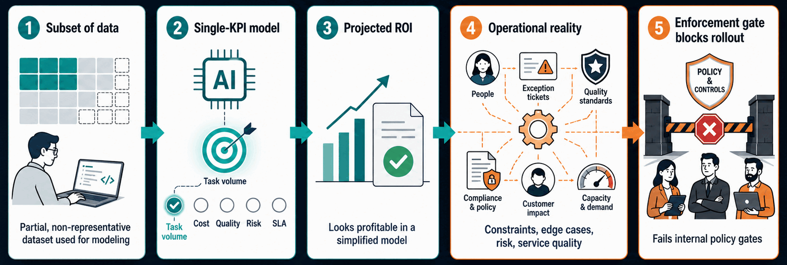
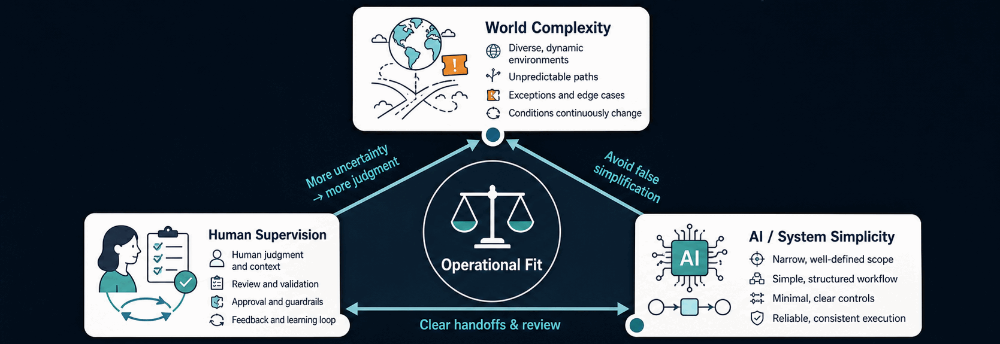
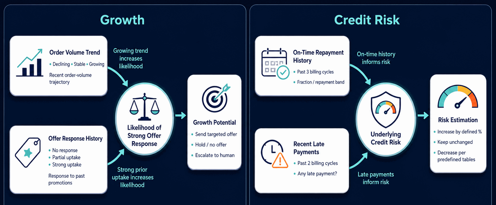
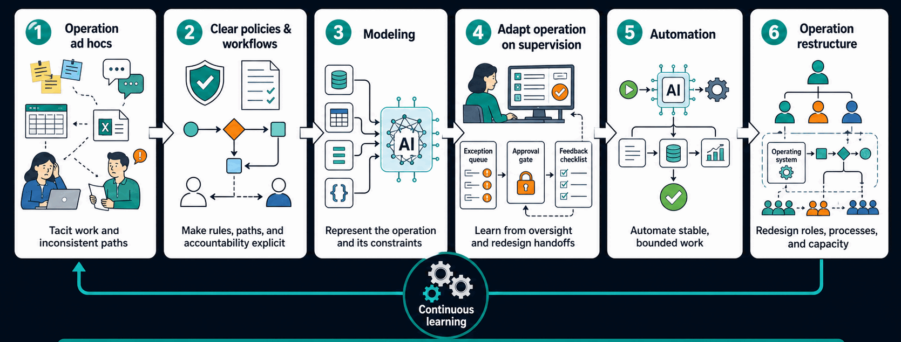

## Selling Operating Models

Let us begin with a familiar process: selling. A street vendor sells items individually from a fixed cart. By working longer hours, the vendor can sell more. However, time imposes a strict ceiling. No one can work 30 hours in a day. Revenue therefore hits a scalability limit. The vendor decides to own a store and become its manager. The store employes people in specialized roles: a cashier handles purchases, salesperson assists customers, and stock clerk manages the inventory. The store owner's role shifts from doing the whole process on his own to designing a mechanism of specialized roles and monitoring it. That allows him to serve more customers. However, One person cannot manage two different stores in two different places simultaneously. Revenue therefore hits a scalability limit. The owner delegates daily operations to managers across ten distinct store locations, and conducts periodic site visits to supervise them. Such management or supervision raises a new cost of transportation but the payoff from store expansion exceeds it. Beyond a certain point of stores count, the coordination cost may diminish more profit margins. The owner decides to build a website where customers browses items, purchases, and receive deliveries at home. The owner scales his business far beyond what 100 stores may serve. The website monitoring cost is very cheap compared to client volume served.

## Returns to Scale

The aforementioned sale mechanisms illustrate the notion of _returns to scale_ in microeconomics. It explains how increasing output relate to input increase. When the launches multiple stores, revenue increases. However, the revenue growth in proportion to the added cost of coordination and monitoring is less. The total revenue rises but the average revenue per unit of output declines.

Microeconomics conventionally represents the production function $F(K,L)$. For our purposes, we use $C(N) = cN + H(N)$ where $C$ is cost function, $N$ is output units, $c$ is the per-unit cost, and $H(N)$ is human coordination cost. Scalability improves when $H(N)$ grows slowly relative to $N$. Owning many stores corresponds to a high $H(N)$ due to the management hierarchy, and a moderate $c$ due to store rent. The website corresponds to low $H(N)$ due to specialized IT administrators, and low $c$ due to server cost. The average cost per unit of output is less in the website. The _returns to scale_ is increasing. The website enables the business to scale its value delivery.

## eBay and Mechanism Design

Consider the case that the store sells used items by manually bidding where the bid is raised step-by-step. If the owner sticks to the same process of manually bidding but with a larger volume through the internet, she may raise selling volume. However, the website won't scale, compared to a website selling fixed-price items. The bidding process raises the cost of $H(N)$ while ordering a fixed-price item has a low cost of $H(N)$. The process is the same in fixed-price items but the bid price stepping depends on human interaction.

eBay innovated a new mechanism for its auctions. The bidder enters the maximum amount she is willing to pay, and an algorithm bids on behalf of bidders following a deterministic procedure, to keep them in the lead based on fixed bid increments. That mechanism requires less human interaction and enables eBay to scale its business like fixed-price websites.

The lesson is that a healthy business aims to increase its _returns to scale_ by designing a scalable mechanism. Taking the operational workflow for granted, then using technology to speed up a process or accommodate more volume is often not optimal.

## Inconsistent Enforced AI Workflow

An engineer may take a subset of data and train a predictive model to optimize a single KPI like task volume. The engineer implicitly compresses the rich complexities of the operation teams into a singular metric. That single metric may project a ROI on paper, but the AI system may fail to satisfy the operational constraints that govern decisions, which have been hardened by real-world experience.

Consider an example. A B2B marketplace adopts an AI system for default prediction. A correct prediction may be overridden for various reasons: to preserve a high-value retailer; the sales representative visited the retailer in person; a new supplier joined and was requested by that retailer; a subscription is approaching an expiration date and the firm aims for retention; customer service escalation granted a promotional code.

An 80% accuracy model may be overridden 80% of the time. The operation team then lose trust in the model and find it an unnecessary complication. The ad hoc inconsistent exceptions may be so numerous, so that no AI can fit the workflow. The operation will defend their stance that they are reacting to a fast-paced world around them, and that data is not enough for decisions.

## Dimensions

**World Complexity.** As operations scale to handle more of the world's complexities, workflow complexity naturally increases. Consider a B2B marketplace. It may source from a single supplier with fixed catalogs and stable prices. A clerk then checks a paper or spreadsheet catalog, confirms stock over the phone, and writes up a purchase order. If multiple suppliers offer overlapping products, each with buyer-specific pricing, a category manager then must cross-reference several supplier price sheets. The number of sheets, the cross-relationships of them, and the processes all grow as the marketplace handles more complex operations.

**AI / System Simplicity.** A marketplace may operate an inventory warehouse. A simple max-min threshold automation embedded in a spreadsheet may suffice: when a quantity falls below the minimum, a triggered formula or macro flags the item and auto-generates a replenishment request up to the max level. As the marketplace grows, buyer behaviour becomes more volatile. A predictive AI for demand forecasting may then determine reorder points. The mechanism evolves from a conditional formula to a learning model. The formula is easy to understand and audit. The learning model requires the operation to maintain additional complexities because predictions may not always be accurate. This include data distribution shift, model recalibration, and feedback loops.

**Human Supervision.** In customer support, for example, a human may not intervene in cases at all or may handle only a proportion of cases. A human may write an answer from scratch, review a given one, or monitor an aggregate of many cases.

As the operation aims to handle more of the world's complexities, it naturally requires more human supervision and more complex operation procedures. A good AI engineer designs the operational workflow and utilizes AI toolkit so that a high complexity of the world is reduced to a simple AI or system mechanism requiring a minimal human supervision.

## Refining the Operation by Incremental Modeling

**Operation Ad hoc**

A B2B marketplace has a growth team and a credit-risk team. They make calls, issue offers, and decide credit limits based on judgment call, i.e what feels right, following random inconsistent justifications. Examples include: This grocer has been with us for a year, so increase its credit limit; This area is usually problematic, so deny all new retailers from there; We have a GMV target this quarter, so approve more and postpone dealing with risk later.

**Process and Policy**

Each department establishes a simple decision table to clarify the process it follows.

The growth team sets rules: (1) If a retailer's average monthly order volume during the past three months is below some segment baseline and the retailer has been active for at least two billing cycles, then the growth team reviews; (2) If a retailer's average monthly order volume is at least the segment baseline and showed a positive response of an increased order volume within the past two cycles, then the growth team offers the retailer a promotion.

The credit-risk team sets rules: (1) For each retailer segment, like small grocery, the team assigns a base credit limit according to a predefined table; (2) If a retailer has 100% on-time repayment history during the past three billing cycles, the team increases credit limit; (3) If the retailer's average monthly order volume during the past three months is greater than the segment's baseline monthly volume, the team increases the credit limit by an additional predetermined amount; (4) If the retailer has any late payments during the past two billing cycles, the team either keeps the current limit unchanged or decreases it.

**Modeling Business Knowledge by Applied Math**

Based on the clear process above, it is feasible to design a probabilistic model to evaluate a retailer for growth promotion or credit limit increase. For simplicity, think of scoring a retailer by a weighted average formula.

Growth

- nodes / variables
  - _Order Volume Trend_: Recent trajectory of the retailer's order volume (e.g., declining, stable, growing).
  - _Offer Response History_: How the retailer responded to past promotional offers (e.g., no response, partial uptake, strong uptake).
  - _Growth Potential_: The action taken by the team (e.g., send targeted offer, hold/no offer, escalate to human).

- edges / causality
  - Retailers who enjoy a growing _volume trend_ are more likely to respond well again.
  - Retailers who showed strong uptake on past offers are more likely to respond well again.

Credit Risk

- nodes / variables
  - _On-Time Repayment History_: The fraction or band of on-time payments during the past three billing cycles.
  - _Recent Late Payments_: Whether there were any late payments during the past two billing cycles.
  - _Risk Estimation_: increase by a defined percentage; keep unchanged; or decrease according to the predefined tables.

- edges / causality
  - _On-Time Repayment History_ influences _Underlying Credit Risk_.
  - _Recent Late Payments_ influences _Underlying Credit Risk_.

**Integrating Automation and Monitoring**

The operation manager notices 60–70% of cases agree with the model's suggested decision. They decide to use the model to compute a probability. If that probability is high enough, the action is executed automatically. Otherwise, the case is escalated to a human. The team designs dashboards for: (1) The percentage of decisions taken automatically; (2) The failure rate of auto-approved and manually approved cases; (3) The decision type and policy version of manually escalated decisions. The team created feedback loops to recalibrate the model. The operation transitioned from deciding everything to taking the role of: (1) model critics and calibrators, (2) designers of the override rules, and (3) exception handlers. The operation workflow becomes more structured.

**Restructuring the Team**

We can set a layer above the two models which considers both _growth potential_ and _credit risk_ to decide whether to increase the credit limit.

| Risk \ Growth | Growth < Threshold | Growth ≥ Threshold |
|---|---|---|
| Risk ≥ Threshold | Auto reject | Escalate to human |
| Risk < Threshold | Escalate to human | Auto approve |

_Region 1_ and _Region 2_ are autonomous. The team develops new dashboards to analyze each region across other variables. Feedback loops and recalibration aim to reduce human escalation.

The team notices a cohesive framework which combines two separate departments, and decides to merge both departments for all decisions related to growth and risk.

**A New AI Workflow**

Only then does building a predictive AI fits because the ad hoc exceptions and inconsistencies caused by the growth and risk teams are resolved. The probabilistic model defines a stable and transparent structure of variables and causal assumptions. The automated decision engine specified clearly where predictions would be used. The unified process which combines both growth and risk has a clear and agreed-upon objective functions.

## Lean Reduction

Eric Ries initiated the _Lean Startup_ methodology to avoid long business planning and to avoid costly engineering, which may receive negative customer feedback, requiring redoing much work from scratch. The idea is to build a minimum product to discover and validate what the client needs, then iteratively improve on the product alongside client feedback. Building and feedback therefore proceed hand-in-hand.

Our situation is analogous. We may build a time-consuming AI which enforces a workflow, only to discover it is inconsistent with the operation team ad hocs. We may build an expensive AI, only to discover it presumes a decision-making maturity missing from the operation members. By analogy with the _Lean Startup_, we need another kind of _Lean_, where AI and operation adaptation go hand-in-hand.

The goal is not to immediately design the best workflow or best AI. The goal is to iteratively reduce ad hocs and inconsistencies into order alongside training the operation members to think with structured toolkit. AI and automation will then follow naturally, unlocking new opportunities for operation restructure and value delivery scalability. AI becomes a natural consequence to fulfill subroutines the operation members had mastered but find boring.

<!-- This process is not trivial. If a member is used to manually checking all performance metrics to inform an executive, then taking the step to manually review less information alongside an aggregate view by AI is not easy. Consider a hospital pharmacist who reviews medication orders. He manually checks a prescribed drug against the patient's medication list. If the hospital introduces a prescriptive AI which outputs _Approve_ or _Review_, the pharmacist loses control and the stakes of following a wrong approved recommendation is high. However, If the hospital introduces descriptive information like the risk of ordered drug, the pharmacist may rely more on AI's recommendations for safe drugs and devote more review time for unsafe drugs. That judgment skill, deciding when to follow and when to review, requires training and experience. The process of advancing the pharmacist toward higher-level cognitive work should progress alongside AI solution design and development. -->

## Methodology

further. where to start? where to focus efforts?
