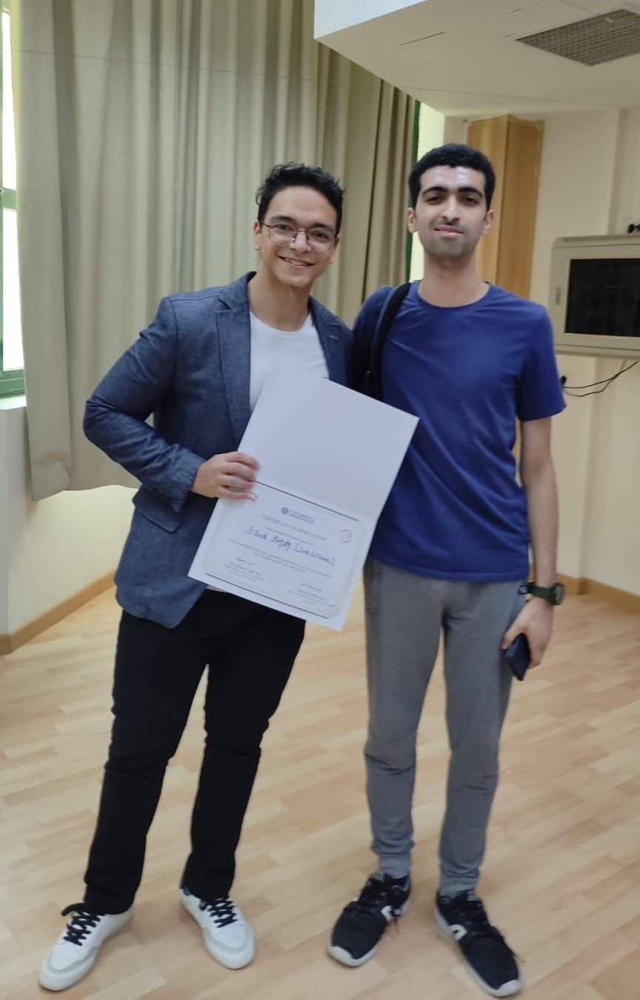

## Best Student Project
- Predictive Population Model By [Eyad Magdy](https://www.linkedin.com/in/eyad-magdy-819b23303/), A rising freshman (1st year) student.
- Before completing Programming I, He learned Python, and made a practical project. 
- Before completing Calculus I, He learned partial derivatives and implemented the gradient descent algorithm, to train a linear model.
- He well explains the case-study motivation, population growth prediction, behind his algorithm and analytics.
- [Github Source Code](https://github.com/eyadXE/population-prediction-model-/tree/main), [Hugging Face Deployed Model](https://huggingface.co/spaces/eyad222/apptest2)

## Materials
- Briggs, Cochran, Gillett & Schulz. Calculus for Scientists and Engineers, Early Transcendentals. Pearson.
- Kolman & Hill. Elementary Linear Algebra With Applications. Pearson.
- Rosen. Discrete Math and its Applications. McGraw Hill.

## Downloading
- All notebooks can be downloaded from HERE.

## Calculus 1

| Week | On-Paper | Python & Programming | Frameworks | Project & Case-study |
|-----|----------|-----------------------|------------|---------|
| Week 00 | <a href="./calculus-i/On-Paper/0.1 - Intro.ipynb" download>0.1 - Intro.ipynb</a>, <a href="./calculus-i/On-Paper/0.2 - Preliminaries.ipynb" download>0.2 - Preliminaries.ipynb</a> |  | <a href="./calculus-i/Frameworks/0.1 - Intro.ggb" download>0.1 - Intro.ggb</a> |
| Week 01 | <a href="./calculus-i/On-Paper/1 - Functions_ Graphing, Exponential, Logarithmic.ipynb" download>1 - Functions_ Graphing, Exponential, Logarithmic.ipynb</a> | <a href="./calculus-i/Python & Programming/1 - List Comprehension.ipynb" download>1 - List Comprehension.ipynb</a> | <a href="./calculus-i/Frameworks/1 - Sequence, Function on sequence, Graphing.ipynb" download>1 - Sequence, Function on sequence, Graphing.ipynb</a> | <a href="./Case-study/1 - Airlines & Product management profit prediction.ipynb" download>1 - Airlines & Product management profit prediction.ipynb</a> |
| Week 02 | <a href="./calculus-i/On-Paper/2 - Functions_ Odd, Even, Shifting, Scaling.ipynb" download>2 - Functions_ Odd, Even, Shifting, Scaling.ipynb</a> | <a href="./calculus-i/Python & Programming/2 - Shifting & Scaling a List.ipynb" download>2 - Shifting & Scaling a List.ipynb</a> | <a href="./calculus-i/Frameworks/2 - Shifting & Scaling a Sequence.ipynb" download>2 - Shifting & Scaling a Sequence.ipynb</a> | <a href="./Case-study/2 -  Maximizing Car Renting Revenue.ipynb" download>2 -  Maximizing Car Renting Revenue.ipynb</a> |
| Week 03 | <a href="./calculus-i/On-Paper/3 - Inverse Functions.ipynb" download>3 - Inverse Functions.ipynb</a> | <a href="./calculus-i/Python & Programming/3 - Inverting lists, Find max_min by looping.ipynb" download>3 - Inverting lists, Find max_min by looping.ipynb</a> | <a href="./calculus-i/Frameworks/3 - Grahping Inverse Functions.ipynb" download>3 - Grahping Inverse Functions.ipynb</a> | <a href="./calculus-i/Project/Optimization by Gradient Descent.ipynb" download>Optimization by Gradient Descent.ipynb</a>, <a href="./calculus-i/Project/ECommerce_consumer_behaviour.csv" download>ECommerce_consumer_behaviour.csv</a>, <a href="./calculus-i/Project/real_estate.csv" download>real_estate.csv</a> |
| Week 04 | <a href="./calculus-i/On-Paper/4 - Continuity & Limits.ipynb" download>4 - Continuity & Limits.ipynb</a> | <a href="./calculus-i/Python & Programming/4 - Table of values for rate of change.ipynb" download>4 - Table of values for rate of change.ipynb</a> | <a href="./calculus-i/Frameworks/4 - Plotting Tangent.ipynb" download>4 - Plotting Tangent.ipynb</a> |
| Week 05 | <a href="./calculus-i/On-Paper/5 - Differentiation_ Properties & Chain.ipynb" download>5 - Differentiation_ Properties & Chain.ipynb</a> | <a href="./calculus-i/Python & Programming/5 - While command.ipynb" download>5 - While command.ipynb</a> |
| Week 06 | <a href="./calculus-i/On-Paper/6 - Differentiation_ First & Higher.ipynb" download>6 - Differentiation_ First & Higher.ipynb</a> | <a href="./calculus-i/Python & Programming/6 - Appending to List.ipynb" download>6 - Appending to List.ipynb</a> |
| Week 09 | | <a href="./calculus-i/Python & Programming/9 - 2d list.ipynb" download>9 - 2d list.ipynb</a> | <a href="./calculus-i/Frameworks/9 - Dataset Manipulation.ipynb" download>9 - Dataset Manipulation.ipynb</a> |
| Week 10 | <a href="./calculus-i/On-Paper/10 - L_Hopital.ipynb" download>10 - L_Hopital.ipynb</a> | | <a href="./calculus-i/Frameworks/10 - Sampling.ipynb" download>10 - Sampling.ipynb</a> |
| Week 11 | <a href="./calculus-i/On-Paper/11 - Rules of Integration.ipynb" download>11 - Rules of Integration.ipynb</a> |
| Week 12 | <a href="./calculus-i/On-Paper/12 - Definite & Indefinite.ipynb" download>12 - Definite & Indefinite.ipynb</a> |
| Week 13 | <a href="./calculus-i/On-Paper/13 - Integration by Substitution & by Parts.ipynb" download>13 - Integration by Substitution & by Parts.ipynb</a> |
| Week 14 | <a href="./calculus-i/On-Paper/Tutorial sheet.pdf" download>Tutorial sheet.pdf</a> |

## Calculus 2

| Week | On-Paper | Python & Programming | Frameworks | Project & Case-study |
|-----|----------|-----------------------|------------|---------|
| Week 00 | <a href="./calculus-ii/On-Paper/0.1 - Intro.ipynb" download>0.1 - Intro.ipynb</a>, <a href="./calculus-ii/On-Paper/0.2 - Preliminaries.ipynb" download>0.2 - Preliminaries.ipynb</a> |  |
| Week 01 | <a href="./calculus-ii/On-Paper/1 - Riemann Sum.ipynb" download>1 - Riemann Sum.ipynb</a> | <a href="./calculus-ii/Python & Programming/1 - List Comprehension, Riemann Sum.ipynb" download>1 - List Comprehension, Riemann Sum.ipynb</a> | <a href="./calculus-ii/Frameworks/1 - Trapezoidal.ipynb" download>1 - Trapezoidal.ipynb</a> | <a href="./calculus-ii/Case-study/1 - Profit for a Segment.ipynb" download>1 - Profit for a Segment.ipynb</a> |
| Week 02 | <a href="./calculus-ii/On-Paper/2 - Definite & Indefinite.ipynb" download>2 - Definite & Indefinite.ipynb</a> | <a href="./calculus-ii/Python & Programming/2 - Compute area under the curve.ipynb" download>2 - Compute area under the curve.ipynb</a> | <a href="./calculus-ii/Frameworks/2 - Plot area under curve.ipynb" download>2 - Plot area under curve.ipynb</a>, <a href="./calculus-ii/Frameworks/2 - Total profit & Maximizing revenue.ipynb" download>2 - Total profit & Maximizing revenue.ipynb</a> |
| Week 03 | <a href="./calculus-ii/On-Paper/3 - Integration by Substitution.ipynb" download>3 - Integration by Substitution.ipynb</a> | <a href="./calculus-ii/Python & Programming/3 - Table of values.ipynb" download>3 - Table of values.ipynb</a> | <a href="./calculus-ii/Frameworks/3 - Visualizing Functions.ipynb" download>3 - Visualizing Functions.ipynb</a> | <a href="./calculus-ii/Project/Multi-variable Gradient Descent.ipynb" download>Multi-variable Gradient Descent.ipynb</a>, <a href="./calculus-ii/Project/customer_order_hour_infRate.csv" download>customer_order_hour_infRate.csv</a>, <a href="./calculus-ii/Project/ECommerce_consumer_behaviour.csv" download>ECommerce_consumer_behaviour.csv</a>, <a href="./calculus-ii/Project/real_estate.csv" download>real_estate.csv</a> |
| Week 04 | <a href="./calculus-ii/On-Paper/4 - Integration by Parts.ipynb" download>4 - Integration by Parts.ipynb</a> | <a href="./calculus-ii/Python & Programming/4 - While command.ipynb" download>4 - While command.ipynb</a> | <a href="./calculus-ii/Frameworks/4 - multivariable-gradient.ggb" download>4 - multivariable-gradient.ggb</a> |
| Week 05 | <a href="./calculus-ii/On-Paper/5 - Trigonometric Integration & Substitution.ipynb" download>5 - Trigonometric Integration & Substitution.ipynb</a> |
| Week 06 | <a href="./calculus-ii/On-Paper/6 - Partial Fraction Integration.ipynb" download>6 - Partial Fraction Integration.ipynb</a> |
| Week 09 | <a href="./calculus-ii/On-Paper/9 - Partial Derivatives & Chain.ipynb" download>9 - Partial Derivatives & Chain.ipynb</a> | | <a href="./calculus-ii/Frameworks/9 - Manipulating dataset.ipynb" download>9 - Manipulating dataset.ipynb</a> |
| Week 10 | <a href="./calculus-ii/On-Paper/Differential Equations.ipynb" download>Differential Equations.ipynb</a> | | <a href="./calculus-ii/Frameworks/10 - Sampling.ipynb" download>10 - Sampling.ipynb</a> |
| Week 11 | <a href="./calculus-ii/On-Paper/11 - Power Series and Tests of Convergence.ipynb" download>11 - Power Series and Tests of Convergence.ipynb</a> |
| Week 12 | <a href="./calculus-ii/On-Paper/Tutorial sheet.pdf" download>Tutorial sheet.pdf</a> |
| Week 13 | |
| Week 14 | |

## Linear Algebra

| Week | On-Paper | Python & Programming | Frameworks | Project & Case-study |
|-----|----------|-----------------------|------------|---------|
| Week 00 | <a href="./linear-algebra/On-Paper/0.1 - Intro.ipynb" download>0.1 - Intro.ipynb</a>, <a href="./linear-algebra/On-Paper/0.2 - Preliminaries.ipynb" download>0.2 - Preliminaries.ipynb</a> |  |
| Week 01 | <a href="./linear-algebra/On-Paper/1 - Matrix Algebra.ipynb" download>1 - Matrix Algebra.ipynb</a> | <a href="./linear-algebra/Python & Programming/1 - List comprehension & 2d matrix addition.ipynb" download>1 - List comprehension & 2d matrix addition.ipynb</a> | <a href="./linear-algebra/Frameworks/1 - Matrix Algebra.ipynb" download>1 - Matrix Algebra.ipynb</a> | <a href="./linear-algebra/Case-study/1 - Travel cost.ipynb" download>1 - Travel cost.ipynb</a> |
| Week 02 | <a href="./linear-algebra/On-Paper/2 - Solving Linear Systems.ipynb" download>2 - Solving Linear Systems.ipynb</a> | <a href="./linear-algebra/Python & Programming/2 - Elementary Matrix Operations.ipynb" download>2 - Elementary Matrix Operations.ipynb</a> | <a href="./linear-algebra/Frameworks/2 - Solving a system.ipynb" download>2 - Solving a system.ipynb</a> | <a href="./linear-algebra/Case-study/2 - Finding Bills Number.ipynb" download>2 - Finding Bills Number.ipynb</a> |
| Week 03 | <a href="./linear-algebra/On-Paper/3 - Determinants.ipynb" download>3 - Determinants.ipynb</a> | <a href="./linear-algebra/Python & Programming/3 - Inversion Count.ipynb" download>3 - Inversion Count.ipynb</a> | <a href="./linear-algebra/Frameworks/3 - Computing the Determinant.ipynb" download>3 - Computing the Determinant.ipynb</a> |
| Week 04 | <a href="./linear-algebra/On-Paper/4 - Cramer.ipynb" download>4 - Cramer.ipynb</a> | <a href="./linear-algebra/Python & Programming/4 - Matrix Multiplication.ipynb" download>4 - Matrix Multiplication.ipynb</a> | <a href="./linear-algebra/Frameworks/4 - Matrix Algebra on Geogebra.ipynb" download>4 - Matrix Algebra on Geogebra.ipynb</a> | <a href="./linear-algebra/Project/4 - Business, Real-data, Business Modeling.ipynb" download>4 - Business, Real-data, Business Modeling.ipynb</a>, <a href="./linear-algebra/Project/Spotify_data.xlsx" download>Spotify_data.xlsx</a>, <a href="./linear-algebra/Project/filmtv_movies.csv" download>filmtv_movies.csv</a> |
| Week 05 | <a href="./linear-algebra/On-Paper/5 - Matrix Inverse.ipynb" download>5 - Matrix Inverse.ipynb</a> | | <a href="./linear-algebra/Frameworks/5 - Sublist, Functional min_max and sorting.ipynb" download>5 - Sublist, Functional min_max and sorting.ipynb</a> | <a href="./linear-algebra/Project/5 - Cosine Similarity.ipynb" download>5 - Cosine Similarity.ipynb</a>
| Week 06 | <a href="./linear-algebra/On-Paper/6 - Vector Space.ipynb" download>6 - Vector Space.ipynb</a> | <a href="./linear-algebra/Python & Programming/6 - List Comprehension.ipynb" download>6 - List Comprehension.ipynb</a> | | <a href="./linear-algebra/Project/6 - Euclidean Distance & Centroids.ipynb" download>6 - Euclidean Distance & Centroids.ipynb</a>
| Week 09 | <a href="./linear-algebra/On-Paper/9 - Span, Independence, Basis, Dimension.ipynb" download>9 - Span, Independence, Basis, Dimension.ipynb</a> | | <a href="./linear-algebra/Frameworks/9 - Boolean Indexing & Recursion.ipynb" download>9 - Boolean Indexing & Recursion.ipynb</a> | <a href="./linear-algebra/Project/9 - Collaborative Filtering.ipynb" download>9 - Collaborative Filtering.ipynb</a> |
| Week 10 | | | <a href="./linear-algebra/Frameworks/10 - Pandas, selecting, NULLs, conversion to numpy.ipynb" download>10 - Pandas, selecting, NULLs, conversion to numpy.ipynb</a> | <a href="./linear-algebra/Project/10 - Movielens Dataset.ipynb" download>10 - Movielens Dataset.ipynb</a>, <a href="./linear-algebra/Project/movies.csv" download>movies.csv</a>, <a href="./linear-algebra/Project/user-movie-rating.csv" download>user-movie-rating.csv</a> |
| Week 11 | | | <a href="./linear-algebra/Frameworks/11 - Sampling.ipynb" download>11 - Sampling.ipynb</a> | <a href="./linear-algebra/Project/11 - Sampling.ipynb" download>11 - Sampling.ipynb</a> |
| Week 12 | <a href="./linear-algebra/On-Paper/12 - Eigenvalues & Eigenvectors.ipynb" download>12 - Eigenvalues & Eigenvectors.ipynb</a> | | | <a href="./linear-algebra/Project/12 - Evaluation by Precision & Recall.ipynb" download>12 - Evaluation by Precision & Recall.ipynb</a>
| Week 13 | <a href="./linear-algebra/On-Paper/13 - Similar Matrices.ipynb" download>13 - Similar Matrices.ipynb</a> |
| Week 14 |

## Discrete Math

| Week    | Notebook |
|---------|----------|
| Week 00 | <a href="./discrete-math/0.1 - Intro.ipynb" download>0.1 - Intro.ipynb</a>,  |
| Week 01 | <a href="./discrete-math/1 - Intro to Logic.ipynb" download>1 - Intro to Logic.ipynb</a> |
| Week 02 | |
| Week 03 | <a href="./discrete-math/3 - Logical Equivalence.ipynb" download>3 - Logical Equivalence.ipynb</a> |
| Week 04 |
| Week 05 | <a href="./discrete-math/5 - Structures.ipynb" download>5 - Structures.ipynb</a> |
| Week 06 |
| Week 09 | <a href="./discrete-math/9 - Graphs, Algorithms, Recurrence.ipynb" download>9 - Graphs, Algorithms, Recurrence.ipynb</a> |
| Week 10 |
| Week 11 | <a href="./discrete-math/11 - Recursive Algorithms.ipynb" download>11 - Recursive Algorithms.ipynb</a> |
| Week 12 | <a href="./discrete-math/12 - Project Progressive Hints.ipynb" download>12 - Project Progressive Hints.ipynb</a>
| Week 13 | <a href="./discrete-math/13 - Project Graph Components by Recursion.ipynb" download>13 - Project Graph Components by Recursion.ipynb</a>
| Week 14 | |
