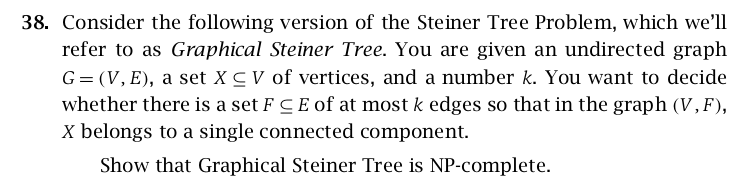
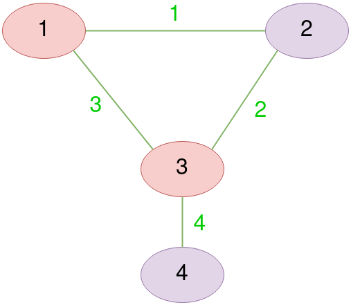
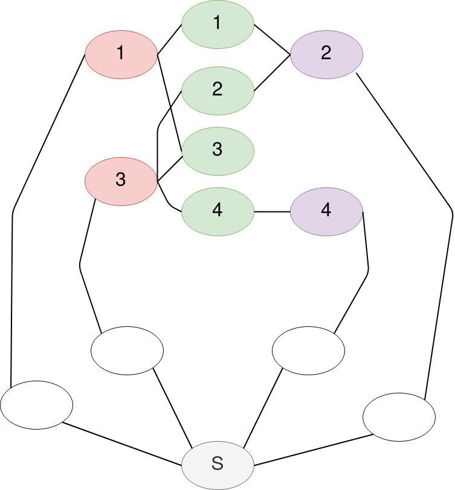

## Preface
We prove the _graphical [steiner tree](https://en.wikipedia.org/wiki/Steiner_tree_problem)_ problem is _NP-complete_ by reducing [vertex cover](https://en.wikipedia.org/wiki/Vertex_cover) to it. The version of it is taken from our favorite _Kleinberg and Tardos' Algorithm Design_ book's exercises. We assume the reader is familiar with _vertex cover_, what _NP-completeness_ is and the general approach for proving it by _reduction_.

## Graphical Steiner Tree Definition
Here is a clear definition of the problem we prove its NP-completeness, Taken from _klienberg and tardos' exercise 38_ of _chapter 8_, _NP and computational intractability_.

## Example and High-Level Overview
Before showing a rigour proof, We present a simple example which demonstrates our approach. We begin with a _vertix cover_ example, then accordingly encode it into an instance of the _graphical steiner tree_ problem. We give some insights why finding a solution to the latter accounts for a solution to the former, and Hence argue our claimed proof is correct.

### Vertex Cover
Let's consider a simple example of _vertex cover_ problem. A graph $G$ has vertices $G(V) = \set {1, 2, 3, 4}$ colored in red and purple, and edges $G(E) = \set {1, 2, 3, 4 }$ colored in _green_. Finally, Let $k=2$

Clearly, A subset $G(V)_{red} = \set {1, 2}$ has the minimum possible number of elements which enables covering all edges $G(E)$. Now let's see how it is going to be encoded into an instance of a _graphical steiner tree_.

### Graphical Steiner Tree
Construct a graph $G'$ whose vertices $G'(V)$ are the unions of,

$\set {S}$ a special vertex, $\set {1, 2, 3, 4} = G'(V)_e$ colored in green corresponding to edges of the vertex cover $G(E)$, $\set {1', 2', 3', 4'} = G'(V)_v$ colored in red and purple corresponding to vertices of the vertex cover $G(V)$, and $\set {1_0, 2_0, 3_0, 4_0} = G'(V)_o$ contains an additional vertex colored in white for each element of $G'(V)_v$. Note vertices in $G'(V)_o$ and vertex $S$ are not corresponded to anything in the _vertex cover_ instance.
 
$G'$'s edges $G'(E)$ are the unions of,

$G'(E)_c$ corresponding to edges which connect $G'(V)_v$ with $G'(V)_e$ in case an edge is covered by a vertex in the _vertex cover_ instance, and $G'(E)_S$ contains two edges for each element of $G'(V)_v$ connecting it to the special vertex $S$ via $G'(V)_o$. Note edges in $G'(E)_S$ are not corresponded to anything in the _vertex cover_ instance.

Define $X' = \set{S} \cup G'(V)_v \cup G'(V)_e$

Define $k' = ||G'(V)_e|| + 2(k) + (||G'(V)_v||-(k))$ $=$ $||G'(V)_e|| + 2(2) + (||G'(V)_v||-(2))$ where $k$ is taken from _vertex cover_ instance.

### Accounting a Solution for Vertex Cover
Let's remark how a solution of encoded _Graphical Steiner Tree_ yields a solution to _Vertex Cover_.

By definition of _Graphical Steiner Tree_, and definition of X, $G'(V)_v$ vertices must be connected to $S$. For each, There are two pathways, Either connecting backward via $G'(V)_o$ with cost of two edges, or connecting forward via $G'(V)_e$. So there is a penalty on connecting backward, and the algorithm is obliged to connect forward as much as possible to reduce the number of edges. In other words, We could reform the algorithm's goal as, In order to connect $X$ in a single component with least possible edges, What is the minimum number of vertices of $G'(V)_v$ needs to be connected backward;y?

The trick here as shown from the example is that we reduced vertices covering edges in _vertex cover_ to vertices connected to other vertices in _graphical steiner tree_.

## More Rigour Remarks
Now let's present some more rigour remarks of our reduction. For the sake of readability, We intentionally omit the definition of constructed encoded instance of _graphical steiner tree_. We believe the above discussion suffices to convince the reader. In addition, We assume on behalf of the reader to see why both _theorem 1_ and _theorem 2_ suffices to prove intended NP-completeness.

### Theorem 1
If a _vertex cover_ instance is _decided_ to be covered by at most $k$ vertices, Then the encoded _graphical steiner tree_ is decided to be solved by at most $k'$ edges.

Note the definition of $k'$ is stated above.

#### Proof
Let $X \subseteq G(V)$ be the chosen vertices in _vertex cover_ instance which cover all its edges. Let $G'(V)_X \subseteq G'(V)_v$ containing elements corresponding to $X$.

Construct $F \subseteq G'(E)$ containing,

One edge from each element of $G'(V)_e$ to some element in $G'(V)_X$, Two edges from each element of $G'(V)_X$ along the path to $S$, and one edge from each element of to $G'(V)_v - G'(V)_X$ to any remaining $G'(V)_e$.

Clearly, Mentioned edges exist. Also, $X'$ (see its definition above) is a single component in the graph, As all needed vertices are connected to $S$. 

By definition, The number of elements in $X$ is at most $k$. Clearly, All mentioned edges of $X'$ are distinct from each other. Hence, The number of them is at most $k'$ following $F$'s construction.

### Theorem 2
If the encoded _graphical steiner tree_ is decided to be solved by at most $k'$ edges, Then _vertex cover_ instance is _decided_ to be covered by at most $k$ vertices.

#### Proof
Let $X'$ be the solution of encoded _graphical steiner tree_. Since $X'$ is a single-component in the graph, All vertices must be connected to $S$ including $G'(V)_v$. Those are connected either _backward_ through $G'(V)_o$ or forward through $G'(V)_e$. Let $G'(V)_b$ be those which are connected backwardly. Let $k'_b$ be equal to its number of elements.

Construct $X \subseteq G(V)$ containing vertices in _vertex cover_ instance corresponding to $G'(V)_b$ in $X'$. It is not hard to see those vertices cover all edges in _vertex cover_. Clearly, In $X'$ each element of $G(V)_e$ is connected to some element in $G(V)_b$, Otherwise they won't be connected to $S$ violating $X'$ definition. Hence, every edge in _vertex cover_ must be covered by $X$.

What is remaining is to prove $X$'s cardinality is at most $k$. In other words, We need to show $k'_b$ is at most $k$. Assume for the sake of contradiction that $k'_b > k$. Then $||X'|| \geq ||G'(V)_e|| + 2(k'_b) + (||G'(V)_v||-(k'_b))$ $>$ $||G'(V)_e|| + 2(k) + (||G'(V)_v||-(k))$ $=$ $k'$ violating $X'$ to be at most $k'$ as defined.

## Conclusion
I acknowledge that might not be a complete proof, However we believe it suffices for anyone with minimum familiarity of _computational complexity theory_ or _NP-completeness_. We did really enjoy figuring the trick of reducing covering edges by vertices to connecting vertices to other vertices. After all, The literature is crammed with proved NP-complete problems. I guess a first-look in _Computers and Intractability: A Guide to the Theory of NP-completeness_ by _Garey_ and _Johnson_ delineates this blog post trivial. However, I am happy that I was able to think from a different perspective to figure this problem out by only the aid of _Kleinberg_ and _Tardos_' book.

## References
- Kleinberg and Tardos. Algorithm Design. Pearson
