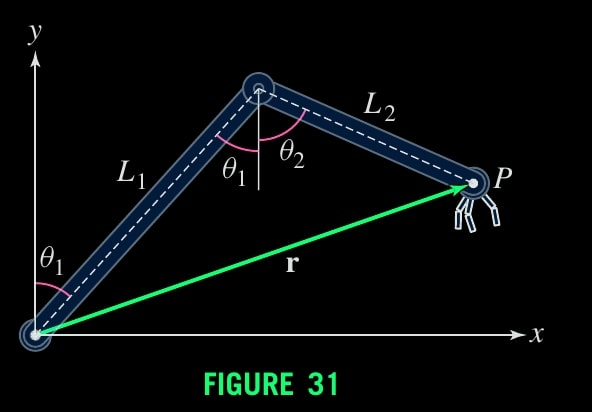
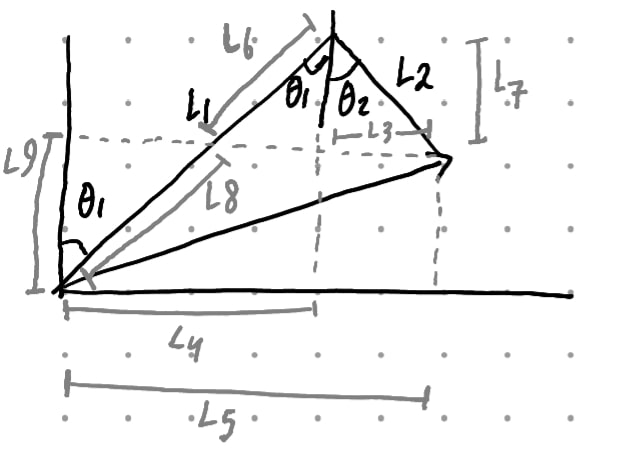
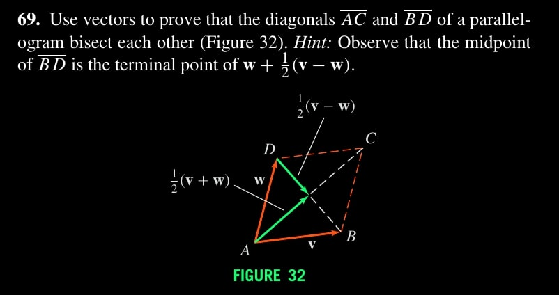
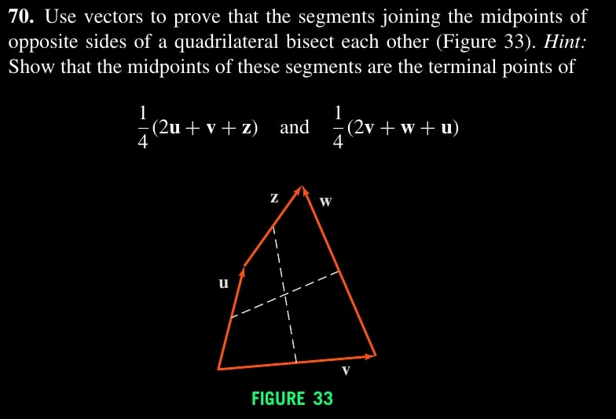
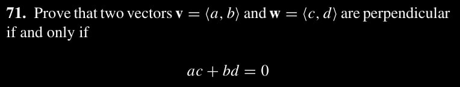

$\newcommand{\ddfrac}[2]{\frac{\displaystyle{#1}}{\displaystyle{#2}}}$

## Exercises

### Ex. 1.66

$$
\begin{aligned}
    ||L_3|| &= ||L_2|| \sin \theta_2 \\\\
    ||L_4|| &= ||L_6|| \sin \theta_1 \\\\
    ||L_5|| &= ||L_3|| + ||L_4|| \\\\
    ||L_7|| &= \sqrt{(L_2)^2 - (L_3)^2} \\\\
    ||L_7|| &= ||L_6|| \cos \theta_1 \rightarrow ||L_6|| = ||L_7|| / \cos \theta_1 \\\\
    ||L_8|| &= ||L_1|| - ||L_6|| \\\\
    ||L_9|| &= ||L_8|| \cos \theta_1
\end{aligned}
$$
Components are $\langle ||L_5||, ||L_9|| \rangle$.

### Ex. 1.69

Observe $\overline{AC} = ||v+w||$ and $\overline{BD} = ||v-w||$.

By vector algebra,
$$
\begin{aligned}
    w + \frac{1}{2} (v-w) &= \frac{1}{2} (v+w) \\\\
    \text{point of BD midpoint} &= \text{point of AC midpoint}
\end{aligned}
$$
Hence bisects each other.

### Ex. 1.70

Observe that we can construct the midpoint between the ends of two vectors by $\frac{1}{2} (v-u)$.

The midpoint of $H$ is $\frac{1}{2} [(v + \frac{1}{2} w) - \frac{1}{2} u] + \frac{1}{2} u = \frac{1}{2} v + \frac{1}{4} w + \frac{1}{4} u$.

The midpoint of $V$ is $\frac{1}{2} [(u + \frac{1}{2} z) - \frac{1}{2} v] + \frac{1}{2} v = \frac{1}{2} u + \frac{1}{4} z + \frac{1}{4} v$

Suffices to show $2u + v + z = 2v + w + u$ which reduces to $u+z = v+w$. By our diagram both yields exactly the same vector.

**Note.** I solved the problem without seeing the hint.

### Ex. 1.71

vectors $v$ and $w$ are perpendicular if and only if
$$
\begin{aligned}
  ||w-v||^2 &= ||v||^2 + ||w||^2 \\\\
  ||\langle c-a, d-b \rangle||^2 &= a^2 +b^2 + c^2 + d^2 \\\\
  (c-a)^2 + (d-b)^2 &= \\\\
  c^2 + a^2 - 2ac + d^2 + b^2 - 2bd &= \\\\
  -2ac - 2bd &= 0 \\\\
  ac - bd &=
\end{aligned}
$$
