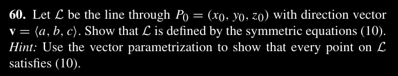
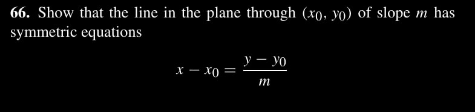
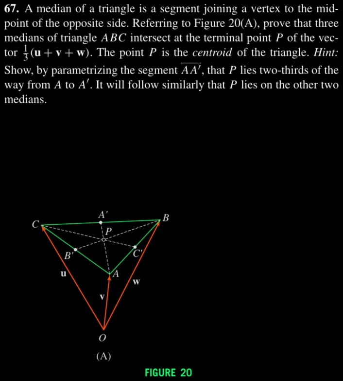

$\newcommand{\nfrac}[2]{\frac{\displaystyle{#1}}{\displaystyle{#2}}}$

## Exercises

### Ex. 2.60

\begin{align*}
    L &= P_0 + tv \\\\
      &= (x_0,y_0,z_0) + t (a,b,c)
\end{align*}
\begin{align*}
    x = x_0 + ta \rightarrow t = \nfrac{x-x_0}{a} \\\\
    y = y_0 + tb \rightarrow t = \nfrac{y-y_0}{b} \\\\
    z = z_0 + tc \rightarrow t = \nfrac{z-z_0}{c}
\end{align*}

### Ex. 2.66

Be definition of a slope, We have two points on the line: $(x_0, y_0)$ and $(x_0 +   1, y_0 + m)$.

By page 640, We take the directional vector: $v = (x_0 + 1, y_0 + m) - (x_0, y_0) =  (1,m)$.

Thus,
\begin{align*}
    x = x_0 + (1)t \rightarrow t = x - x_0 \\\\
    y = y_0 + (m)t \rightarrow t = \nfrac{y - y_0}{m}
\end{align*}
Hence, The symmetric form is satisfied.

### Ex. 2.67

\begin{align*}
    \vec{OA}  &= v \\\\
    \vec{OA'} &= \nfrac{1}{2} (w-u) + u \\\\
              &= \nfrac{1}{2} (w+u) \\\\
    \vec{OA'} - \vec{OA} &= \nfrac{1}{2} w + \nfrac{1}{2} u - v
\end{align*}
Taking $2/3$ of it: $\nfrac{2}{3} (\vec{OA'} - \vec{OA}) = \nfrac{1}{3} w +          \nfrac{1}{3} u - \nfrac{2}{3} v$.

$P$ is the terminal of vector: $v + \nfrac{1}{3} w + \nfrac{1}{3} u - \nfrac{2}{3} v = \nfrac{1}{3} w + \nfrac{1}{3} u + \nfrac{1}{3} v$.

Symmetrically, Taking $\nfrac{2}{3}$ of segments $BB'$ and $CC'$ yields the vector   $\nfrac{1}{3} w + \nfrac{1}{3} u + \nfrac{1}{3} v$, and thus point $P$ lies on the   other two medians as well.

