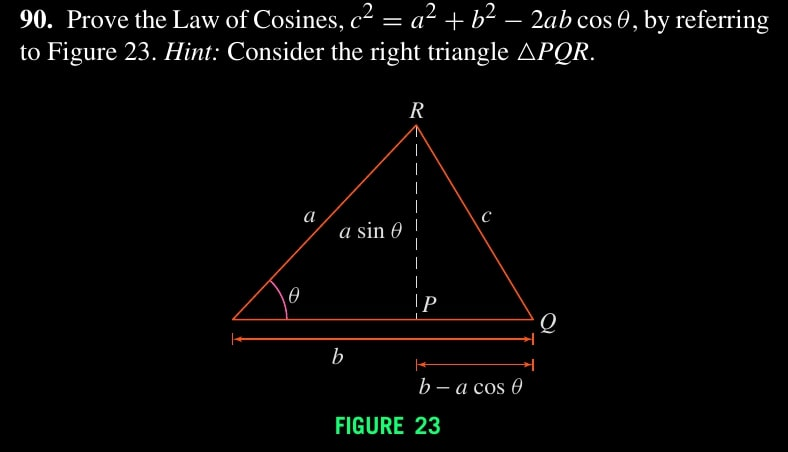
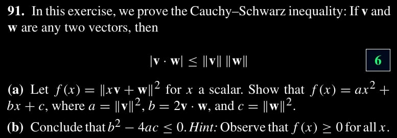
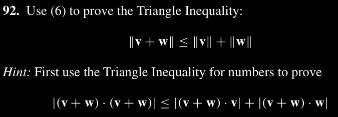
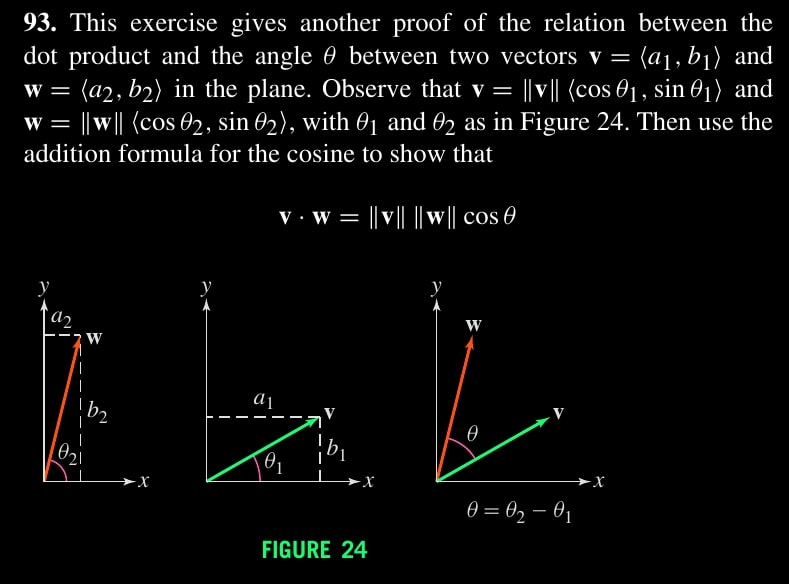
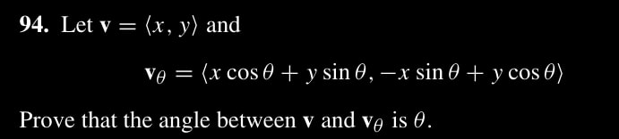
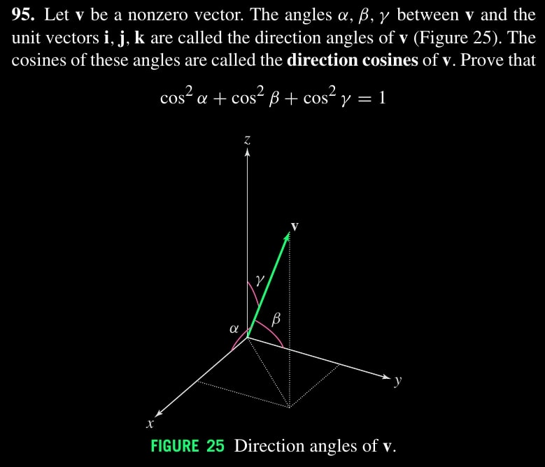

$\newcommand{\nfrac}[2]{\frac{\displaystyle{#1}}{\displaystyle{#2}}}$

## Exercises

### Ex. 3.90

\begin{align*}
    c^2 &= (a \sin \theta)^2 + (b - a \cos \theta)^2 \\\\
        &= a^2 \sin^2 \theta + b^2 + a^2 \cos^2 \theta - 2 ab \cos \theta \\\\
        &= a^2 (\sin^2 \theta + \cos^2 \theta ) + b^2 - 2ab \cos \theta \\\\
        &= a^2 + b^2 - 2ab \cos \theta
\end{align*}

### Ex. 3.91

**(a)**. The goal is $||xv + w||^2 = ||v||^2 x^2 (2v \cdot w)x + ||w||^2$. Then
\begin{align*}
    L.H.S &= (xv + w) \cdot (xv + w) \\\\
          &= xv \cdot xv + 2xv \cdot w + w \cdot w \\\\
          &= x^2 (v \cdot v) + (2v \cdot w)x + ||w||^2 \\\\
          &= ||v||^2 x^2 + (2v \cdot w)x + ||w||^2 \\\\
          &= R.H.S
\end{align*}

**(b)**. We know $f(x) = ax^2 + bx + c \geq 0$. Geometrically a parabola which  does not intersect the x-axis at two points. So there are no two distinct real       solutions, and hence the discriminent $b^2 - 4ac \leq 0$.

### Ex. 3.92

Observe $(v+w) \cdot (v+w) = (v+w) \cdot v + (v+w) \cdot w$, So hint is proven.
\begin{align*}
    L.H.S = ||v+w||^2 &\leq ||v+w|| \; ||v|| + ||v+w|| \; ||w|| \\\\
                      &= ||v+w|| (||v|| + ||w||)
\end{align*}
Thus, $||v+w|| \leq ||v|| + ||w||$.

### Ex. 3.93

Recall the _cosine additition formula_ is $\cos(a-b) = \cos a \cos b + \sin a \sin b$.
\begin{align*}
    v &\cdot w \\\\
      &= ||v|| (\cos \theta_1, \sin \theta_1) \cdot ||w|| (\cos \theta_2, \sin       \theta_2) \\\\
      &= ||v|| \cdot ||w|| \left[ (\cos \theta_1, \sin \theta_1) \cdot (\cos         \theta_2, \sin \theta_2) \right] \\\\
      &= ||v|| \cdot ||w|| \left[ \cos \theta_2 \cos \theta_1 + \sin \theta_2 \sin   \theta_1 \right] \\\\
      &= ||v|| \cdot ||w|| \cos(\theta_2 - \theta_1) \\\\
      &= ||v|| \cdot ||w|| \cos(\theta)    \text{   given } \theta = \theta_2 -       \theta_1
\end{align*}

### Ex. 3.94

It suffices to show $\cos \theta = \nfrac{V \cdot V_\theta}{||V|| \cdot ||V_\theta||}$. But $||V|| = ||V_\theta||$, Then
\begin{align*}
    R.H.S &= \nfrac{(x^2 \cos \theta + xy \sin \theta)+(-xy \sin \theta + y^2 \cos   \theta)}{||V||^2} \\\\
          &= \nfrac{\cos \theta (x^2 + y^2)}{||V||^2} \\\\
          &= \nfrac{\cos \theta  ||V||^2}{||V||^2} \\\\
          &= L.H.S
\end{align*}

### Ex. 3.95

Let $V_x$, $V_y$, $V_z$ be projected vectors of $V$ on $x$, $y$, and $z$ axis. Then:
\begin{align*}
  \cos \alpha &= ||V_x|| / ||V|| \\\\
  \cos \beta  &= ||V_y|| / ||V|| \\\\
  \cos \gamma &= ||V_z|| / ||V||
\end{align*}
It follows
\begin{align*}
    \cos^2 \alpha &+ \cos^2 \beta + \cos^2 \gamma \\\\
  &= (||V_x|| / ||V||)^2 + (||V_y|| / ||V||)^2 + (||V_z|| / ||V||)^2 \\\\
  &= \nfrac{ ||V_x||^2 + ||V_y||^2 + ||V_z||^2 }{ ||V||^2 } \\\\
  & = \nfrac{ ||V_{x,y}||^2 + ||V_z||^2 }{ ||V||^2 } \textit{  (Pythagorean Theorem)} \\\\
  & = \nfrac{ ||V||^2 }{ ||V||^2 } \textit{  (Pythagorean Theorem)} \\\\
  & = 1
\end{align*}
