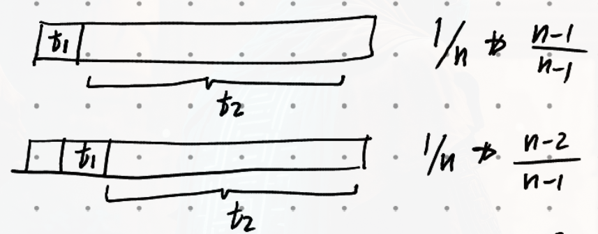

$\newcommand{\nfrac}[2]{\frac{\displaystyle{#1}}{\displaystyle{#2}}}$

## Exercises {#exercises .unnumbered}

### 3 {#section .unnumbered}

**Fact.** Given a set $A$ of distinct elements in a random order, The positition of the maximum element of a subset $S \subset A$ is uniform in $S$.

Define indicator random variables $L_i$ as
$$
L_i =
    \begin{cases} 
        1 & a_i > a_{i-1}, a_{i-2}, \dots, a_{1} \\\\
        0 & a_i < a_j, \text{ for some } j = 1,2, \dots, i-1 
    \end{cases}
$$
So $L_i = 1$ if and only if the ith item $a_i$ is the maximum in subset $A[1:i]$.

It follows $Pr[L_i = 1] = 1/i$ and $Ex[Li] = 1/i$.

Let $X$ be a random variable for the number of times the line `a[first] > a[max_loc]` returns `True`. Observe $X = L_2 + L_3 + \dots + L_n$. So $Ex[X] = 1/2 + \dots + 1/n = H(n) - 1 \approx \ln n - 1$.

$H(n)$ here is the nth harmonic sum.

### 4 {#section-1 .unnumbered}

#### a {#a .unnumbered}

**Note.** Our solution was initially flawed until we read the description of *exercise 6* which gave the correct answer. We only reconstructred the proof given the answer.

**Fact 1.** On the ith step of the first pass of bubble-sort, $A[i]$ is the maximum element among $A[0:i]$.

**Fact 2.** Given $A$ is a set of distinct elements in a random order, The probability of $A[i]$ being the maximum element of $A[0:i]$ is $\frac{\displaystyle{1}}{\displaystyle{i+1}}$.

Let $R_i$ be an indicator random variable, Indicating whether $A[i] > A[i+1]$, at the ith step of the loop. From *Fact 1*, $R_i = 1$ if and only if $A[i+1]$ is not the maximum among $A[0:i+1]$. The probability of that event is $\frac{\displaystyle{i+1}}{\displaystyle{i+2}}$ from *Fact 2*.

Clearly $Ex[R_i] = \frac{\displaystyle{i+1}}{\displaystyle{i+2}}$. It follows $W = \sum_{i=0}^{n-2} R_i = \frac{\displaystyle{1}}{\displaystyle{2}} + \frac{\displaystyle{2}}{\displaystyle{3}} + \dots + \frac{\displaystyle{n-1}}{\displaystyle{n}} = (n-1) - \left ( \nfrac{1}{2} + \nfrac{1}{3} + \dots + \nfrac{1}{n} \right ) = n - 1 - H_n + 1 \approx n - \lg n$.

#### b {#b .unnumbered}

That event happens if and only if
- $max(A[1], A[2]) < A[3]$. Its probability is $\frac{\displaystyle{2}}{\displaystyle{3}}$. Or
- $max(A[1], A[2]) > A[3]$ and $A[1] < A[3]$. Its probability is $\frac{\displaystyle{1}}{\displaystyle{3}} \cdot \frac{\displaystyle{1}}{\displaystyle{2}} = \frac{\displaystyle{1}}{\displaystyle{6}}$.

So the probability $A[1] < A[2]$ after the first pass of bubble-sort is $\frac{\displaystyle{2}}{\displaystyle{3}} + \frac{\displaystyle{1}}{\displaystyle{6}} = \frac{\displaystyle{4}}{\displaystyle{6}} = \frac{\displaystyle{2}}{\displaystyle{3}}$.

### 5 {#section-2 .unnumbered}

**Fact.** Given a randomly ordered $A$, Any $A[:K]$ is also randomly ordered.

**Fact.** Uniformly $A[k] \in \{ q_1, q_2, \dots, q_k \}$ where $q_i \in A[:k]$ and $q_1 > q_2 > \dots > q_k$.

In kth iteration, $A[1:k-1]$ is sorted, and $A[k]$ will be uniformly displaced to
- position $k, k-1, \dots, 1$. Respectively,
- #comparisons $= 1,2, \dots, k$. Respectively,
- #assignments $= 0, 1, \dots, k-1$.

Denote total number of comparisons by $C$ and comparisons in kth iteration by $C_k$. Similarly $A$ and $A_k$ for assignments. In expectation
\begin{aligned}
    Ex[C_k] &= \nfrac{1}{k} (1 + \dots + k) = \nfrac{1}{k} \nfrac{k \cdot k+1}{2} = \nfrac{k+1}{2} \\\\
    Ex[A_k] &= \nfrac{1}{k} (1 + \dots + k-1) = \nfrac{1}{k} \nfrac{(k-1)k}{2} = \nfrac{k-1}{2}
\end{aligned}
Clearly $C = \sum_{k=2}^n C_k$ and $A = \sum_{k=2}^n A_k$. So
\begin{aligned}
    Ex[C] &= \sum_{k=2}^n \nfrac{k+1}{2} \\\\
          &= \nfrac{1}{2} \sum_{k=2}^n k+1 \\\\
          &= \nfrac{1}{2} \left [ ( \sum_{k=1}^{n+1} k) - 1 - 2 \right ] \\\\
          &= \nfrac{1}{2} \left [ \nfrac{(n+1)(n+2)}{2} - 3 \right ] \\\\
          &= \nfrac{(n+1)(n+2)}{4} - \nfrac{3}{2} \\\\
    Ex[A] &= \sum_{k=2}^n \nfrac{k-1}{2} \\\\
          &= \nfrac{1}{2} \sum_{k=2}^n k-1 \\\\
          &= \nfrac{1}{2} \sum_{k=1}^{n-1} k \\\\
          &= \nfrac{1}{2} \nfrac{n(n-1)}{2} \\\\
          &= \nfrac{n(n-1)}{4}
\end{aligned}

### 6

The fact $Ex[W_n] = n - H(n)$ rests on the assumption array $A$ is randomly ordered. That is not the case after the first pass. This is clear from our answer in _Ex. 4, b_.

### 9

**Fact 1.** The number of comparisons took by the algorithm is decided by the smaller-position target.

**Fact 2.** Given $A$ is randomly ordered, target $t_1$ is uniform among all $n$ positions, and target $t_2$ is uniform among all remaining $n-1$ positions.

**Fact 3.** Since we are operating on remaining $n-1$ positions, The choice of $t_1$ is irrelevant. In other words the two events independent.

Let $R$ be the number of algorithm's comparisons. Let $W$ be the position of smaller-position target. By *Fact 1* $R = W+1$. Observe $Pr[W=0] = Pr[R=1] = \frac{\displaystyle{1}}{\displaystyle{n}} \cdot \frac{\displaystyle{n-1}}{\displaystyle{n-1}}$, $Pr[W=1] = Pr[R=2] = \frac{\displaystyle{1}}{\displaystyle{n}} \cdot \frac{\displaystyle{n-2}}{\displaystyle{n-1}}$

Generally, for $k \in \{ 0, 1, \dots, n-1 \}$, $Pr[R=k] = \frac{\displaystyle{n-k}}{\displaystyle{n-1}}$. So by definition,
\begin{aligned}
    Ex[R] &= \sum_{k=1}^{n-1} i \cdot \frac{\displaystyle{1}}{\displaystyle{n}} \cdot \frac{\displaystyle{n-i}}{\displaystyle{n-1}} \\\\
        &= \frac{\displaystyle{1}}{\displaystyle{n}} \cdot \frac{\displaystyle{1}}{\displaystyle{n-1}} \sum_{i=1}^{n-1} i (n-i) \\\\
        &= \frac{\displaystyle{1}}{\displaystyle{n}} \cdot \frac{\displaystyle{1}}{\displaystyle{n-1}} \left ( n \sum_{i=1}^{n-1} i - \sum_{i=1}^{n-1} i^2 \right ) \\\\
        &= \frac{\displaystyle{1}}{\displaystyle{n}} \cdot \frac{\displaystyle{1}}{\displaystyle{n-1}} \left ( n \frac{\displaystyle{n(n-1)}}{\displaystyle{2}} - \frac{\displaystyle{(n-1)n(2n-1)}}{\displaystyle{6}} \right ) \\\\
        &= \frac{\displaystyle{3n}}{\displaystyle{6}} - \frac{\displaystyle{2n-1}}{\displaystyle{6}} = \frac{\displaystyle{n+1}}{\displaystyle{6}}
\end{aligned}
